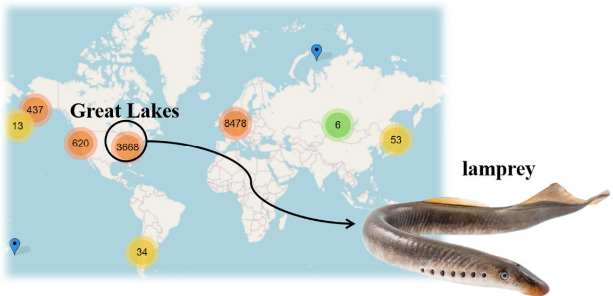
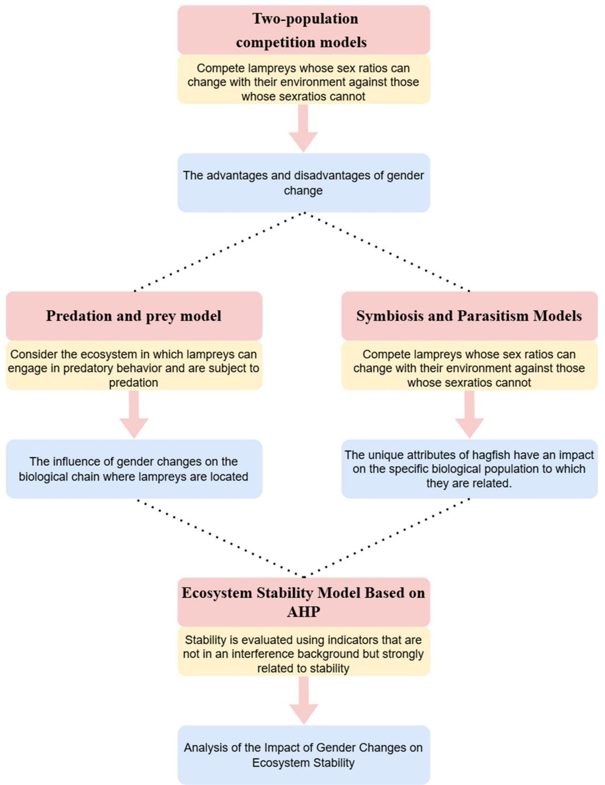
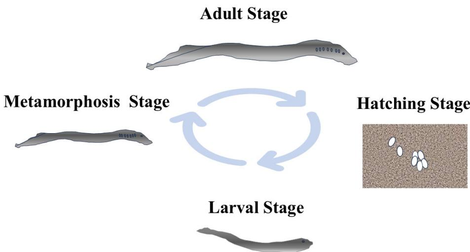
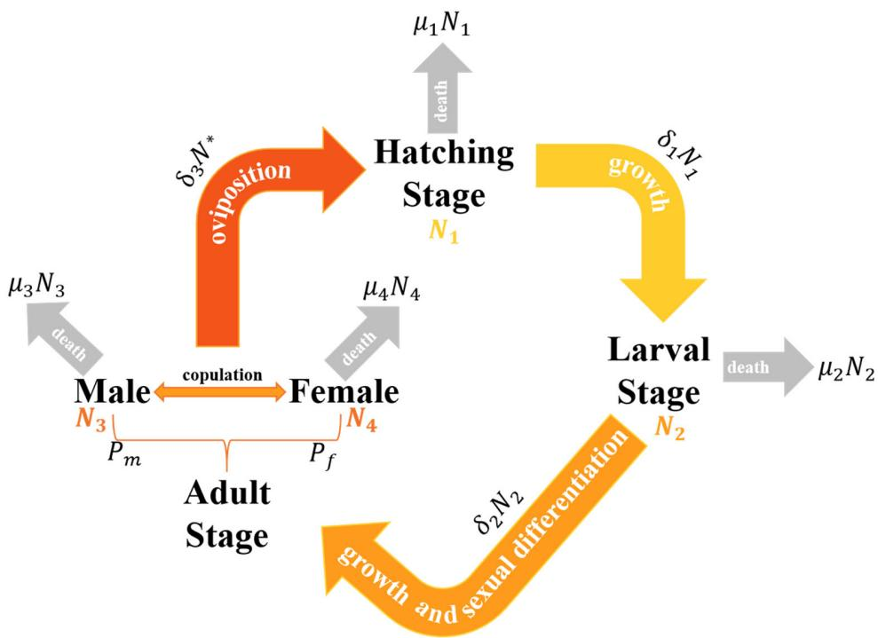

<!-- source: MinerU_markdown_applsci-15-07680_20260126133247_2015659158767026176.md; mode: auto->qex ; lines: 1-301 -->

Article

# Modeling Population Dynamics and Assessing Ecological Impacts of Lampreys via Sex Ratio Regulation

Ruohan Wang, Youxi Luo *, Hanfang Li * and Chaozhu Hu

School of Science, Hubei University of Technology, Wuhan 430068, China; 2210621218@hbut.edu.cn (R.W.); huchaozhu0035@hbut.edu.cn (C.H.)

* Correspondence: 20051038@hbut.edu.cn (Y.L.); 20020015@hbut.edu.cn (H.L.)

# Abstract

Regulating lamprey populations is crucial for maintaining ecological equilibrium. However, the unique sex determination process of lampreys is constrained by multiple factors, complicating intuitive analysis of population dynamics and their impact on the natural environment. This study employed a two-species competition mechanism to elucidate the factors influencing sex ratios and their mechanistic effects on lamprey population size. Using the Lotka-Volterra equations, we investigated how sex ratios affect trophic levels both upstream and downstream of lampreys in the food web. A logistic population growth model was applied to assess the impact of sex ratio variations on symbiotic parasitic species, while the Analytic Hierarchy Process (AHP) was utilized to explore the dynamic relationship between sex ratio changes and ecosystem stability. To validate model efficacy, we manipulated temperature and food availability under controlled disturbance conditions, analyzing temporal variations in lamprey population size across different disturbance intensities to evaluate model sensitivity. The findings indicate that the variable sex ratio's benefit is in facilitating the lampreys' population's enhanced adaptation to environmental shifts. The coexisting species exhibit a similar pattern of population alteration as the lampreys, albeit with a minor delay. A definitive link between the quantity of lampreys and the parasitic species is absent. A male ratio of 0.6 optimally contributes to the ecosystem's equilibrium. Over time, the configuration of our model's parameters proves to be sensible. This research provides robust theoretical support for developing scientific strategies to regulate lamprey populations.

Keywords: sex ratio; Lotka-Volterra equation; population size; logistic model

Academic Editor: Ephraim Suhir

Received: 10 June 2025

Revised: 5 July 2025

Accepted: 7 July 2025

Published: 9 July 2025

Citation: Wang, R.; Luo, Y.; Li, H.; Hu, C. Modeling Population

Dynamics and Assessing Ecological Impacts of Lampreys via Sex Ratio

Regulation.Appl.Sci.2025,15,7680.

https://doi.org/10.3390/

app15147680

Copyright: © 2025 by the authors.

Licensee MDPI, Basel, Switzerland.

This article is an open access article distributed under the terms and

conditions of the Creative Commons

Attribution (CC BY) license

(https://creativecommons.org/

licenses/by/4.0/).

# 1. Introduction

# 1.1. Background

Sea lampreys, resembling eels and feeding on blood, are widely distributed globally, as depicted in Figure 1. This species possesses a distinct mechanism for determining sex, governed by the larvae's growth speed [1]. The growth rate of marine lampreys during the larval stage varies by the availability of food, which influences the sex ratio in adulthood. Adaptive sex ratio variation in nature is influenced by multiple factors and exerts significant effects at various biological scales, ranging from population-level dynamics to broader ecosystem processes. Consequently, examining how lampreys' gender proportions correlate with their habitat's resource availability is crucial for maintaining ecosystem stability over time.

Figure 1. Global distribution chart of lampreys. The numbers in the figure represent the number of adult lampreys, with the unit being hundreds. Red signifies a broad distribution of lampreys, yellow indicates a moderate dispersion, and green denotes a limited distribution.

We aim to create a comprehensive model to explore the interaction between the adaptive differences in the sex ratio of sea lampreys and ecological systems. The objective of this approach is to enhance the overall comprehension of sea lampreys' biological characteristics and their ecological functions. Such a model not only helps to elucidate the underlying mechanisms of sea lamprey population dynamics but also offers valuable scientific insights for ecological conservation and management.

# 1.2. Review

The population of sea lampreys, a blood-feeding species that consumes the blood of other fish, plays a crucial role in maintaining the balance of the ecosystems they inhabit. As a result, the environmental effects of sea lampreys are garnering more focus from pertinent management bodies, making their population control a key concern in managing lake ecosystems. However, due to the inherent complexity of ecosystems and the need to account for the interplay of multiple factors, qualitative methods alone are insufficient for capturing the underlying dynamics.

Ecosystem modeling offers a promising alternative by incorporating both structural components and functional processes into a unified framework, enabling a more quantitative and systematic approach to ecological research. Scholars have explored ecosystem modeling across various dimensions, covering terrestrial [2], aquatic [3], and aerial [4] environments, and extending across domains such as agriculture [5], forestry [6], and fisheries [3]. Research has ranged from single-species studies to large-scale community and ecosystem modeling [7]. With increasing ecological challenges in recent years, such modeling approaches have become essential tools for both understanding and conserving ecosystems.

In terms of modeling techniques, several approaches have been developed: Christopher K. Wikle [4] employed hierarchical Bayesian models to incorporate parameter uncertainty and layered ecological structures, finding no significant time trend in house sparrow abundance. Miguel Lurgi et al. [8] used ecological network models to simulate how invasive species influence prey (e.g., rabbits) abundance, considering important feedback mechanisms. Hugo Fort [9] employed the linear generalized Lotka-Volterra model to demonstrate its predictive capability in multi-species systems.

However, these researchers frequently overlooked the ripple effects on the environment caused by changes in abundance. This paper addresses that gap by explicitly consid-

ering how population changes, especially those driven by sex ratio variation, can further affect ecosystem dynamics. While Zhen et al. [10] also employed the Lotka-Volterra framework to study total population and assess the influence of sex ratio changes, their model overlooked the life-history stages and developmental heterogeneity that characterize sea lamprey population structure. In this study, we incorporate a detailed life-cycle representation of sea lampreys, considering their distinct behavioral and ecological traits at different developmental stages. This integrated modeling approach offers a robust framework for simulating the ecological impact of adaptive sex ratio variation and provides deeper insights into sea lamprey population dynamics and their role within ecosystems.

# 1.3. Our Work

In this paper, we establish four mathematical models progressively and address four problems, which are shown in Figure 2.

Figure 2. Models and problems.

Additionally, a summary of our key contributions is presented below:

(1) Through the amalgamation of lampreys' tripartite life cycle and their gender transition process, we developed a dual-species comparative framework grounded in differential equation methodologies. This model considers variations in population at various phases of the species' growth and development, diverging from prior research.

(2) Implementing the fourth-order Runge-Kutta technique guarantees the precision, steadiness, and intricacy of the outcomes. This facilitates a more effective computation of the outcomes derived from the dual-species competition model.

(3) Employing a hierarchical analysis approach evaluates the impact of various elements on ecosystem stability, thereby enhancing the efficacy of the derived outcomes.

# 2. Assumptions and Symbols

To simplify the problem, we adopt the following basic assumptions, each of which is justified. Other assumptions based on different models will be listed in the following model-related sections.

Assumption 1: Food availability is the main factor affecting the growth rate of sea lamprey larvae.

Justification: In nature, food availability directly affects the growth rate and survival of individuals. For many aquatic organisms, food availability is a key limiting factor in determining growth and development rates. Particularly for juvenile fish, adequate food supply can promote rapid growth and increase chances of survival, whereas food scarcity can limit growth rates and even lead to high mortality rates.

Assumption 2: Variations in the sex ratio have a direct impact on the rate of reproduction and the size of the population.

Justification: Sex ratio is one of the key factors affecting the reproductive potential of a population. A balanced sex ratio ensures adequate reproductive opportunities, while a skewed sex ratio may reduce the reproductive success of a population, which in turn affects population size and growth rate.

Assumption 3: Overlook the impact of disease spread and movement within and outside populations on the size of the population.

Justification: Although disease and migration have significant effects on population dynamics, ignoring these factors during the initial modeling phase simplifies the model and makes it easier to analyze and understand. This simplifying assumption allows the researcher to focus on food availability and sex ratio, two factors that more directly affect population growth.

Assumption 4: Limit environmental carrying capacity.

Justification: Any ecosystem has a finite amount of resources, which limits the maximum sustainable size of populations living in that system. Environmental carrying capacity takes into account the limits of the resources available in an ecosystem and is an important predictor of population growth and stability.

Assumption 5: Individuals at an identical developmental phase in a population are considered equal.

Justification: This assumption assumes that there are no significant genetic or phenotypic differences between individuals within a population, and thus that each individual is the same in terms of growth rate, survival rate, and so on. This simplification reduces the complexity of the model and is a practical approximation for large-scale population dynamics studies, although it may ignore inter-individual differences.

Assumption 6: Once established, the sexes remain unchanged.

Justification: This reflects the biological reality of most vertebrates that the sex of an individual will not change once it is determined early in a life stage. This assumption simplifies the modeling of sex dynamics because it excludes the potential effects of sex transitions on population structure and dynamics.

The main notations used in this paper are listed in Table 1.

Table 1. Notations used in this paper.

<table><tr><td>Symbol</td><td>Description</td></tr><tr><td>K</td><td>Environmental capacity</td></tr><tr><td>Ni</td><td>The i-th lamprey population</td></tr><tr><td>δi</td><td>Growth rate of the i-th lamprey population</td></tr><tr><td>μi</td><td>Mortality rate of the i-th lamprey population</td></tr><tr><td>f</td><td>Total amount of food</td></tr><tr><td>η</td><td>Environmental Resource Utilization</td></tr></table>

Additionally, sources of data used in the paper are websites such as the Great Lakes Fishery Commission and so on.

# 3. Resource-Dependent Sex Ratio Dynamics Model (RDSRD Model)

In this section, we analyze the advantages and disadvantages of adaptive sex ratio variation in sea lamprey populations under changing resource availability, based on a comprehensive modeling of their life cycle and supported by a population-level competition mechanism through simulation experiments.

# 3.1. Two-Species Competition Mechanism

This part will focus on creating a model for population competition, integrating the lampreys' life cycle traits and gender determination processes.

Population expansion occurs in three distinct phases according to the life cycle

The life cycle of lampreys is a complex process divided into four main stages, each with its own unique physiological and ecological characteristics. These fourstages include the Hatching Stage, Larval Stage, Metamorphosis Stage, Adult Stage. The four-phase life cycle change is shown in Figure 3 below.

Figure 3. Growth diagram of the three stages of the lamprey life cycle [11].

The Hatching Stage (HS) is the first stage of the life cycle of lampreys. Lamprey eggs are diminutive yet yield a substantial amount. On each occasion, their egg production ranges from 80,000 to 100,000. Typically, eggs are found clinging to sandy and gravelly surfaces. Soon after emerging, they transform into fry and progress to the larval phase.

The Larval Stage (LS) can last up to seven years or more, which is the longest stage of the lampreys' life cycle [12]. During this period, larvae live on the bottom of freshwater streams, usually buried in silt or sand, forming U-shaped or slanted burrows.

The Metamorphosis Stage (MS) is relatively short and marks a rapid transition from larva to adult. At the end of this stage, individuals complete sex differentiation, which may be influenced by environmental conditions such as food availability.

The Adult Stage (AS) is the final stage of the lampreys' life cycle and is shorter in duration relative to the larval stage. Mature lampreys evolve into predators, consuming tiny fish, invertebrates, and various animals. At maturity, lampreys return to freshwater streams to lay eggs and die shortly thereafter, completing their life cycle [12,13].

During the modeling process, the metamorphosis stage was ignored because it was in a transitional phase and had a relatively short duration. In conjunction with the stage characterization of sea lampreys, we divided the population growth model into three stages. The relationship between number changes in the three phases is shown in Figure 4 below. After the larva's sex is determined, it transforms into an adult. The adult stage of lampreys is divided into male and female.

Figure 4. Relationship between the number changes in the three stages of lampreys.

Consequently, the number of the lamprey population is calculated as

$$
N = N _ {1} + N _ {2} + N _ {3} + N _ {4} \tag {1}
$$

where  $N_{1}, N_{2}, N_{3}$ , and  $N_{4}$  are the number in the hatching stage, the number in the larval stage, the number of male adults, and the number of female adults, respectively.

To build a model reflecting the number of the sea lamprey population, we need to define the pattern of change and the interrelationship of numbers in each stage. The incubation phase (N1) encompasses the transformation of fertilized eggs into larvae. The success rate of hatching can be affected by multiple elements, such as temperature, the intensity

of predation, and the prevailing environmental conditions. Larval stage (N2) refers to the phase post-hatching where larvae undergo growth until their transformation into adults. Number growth during this period can be affected by factors such as food availability, mortality, and growth rate. Adult stage (N3 for males and N4 for females): larvae pass through the metamorphosis stage to become adults, with the sexes differentiating at the end of the metamorphosis stage. The number of adults (males and females) is affected by factors such as the success of metamorphosis, the proportion of sex differentiation, and the mortality rate of adults. Sex differentiation can be expressed as the proportion of females  $P_{f}$  and the proportion of males  $P_{m}$  in the adult population, while we have

$$
P _ {m} + P _ {f} = 1 \tag {2}
$$

From this, we used a set of differential equations with time as the independent variable to describe the number of lampreys at each stage. We adopted Assumption 3 (overlook the impact of disease spread and movement within and outside populations on the size of the population) and Assumption 5 (individuals at an identical developmental phase in a population are considered equal here).

$$
\frac {d N _ {1}}{d t} = \gamma \delta_ {3} N ^ {*} - \delta_ {1} N _ {1} - \mu_ {1} N _ {1} \tag {3}
$$

$$
\frac {d N _ {2}}{d t} = \delta_ {1} N _ {1} - \delta_ {2} N _ {2} - \mu_ {2} N _ {2} \tag {4}
$$

$$
\frac {d N _ {3}}{d t} = P _ {m} \delta_ {2} N _ {2} - \delta_ {3} N ^ {*} - \mu_ {3} N _ {3} \tag {5}
$$

$$
\frac {d N _ {4}}{d t} = P _ {f} \delta_ {2} N _ {2} - \delta_ {3} N ^ {*} - \mu_ {4} N _ {4} \tag {6}
$$

$$
N ^ {*} = \min  \left(N _ {3}, N _ {4}\right) \tag {7}
$$

where  $\gamma$  is the hatching success rate,  $\delta_1$ ,  $\delta_2$ , and  $\delta_3$  are the maturation rate from fertilized eggs to juveniles, the maturation rate from juveniles to adults, and the mating rate of adults, and  $\mu_1$ ,  $\mu_2$ ,  $\mu_3$ , and  $\mu_4$  are the mortality rates of lamprey eggs, juveniles, and adult males and females, respectively. Here,  $N^*$  is the lower number of males and females, which determines the likelihood of mating. This setting ensures that the number of mating events is limited by the sex ratio balance.

Relationship between sex ratio and food availability under sex-determined mechanisms

Lampreys' sex determination mechanism is environmentally delicate and, in contrast to numerous other species, does not rely exclusively on genetic elements. Specifically, the sex of the lampreys is not fixed at fertilization but is influenced by specific conditions in the environment, especially food availability. This mechanism of sex determination is characterized by the following:

Association between growth rate and sex differentiation: During the larval stage of lampreys, the growth rate of an individual affects its eventual sex. This means that sex determination is directly related to the environmental conditions encountered by the individual during the initial phase of development.

Role of food availability: Food availability is considered a key factor in determining the growth rate of larvae. Larvae in environments abundant in food exhibit quicker growth, typically leading to a greater female ratio. Conversely, in environments with limited food availability, larvae exhibit slower growth and a comparatively larger male population.

Variability in sex ratio: Since sex is determined based on environmental conditions, this leads to significant variability in the sex ratio of lampreys under different environmental conditions. For example, when food availability is low, the proportion of males can reach about  $78\%$  of the population, whereas in environments abundant in food, the proportion of males may drop to about  $56\%$  [1].

Therefore, we first constructed a sex ratio function for lampreys.

$$
P _ {m} = F (x) \tag {8}
$$

$$
x = \frac {f}{N _ {2}} \tag {9}
$$

Equations (8) and (9) describe the relationship between sex ratio and food availability per unit of larva.  $P_{m}$  is the proportion of males in the total adult population.  $x$  denotes the average amount of food available per larva, where  $f$  is the total amount of food available and  $N_{2}$  is the number of lampreys in the larval stage. We adopted Assumption 1 (food supply is the main factor influencing the growth rate of sea eel larvae).  $F(x)$  is a decreasing function reflecting the ecological trend that greater food availability leads to a lower male proportion and a higher female proportion. The specific form of the sex ratio function is as follows:

$$
F (x) = 1 - \left(1 - a _ {1} \cdot e ^ {- x}\right) \cdot b _ {1} \tag {10}
$$

The effect of food quantity on the sex ratio is regulated by parameters  $a_1$  and  $b_1$ . This function may reflect the tendency for the proportion of males to decrease and the proportion of females to increase as food availability increases.

Since food availability is dynamic, we developed an equation for food availability over time

$$
\frac {d f}{d t} = a _ {2} - b _ {2} \cdot N _ {2} \cdot e ^ {\frac {f}{N _ {2}}} \tag {11}
$$

where  $a_2$  represents the natural rate of growth of food and  $b_2$  is the coefficient on the rate of food consumption. When studying the advantages and disadvantages of sex ratio variation in lampreys and analyzing whether changing the sex ratio is beneficial to coping with changes in external conditions, we should compare the differences between the two situations with adaptive sex mechanisms and without sex mechanisms. A two-species competition mechanism was subsequently introduced [14], in which a population of sea lampreys with adaptive sex ratios competed with a population of sea lampreys with fixed sex ratios to more visually examine changes in sex ratios, reproductive success, and population size in the face of being competed against by conspecifics. To integrate the gender composition into the model of population competition, the initial value of this function,  $F(x(0))$ , is utilized to ascertain the population's initial gender makeup through a gender adaptation process:

The initial gender composition of the adaptive mechanism population is

$$
\left\{ \begin{array}{c} P _ {m} = F \left(\frac {f _ {0}}{N _ {2} (0)}\right) \\ P _ {f} = 1 - P _ {m} \\ N _ {2, m a l e} (0) = P _ {m} \cdot N _ {2} (0) \\ N _ {2, f e m a l e} (0) = P _ {f} \cdot N _ {2} (0) \\ N _ {2, f e m a l e} (0) + N _ {2, m a l e} (0) = N _ {2} (0) \end{array} \right. \tag {12}
$$

where  $f_{0}$  is the total amount of food available at the initial time,  $N_{2,female}(0)$  is the number of female lampreys in the larval stage at the initial time,  $N_{2,male}(0)$  is the number of male

lampreys in the larval stage at the initial time, and  $N_{2}(0)$  is the number of lampreys in the larval stage at the initial time.

Dominant population model based on competitive mechanisms

The basic mathematical model of the competition between two species is constructed below.

Let two kinds of groups  $i$ ,  $j$ , in the same environment rely on the same limited resources to survive. Set the moment  $t$  when the two species' total numbers were  $N_{i}(t)$  and  $N_{j}(t)$ , the growth of the population is subject to their laws, the natural growth rate of  $\mathbf{r}_{\mathrm{i}}$  and  $r_j$ , respectively, when the other side of the extinction of the number of survival is, respectively,  $K_{i}$  and  $K_{j}$ . In this context,  $N_{i,\text{larva}}(0)$  is the  $N_{2}(0)$  referenced in Equation (12).

$$
N _ {i} (0) = N _ {i, e g g} (0) + N _ {i, l a r v a} (0) + N _ {i, a d u l t} (0) \tag {13}
$$

Set the initial moment when both populations are small. If the consumption of resources by the individuals of the second population is  $a_{i}$  times the consumption of the individuals of the first population, then the growth rate of the first species group is

$$
r _ {i} \cdot \left(1 - \frac {N _ {i} + a _ {i} N _ {j}}{K _ {i}}\right) N _ {i} \tag {14}
$$

Similarly, if individuals of the first population consume  $a_{j}$  times more resources than individuals of the second population, the growth rate of the second species group is

$$
r _ {j} \cdot \left(1 - \frac {N _ {j} + a _ {j} N _ {i}}{K _ {j}}\right) N _ {j} \tag {15}
$$

The growth rate of each population  $(r_i$  and  $r_j)$  reflects the natural ability to grow in the absence of competitive pressures. This rate depends on the reproduction rate, mortality rate, and viability of individuals. Here, we have employed basic Assumption 4 (limited environmental carrying capacity).  $K_{i}$  and  $K_{j}$  denote the maximum population size that each population can reach in the absence of competition, i.e., the carrying capacity of the environment.  $a_{i}$  and  $a_{j}$  denote the resource consumption between two populations. This ratio determines the amount of competitive pressure one population exerts on the other. Thus, the total number of two populations  $N_{i}(t)$  and  $N_{j}(t)$  satisfy the following set of differential equations

$$
\left\{ \begin{array}{l} \frac {d N _ {i}}{d t} = r _ {i} \cdot \left(1 - \frac {N _ {i} + a _ {i} N _ {j}}{K _ {i}}\right) N _ {i} \\ \frac {d N _ {j}}{d t} = r _ {j} \cdot \left(1 - \frac {N _ {j} + a _ {j} N _ {i}}{K _ {j}}\right) N _ {j} \end{array} \right. \tag {16}
$$

Introducing

$$
b _ {i i} = \frac {r _ {i}}{K _ {i}}, b _ {i j} = \frac {r _ {i} a _ {i}}{K _ {i}}, b _ {j i} = \frac {r _ {j} a _ {j}}{K _ {j}}, b _ {j j} = \frac {r _ {j}}{K _ {j}} \tag {17}
$$

where  $b_{ii}, b_{ij}, b_{ji},$  and  $b_{jj}$  are competition coefficients that characterize the strength of interactions between populations. These coefficients reflect the degree of influence of one population on the growth of another. Substituting Equation (17) into Equation (16) yields

$$
\left\{ \begin{array}{l} \frac {d N _ {i}}{d t} = N _ {i} \left(r _ {i} - b _ {i i} N _ {i} - b _ {i j} N _ {j}\right) \\ \frac {d N _ {j}}{d t} = N _ {j} \left(r _ {j} - b _ {j i} N _ {i} - b _ {j j} N _ {j}\right) \end{array} \right. \tag {18}
$$

Once initial values are allocated to the populations, the equation system becomes the mathematical representation of the two-species competitive system.

