<!-- source: MinerU_markdown_applsci-15-07680_20260126133247_2015659158767026176.md; mode: auto->qex ; lines: 302-534 -->

# 3.2. Results Analysis

In this subsection, we will perform experimental simulations using the previously developed two-population competition model and present and analyze the experimental results. In the analysis results, we employed the two hypotheses mentioned earlier:

Assumption 2: Variations in the sex ratio have a direct impact on the rate of reproduction and the size of the population.

Assumption 6: Once established, the sexes remain unchanged.

Before comparing these two competing populations, we first give the algorithm for solving the differential equations and define two new metrics for comparison, including environmental resource utilization and reproductive success.

The following Algorithm 1 is designed to address the differential equations in the intricate growth model introduced above.

Algorithm 1. Fourth-order Runge-Kutta method solves ODE

INPUT: the initial conditions:  $N_{i}(t = 0)$ $\mu_{i}$ $\delta_{i}$ $p_i,\dots$  , iteration step  $h$  range   
OUTPUT:  $N_{i}(t)$  changes over time results   
1: for i in h do   
2: def ODE():   
3: while t < t_end do   
4: #Calculate the weight of a numerical integral  $(K_{i})$    
5:  $K_{1}\gets h\cdot f(t,N_{i})$    
6:  $K_{2}\gets h\cdot f(t + h / 2,N_{i} + K_{i} / 2)$    
7:  $K_{i}$  similar...   
8: # Update  $N_{i}$    
9:  $N_{i}\gets N_{i} + (K_{1} + 2\cdot K_{2} + 2\cdot K_{3} + K_{4}) / 6$    
10: t  $\leftarrow t + h$    
11: end while   
12: return  $N_{i}(t)$  and determine convergence and error   
13: end for

Figure 5 displays the outcomes of applying the aforementioned algorithm to model variations in lampreys' number and sex ratio over time, considering different conditions of food availability. The outcomes under conditions of food adequacy are depicted in Figure 5a, while Figure 5b presents the findings in scenarios of food scarcity.

Comparing Figure 5a,b, we can see that in the first five years, the male ratio of the food-sufficient group was lower, while the male ratio of the food-deficient group was higher, which is consistent with the theory that "males have a lower energy threshold for growth". As time went on, the number of food-deficient groups dropped sharply and approached extinction. When contrasted, the proportion of males in the group lacking food was found to be lower. This indicates that the male ratio is affected by multiple factors and has an opposite trend over time.

Over time, as depicted in Figure 5a,b, it becomes evident that the male ratio tends to stabilize at a specific value. Now, we will precisely analyze whether such a balance point exists. If it does exist, then:

$$
\frac {d N _ {3}}{d t} = \frac {d N _ {4}}{d t} = 0 \tag {19}
$$

$$
\frac {d f}{d t} = 0 \tag {20}
$$

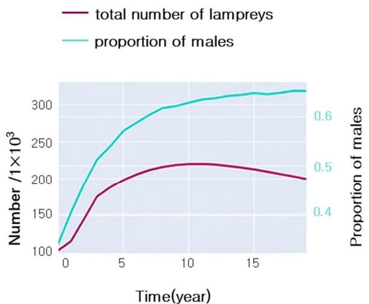

(a) Population changes of lampreys under conditions of sufficient food supply

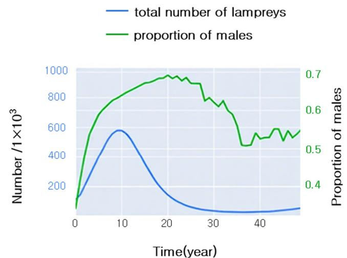

(b) Population changes of lampreys under conditions of insufficient food supply

Figure 5. Growth and sex ratio of lampreys under different conditions of food availability.

From Equations (6) and (7), we can obtain:

$$
P _ {m} \delta_ {2} N _ {2} - \delta_ {3} N ^ {*} - \mu_ {3} N _ {3} = P _ {f} \delta_ {2} N _ {2} - \delta_ {3} N ^ {*} - \mu_ {4} N _ {4} \tag {21}
$$

that is,

$$
P _ {m} = \frac {1}{2} \left(\frac {\mu_ {3} N _ {3} - \mu_ {4} N _ {4}}{\delta_ {2} N _ {2}} + 1\right) \tag {22}
$$

From Equation (11), we can obtain:

$$
x = \frac {f}{N _ {2}} = \ln \frac {a _ {2}}{b _ {2} \cdot N _ {2}} \tag {23}
$$

since  $x$  is one-to-one corresponding to  $P_{m}$ , when  $P_{m}$  remains constant, by analyzing the above equation, we can conclude that the fluctuation of  $P_{m}$  depends on  $\frac{\mu_3N_3 - \mu_4N_4}{\delta_2N_2}$ :

When  $\mu_3N_3 > \mu_4N_4$ ,  $P_{m}$  is greater than  $\frac{1}{2}$ .

When  $\mu_3N_3 < \mu_4N_4$ ,  $P_{m}$  is less than  $\frac{1}{2}$ .

When  $\mu_3N_3 = \mu_4N_4$ ,  $P_{m}$  is equal to  $\frac{1}{2}$ .

The proportion of hatchery and juvenile lampreys was large and similar, with the sum of the two exceeding  $80\%$ , and the ratio of males to females gradually decreased from an initial 3:1 to nearly 1:1, as depicted in Figure 6.

In summary, the complete population growth model of lampreys takes into account its life cycle stage pattern and sex determination mechanism and synthesizes the complexity and ecological dynamics of biological processes. Modifying the parameters of the model enables the forecasting of how various environmental scenarios and management strategies impact the lampreys' population composition and number. It can be seen that food sufficiency leads to an increase in the number of sea lampreys and eventually stabilization, and the male ratio increases and stabilizes, while food scarcity leads to a decrease in the number of sea lampreys and an increase in the male-to-female ratio followed by a decrease and a gradual tendency toward 1:1.

Furthermore, we set up two types of lampreys with identical conditions except for the trait of whether the sex ratio changed over time. First, we introduce two comparative indicators, including environmental resource utilization and reproductive success.

hatch

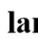

larval

male

female

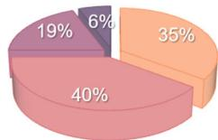

(a) In the 10th year

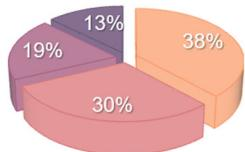

(b) In the 20th year

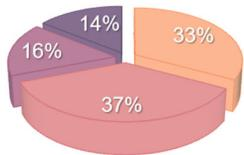

(c) In the 30th year

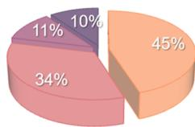

(d) In the 40th year

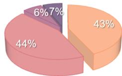

(e) In the 50th year

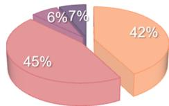

(f) In the 60th year

Figure 6. Age distribution of lamprey populations over time.

Environmental Resource Utilization  $\eta$ : the ratio of a population's number  $N$  to its environmental holding capacity  $K$ . We adopted Assumption 4.

Reproductive success (RS): the product of hatching success  $\gamma$  and mating success  $\delta_{3}$  in Equation (4).

The expression is as follows:

$$
\eta = \frac {N}{K} \tag {24}
$$

$$
R S = \gamma \cdot \delta_ {3} \tag {25}
$$

Figure 7 illustrates the variations in population sizes of two species over time under experimental conditions with the same initial sex ratio and initial age composition when sea lampreys with sex ratios that can change in response to the environment compete with sea lampreys with unchanging sex ratios.

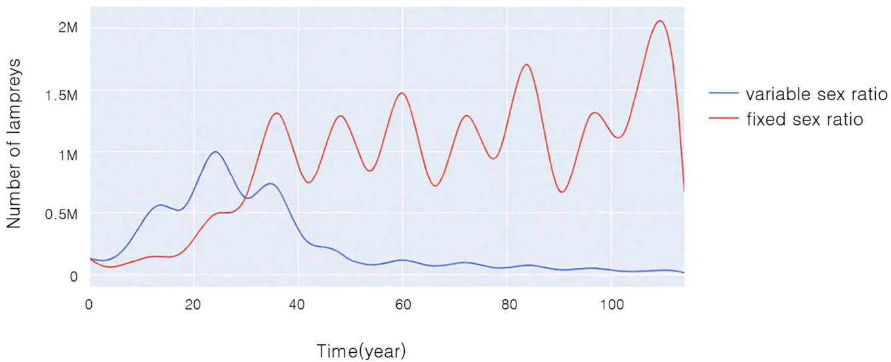

Figure 7. Changes in population size over time during competition between two populations.

From Figure 7, it can be seen that in the first 30 years, the population size of both lampreys tended to become larger, and the population size of sea lampreys with a variable sex ratio was significantly larger than that of those with a non-variable sex ratio. Thirty years later, the population size of sea lampreys with a non-variable sex ratio exceeded

that of those with a variable sex ratio, and gradually tended to be in dynamic equilibrium, whereas the population size of lampreys with a variable sex ratio gradually became smaller and smaller, approaching nearly extinct status.

Figure 8 compares the differences of the following indices between the two populations:

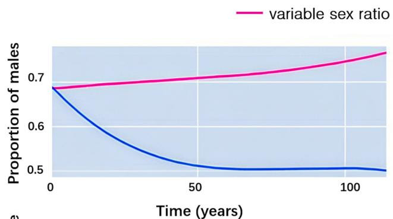

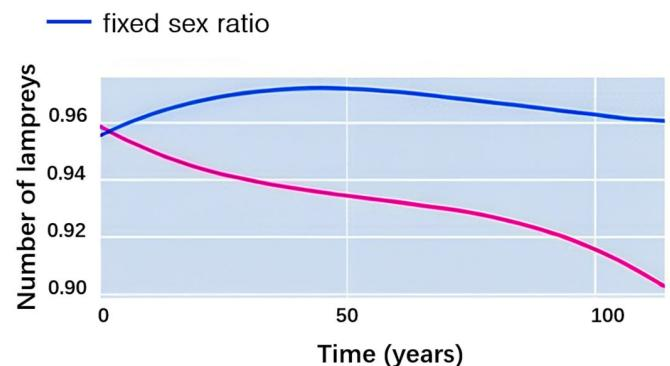

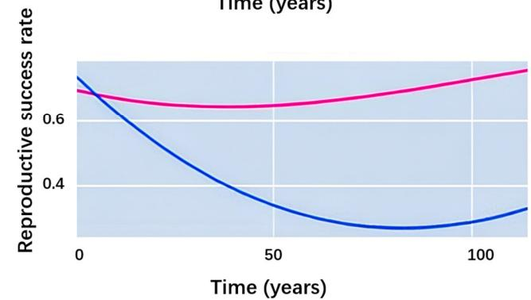

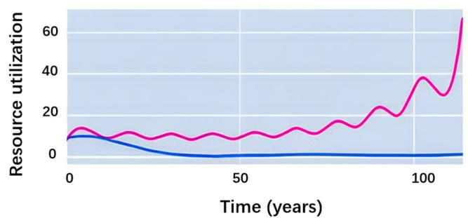

Figure 8. Changes in the percentage of males, percentage of juveniles, reproductive success, and resource utilization during competition.

Stability of population sex ratio: We set the initial male ratio of both lampreys to 0.7 and found that the male ratio of lampreys with an unchanged sex ratio gradually returned to normal, i.e., 0.5, while the male ratio of lampreys with a changeable sex ratio in the external environment was maintained at 0.7, with a tendency to increase.

Stability of age composition structure: For the juvenile ratio of both lampreys, we set the initial juvenile ratio of both at 0.96 and found that the juvenile ratio of lampreys with no change in sex ratio stayed at 0.96.

Reproductive success: Our finding indicates that the reproductive success rate of lampreys with an unchanged sex ratio gradually decreased, and the decrease was large, while the reproductive success rate of lampreys with a changeable sex ratio was maintained at about 0.7.

Environmental resource utilization: Regarding the resource utilization of the two species, it was found that the resource utilization of lampreys, which did not change their sex ratio, showed a decreasing trend and remained low for the first 20 years. On the other hand, the resource utilization of lampreys that can change their sex ratio following the external environment showed a significant upward trend, dynamically increasing from  $10\%$  to  $70\%$ .

From this, we can further conclude that the advantages of a variable sex ratio in lamp-prey populations include increased adaptability to environmental changes, the optimization of resource use, and reproductive success by adjusting the sex ratio.

We summarize the advantages and disadvantages of variable sex ratios in lamprey populations, and overall, if a population with variable sex ratios is allowed to compete with non-variable populations, it is not advantageous.

The advantages include increased resilience to environmental change by adjusting sex ratios to optimize environmental resource utilization and reproductive success. Within environments abundant in material resources, an increased number of females might promote swift population increase and proliferation. Such a mechanism may help populations to remain stable when environmental conditions change.

The disadvantage of this sex mechanism is that in resource-constrained and competitive environments, the population structure (composed of age composition and sex ratio) is unstable, and excessive bias toward one sex may lead to a reduction in genetic diversity. Over time, this could impact the population's survival and reproductive capabilities.

We speculate that fluctuations in sex ratios may have an impact on other species in the ecosystem, altering the existing balance of the food chain, which will be discussed in subsequent sections. The impacts on ecosystems are complex and multifaceted, and further research is needed to gain a deeper understanding of the long-term impacts of sex ratio fluctuations on ecological balance and other species.

