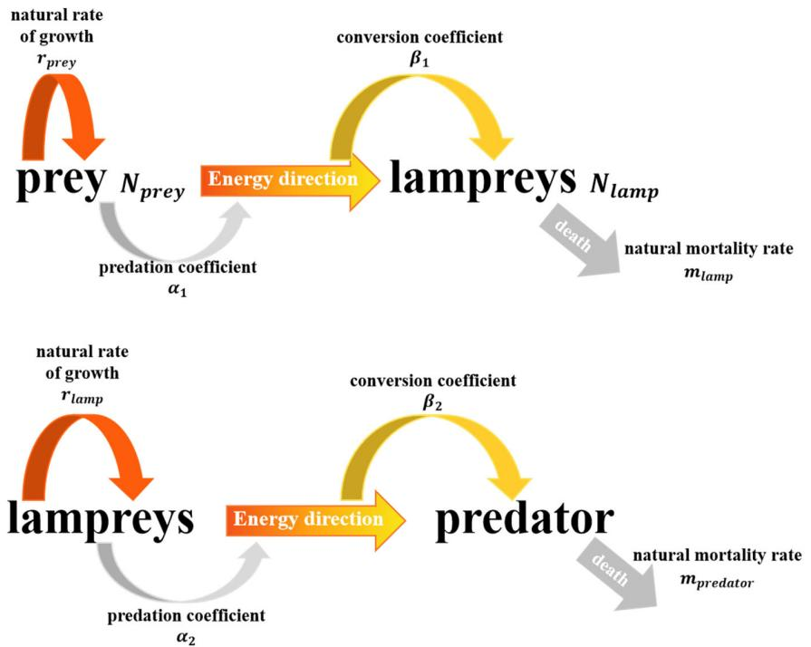
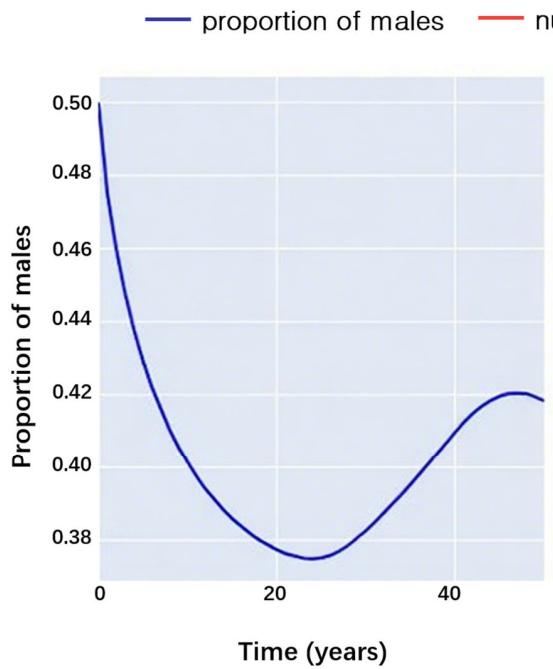
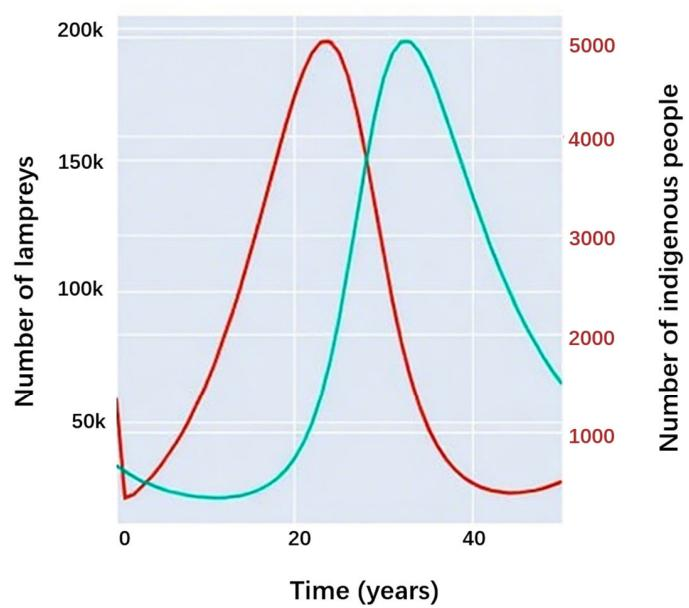
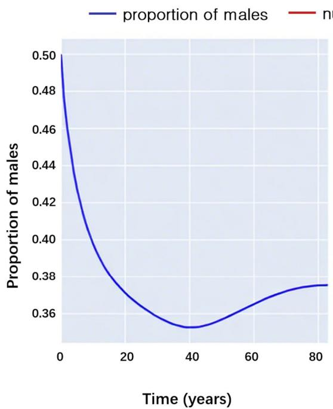
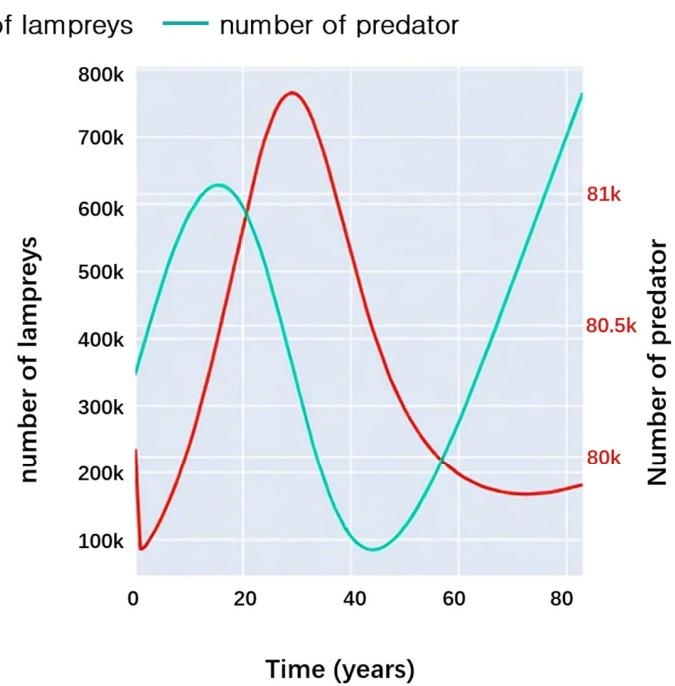
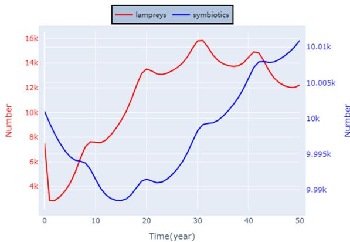
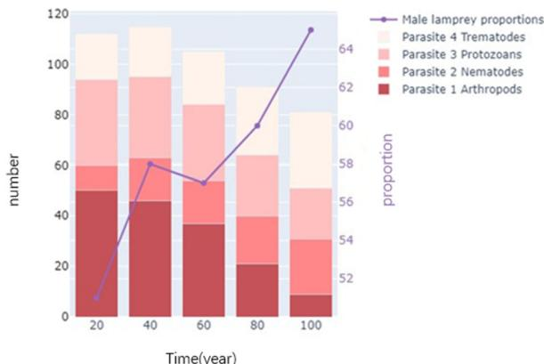
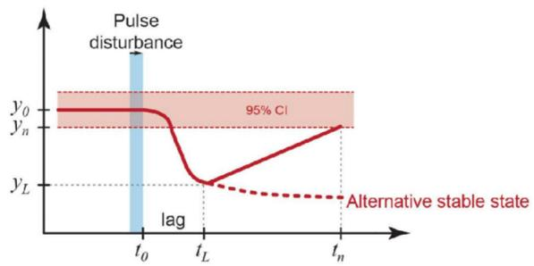
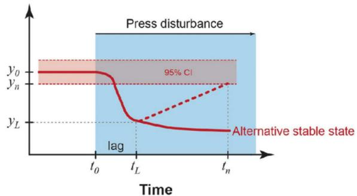

<!-- source: MinerU_markdown_applsci-15-07680_20260126133247_2015659158767026176.md; mode: auto->qex ; lines: 535-771 -->

# 4. Adaptive Sex Ratio Impact Model (ASRI Model)

In this section, we will first use the Lotka-Volterra equation to construct the predation and prey models of lampreys according to the different roles they play in different ecosystems. Subsequently, by conducting experimental simulations, we aim to examine how lampreys affect species both upstream and downstream within the communal food web.

# 4.1. Predation and Prey Model Based on the Lotka-Volterra Equation

The role played by lampreys in the ecosystem is complex, whereby larvae live at the bottom of freshwater streams and feed mainly on microorganisms and organic matter in filtered water, considered to be parasites that have a significant impact on the ecosystem. Adult lampreys may migrate to different waters, including freshwater and brackish environments, and adult lampreys turn into predators, feeding on small fish, invertebrates, and so on. Concurrently, lampreys serve as a food source in certain global areas, including Scandinavia, the Baltic Sea, and among indigenous communities in North America's Pacific Northwest. Therefore, we examine the role of lampreys as predators and prey in the food chain in the community separately. Figure 9 illustrates the varied functions of lampreys within the ecosystem dynamics.

Modeling of lampreys as predators

In this model, we assume that lampreys predominantly prey on a particular fish (the prey). Using the Lotka-Volterra equation [15], we can express this as:

Population growth equation for the prey(fish):

$$
\frac {d N _ {p r e y}}{d t} = \left(r _ {p r e y} - \alpha_ {1} N _ {l a m p}\right) \cdot N _ {p r e y} \tag {26}
$$

where  $N_{prey}$  is the number of prey,  $r_{prey}$  is its natural growth rate,  $N_{lamp}$  is the number of predators (lampreys), and  $\alpha_{1}$  is the predation rate coefficient.  $r_{prey}N_{prey}dt$  is the naturally increasing number, and  $\alpha_{1}N_{lamp}N_{prey}dt$  is the number of prey that are preyed upon. The quantity of prey being preyed upon is proportional to the number of prey and the predator, because only when predators and prey meet will predation occur.

Population growth equation for predator (lampreys):

$$
\frac {d N _ {\text {l a m p}}}{d t} = \left(\beta_ {1} \alpha_ {1} N _ {\text {p r e y}} - m _ {\text {l a m p}}\right) \cdot N _ {\text {l a m p}} \tag {27}
$$

where  $\beta_{1}$  is the transformation efficiency coefficient (the efficiency with which a preys transformed into a new individual of the predator) and  $m_{lamp}$  is the natural mortality rate

of the predator (lampreys).  $\beta_{1}\alpha_{1}N_{prey}N_{lamp}dt$  is the increase in the number of predators (lampreys) due to the hunting process. The additional coefficient in Equation (27) is because the predators may need to eat several times before they can produce new individuals, thus there is a transformation efficiency coefficient  $\beta_{1}$ .  $m_{lamp}N_{lamp}dt$  refers to the number of dead lampreys.

Figure 9. Number transfer relationships between lampreys as predator and prey.

Modeling of lampreys as prey

In another scenario, we can consider lampreys as the prey and some larger predatory fish or other aquatic animal as the predator. The model equations can be set up similarly to obtain the following system of equations:

$$
\left\{ \begin{array}{c} \frac {d N _ {\text {l a m p}}}{d t} = \left(r _ {\text {l a m p}} - \alpha_ {2} N _ {\text {p r e d a t o r}}\right) \cdot N _ {\text {l a m p}} \\ \frac {d N _ {\text {p r e d a t o r}}}{d t} = \left(\beta_ {2} \alpha_ {2} N _ {\text {l a m p}} - m _ {\text {p r e d a t o r}}\right) \cdot N _ {\text {p r e d a t o r}} \end{array} \right. \tag {28}
$$

where  $r_{lamp}$  is the natural growth rate of lampreys,  $\alpha_{2}$  is the predation rate coefficient, and  $N_{predator}$  is the number of predators.  $\beta_{2}$  is the transformation efficiency coefficient, and  $m_{predator}$  is the natural mortality rate of predators.

4.2. Results and Analysis of Modeling the Role of Sex Change in the Food Chain

We use the predator-prey model established previously, and the experimental results are shown and analyzed.

The first is an experimental simulation of a scenario in which lamppreys serve as prey, and the results obtained are shown in Figure 10.

The left picture of Figure 10 shows the trend of the male proportion of lampreys over time after predation, which corresponds to the trend of the seven-gill lampreys and predator populations over time shown in the right picture of Figure 10. It can be seen that, as the number of lampreys increases, the male proportion of the lampreys shows a gradual decline and the number of predators rises with a time lag; then, the increase in the number of predators results in a large number of lampreys being preyed upon. There was

a significant drop in lamprey populations and a rise in male lamprey numbers, and over time, predator numbers also fell swiftly due to reduced food availability.

Figure 10. Interactions between lamppreys and predators.

Subsequently, there was a simulated experiment where lampreys functioned as predators, with the outcomes depicted in Figure 11.

Figure 11. Interactions between lampreys and their prey.

The left panel of Figure 11 shows the trend in the proportion of male sea lampreys as predators over time, which matches the trend in the number of sea lampreys over time shown in the right panel of Figure 11. Moreover, it can be observed that as the number of prey increases, the proportion of males in sea lampreys gradually decreases, while the number of sea lampreys themselves rises. There is the same time lag, and then the increase in the number of sea lampreys leads to a large number of prey being preyed upon and a

sharp decrease in numbers, while the proportion of male sea lampreys rises. After a period of time, the number of prey also gradually increased due to the decrease in the number of sea lampreys.

In summary, we have experimentally obtained conclusions about the effects of variable sex in lamprey populations on the ecosystem. Changes in lamprey sex ratios have important effects on the food web, and changes in the sex ratio of lamprey populations indirectly affect species upstream and downstream of their food chain by altering reproduction rates and population sizes. For example, population growth due to an increase in the proportion of females may increase predation pressure on downstream prey species while providing more food resources for upstream predators when food conditions become more abundant.

In addition, population dynamics due to changes in sex ratios may affect other species, such as parasites and species in symbiotic relationships. These important effects will be discussed in the subsequent sections, and in the next section, we will examine their implications for ecosystem stability.

# 5. Sex Ratio Impact on Ecosystem Stability Model (SRIES Model)

In this section, we will first develop a simple logistic model of population growth. Subsequently, we refine the basic model by considering the life cycle stage traits and the sex differentiation variability among the sea lamprey population. Evaluate how this unique seven-gill trait impacts individual organism populations in the ecosystem where it has a distinct relationship, such as symbiotic or parasitic, and conduct both practical and experimental evaluations of the model's application and testing.

# 5.1. A Simple Logistic Model of Population Growth

In this case, we adopt Assumption 4. Additionally, the following four assumptions are made about the lamprey population in a given region:

1. Assumption 2: The effect of migration of lamprey individuals in and out of the population on population size is not considered.

2. Assumption 4: The carrying capacity of the environment in a given region is constant and does not change over time.

3. Assumption 5: The population is homogeneous and all individuals within the population are physiologically and behaviorally identical.

4. The population growth rate is constant, without considering the effects of changes in sex ratio and age composition.

We define the average number of lamprey species as  $N$ . According to the Logistic model, this number increases over time without exceeding the environmental carrying capacity  $K$ . We have

$$
\frac {d N}{d t} = r N \left(1 - \frac {N}{K}\right) \tag {29}
$$

where  $r$  is the intrinsic growth rate,  $K$  is the maximum average number of the species within the environmental limit, and  $\frac{dN}{dt}$  is the rate of change in population size over time.

However, practical application to lampreys as a population requires the consideration of hypothetical limitations, particularly in variable natural and artificial environments. Lampreys have a uniquely distinct three-stage life cycle, and sex ratios are influenced by food availability, so environmental carrying capacity is not constant in growing environments with variable food availability, which in turn leads to non-constant population growth rates by affecting age composition and sex ratios. At the same time, the contribution of lampreys of different sexes to the population is different because males or females show different sex dominance in environments with different food conditions [1,11].

# 5.2. Symbiotic Sex Ratio Dynamics Model (SSRDM)

The objective of this model is to analyze how changes in sex ratios within lamprey populations affect the dynamics of related populations in an ecosystem under symbiotic relationships. The model takes into account the interactions between the two populations and introduces a logistic growth function to simulate the self-limiting properties of population growth [16,17].

Growth modeling of population 1:

$$
\frac {d x _ {1}}{d t} = r _ {1} x _ {1} \left(1 - \frac {x _ {1}}{N _ {1}} + a _ {1} \frac {x _ {2}}{N _ {2}}\right) \tag {30}
$$

where  $x_{1}$  and  $x_{2}$  are the numbers of the two populations,  $r_{1}$  is the natural growth rate of population 1,  $N_{1}$  and  $N_{2}$  are the environmental carrying capacities of population 1 and population 2, respectively, and  $a_{1}$  is the coefficient of influence of population 2 on the growth of population 1.

Growth model for population 2:

$$
\frac {d x _ {2}}{d t} = r _ {2} x _ {2} \left(1 - a _ {2} \frac {x _ {1}}{N _ {1}} - \frac {x _ {2}}{N _ {2}}\right) \tag {31}
$$

where  $r_2$  is the natural growth rate of population 2 and  $a_2$  is the coefficient of influence of population 1 on the growth of population 2.

# 5.3. Host-Parasite Sex Ratio Dynamics Model (HPSRDM)

The purpose of this model is to help us understand how changes in sex ratios within host populations can affect the growth and spread of host populations, and how this interaction can, in turn, affect the health and number of host populations [18].

Modeling the growth of host populations:

$$
\frac {d H}{d t} = r _ {H} H \left(1 - \frac {H}{K _ {H}}\right) - \alpha P H \tag {32}
$$

where  $H$  is the number of host populations,  $r_{H}$  is the natural growth rate of the host,  $K_{H}$  is the environmental carrying capacity of the host,  $\alpha$  is the parasitism rate coefficient, and  $P$  is the number of parasitized populations.

Growth modeling of parasitized populations:

$$
\frac {d P}{d t} = \beta P H - \mu P \tag {33}
$$

where  $\beta$  is the transformation efficiency of the parasitized population to acquire new parasites from the host population and  $\mu$  is the mortality rate of the parasitized population.

# 5.4. Application and Analysis of Extended Models

We conducted experimental simulations of symbiotic and parasitic relationships associated with lampreys, respectively, and the results obtained are shown below.

As shown in Figure 12, we also explored salmonids that have a symbiotic relationship with lampreys to plot the number of interactions between them over time. It can be found that their population number changes are basically synchronized, which is consistent with the basic model of a mutually beneficial symbiotic relationship. However, a noticeable delay persists, given that their populations are simultaneously constrained by environmental capabilities.

Figure 12. Symbiosis of lampreys.

As shown in Figure 13, our model further explores four parasites that have parasitic relationships with lampreys, plotting their number over time at 20-year intervals. It can be seen that a gradual increase in the sex ratio of lamprey populations is accompanied by an increase in the number of Nematodes and Trematodes, in contrast to the changes in Arthropods and Protozoans. Thus, the proportion of males in lampreys is positively correlated with Nematodes and Trematodes.

Figure 13. Parasitism of lampreys.

In summary, sea lamprey populations provide an advantage to other species in the ecosystem, while there are only general symbiotic interspecific interactions with species in symbiotic relationships. Changes in sex ratios may affect the host selection and transmission strategies of parasites, as lampreys of different sexes may be different physiologically and behaviorally. This may affect parasite life cycles and spread rates, alter the dynamics of host-parasite relationships, and affect species diversity and stability in ecosystems. Models can be used to predict and develop strategies to control the spread of parasitized populations, especially when considering how to reduce parasitism pressure by managing host population sex ratios.

# 6. Variable Sex Ratio Ecosystem Interaction Model (VSREI Model)

This part delves into the impact of the sea lampreys on the entire ecosystem, modeling its stability via hierarchical analysis and examining the influence of sex ratio alterations on ecosystem stability.

# 6.1. Definition of Quantitative Indicators

Before conducting the hierarchical analysis, we first define several quantifiable indicators associated with ecosystem stability. The ecological definition of ecosystem stability

is mostly a combination of resistance stability and resilience stability, which is defined in the context of disturbance. Furthermore, our aim is to employ measures not related to disruptions but closely linked with stability, in conjunction with the initial two metrics, to thoroughly evaluate stability and consider the degree of community number fluctuation and the community structure robustness index. The definitions of each are given in Figure 14.

Figure 14. Examples of quantitative definitions of resistance and resilience from ecology.

# Resistance and Resilience

Cluster parameters have a mean and time variance of  $y_0$ , shown here by 95% confidence intervals around the mean. Impulse perturbations end at time  $t_0$  (or stress perturbations begin) and parameters change  $|y_0 - y_L|$  after a time lag  $|t_L - t_0|$  [19].

The resistance  $(RS)$  is an index of the magnitude of this change.

$$
R S = 1 - \frac {2 \left| y _ {0} - y _ {L} \right|}{y _ {0} + \left| y _ {0} - y _ {L} \right|} \tag {34}
$$

The resilience  $(RL)$  is an exponent of the rate of return to  $y_{0}$  after the lag period,

$$
R L = \left(\frac {2 \left| y _ {0} - y _ {L} \right|}{\left| y _ {0} - y _ {L} \right| + \left| y _ {0} - y _ {n} \right|} - 1\right) \div \left(t _ {n} - t _ {L}\right) \tag {35}
$$

where  $y_{n}$  is the value of the parameter at the measurement time  $t_{n}$ , which indicates the recovery after a certain period of time.

Degree of community number fluctuation and community structure robustness index

Assuming that there are  $k$  species in the community, the degree of fluctuation of the  $k$  species is weighted and summed, and the degree of fluctuation is measured by the population number variance. Then, the expression for the degree of fluctuation of the community is

$$
\sum_ {k} \operatorname {V a r} \left(N _ {k}\right) = \sum_ {k} \int_ {T} \left(N _ {k} - \overline {{N _ {k}}}\right) ^ {2} d t \div \int_ {T} d t \tag {36}
$$

where  $\overline{N_k}$  is the average number of species  $k$ , expressed as

$$
\overline {{N _ {k}}} = \frac {\int_ {T} N _ {k} d t}{T} \tag {37}
$$

The community structure robustness index refers to the weighted sum of the number of individual populations in the community, where the weighting coefficient is related to the contribution of the species in maintaining the stability of the community. The expression is

$$
Q = \sum_ {k} g _ {k} \cdot N _ {k} \tag {38}
$$

where  $g_{k}$  is the community structure coefficient.

