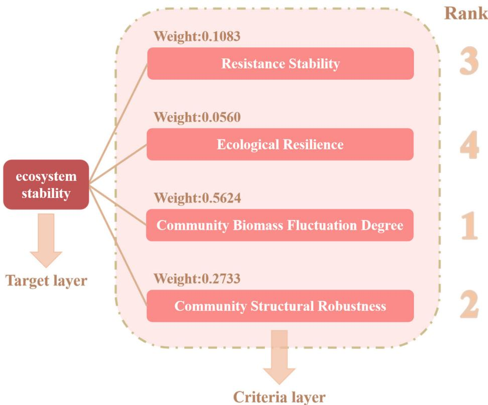
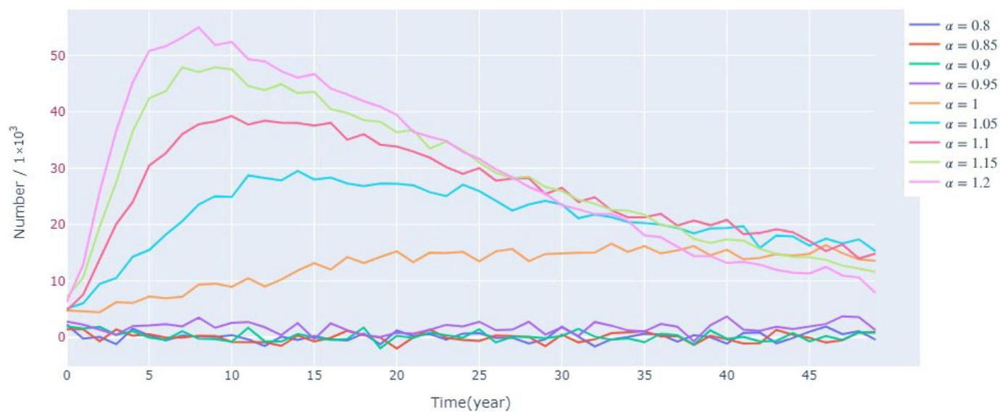
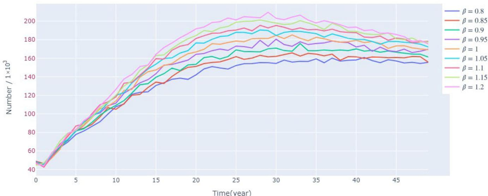

<!-- source: MinerU_markdown_applsci-15-07680_20260126133247_2015659158767026176.md; mode: auto->qex ; lines: 772-1027 -->

# 6.2. AHP-Based Ecosystem Stability Model

The Analytic Hierarchy Process (AHP) allows us to assess the impact of sex ratio changes on ecosystem stability by integrating four quantitative indicators into a comprehensive evaluation model. This approach allows us to identify the influences that are important for ecosystem stability by comparing and weighing different indicators.

Analyzing the impacts in pairs resulted in a judgment matrix derived from significance assessments.

$$
\left[ \begin{array}{c c c c} 1 & 3 & 1 / 6 & 1 / 4 \\ 1 / 3 & 1 & 1 / 7 & 1 / 5 \\ 6 & 7 & 1 & 3 \\ 4 & 5 & 1 / 3 & 1 \end{array} \right]
$$

In the aforementioned matrix, the initial row, second row, third row, and fourth row symbolize resistance, resilience, fluctuations in community number, and the robustness index of the community structure, respectively. Columns one, two, three, and four in the preceding matrix also symbolize resistance, resilience, fluctuations in community number, and the robustness index of community structure. The figures in the matrix symbolize the varied interrelations of significance across the parameters. We allocated values to the pairwise comparison matrix following our judicious assessment:

(1) Given RS's significance in short-term stability, it was deemed somewhat more crucial than RL, leading us to allocate a value of 3.

(2) RS was considered less critical compared to the robustness index, given that the system's long-term stability hinges more on its structural strength, leading us to allocate a value of  $1/6$ .

(3) RL was deemed marginally less significant compared to the robustness index, leading to a rating of 1/5.

We then need to check the consistency of the judgment matrix and evaluate it with a consistency ratio (CR). CR can be calculated by Equation (39).

$$
C R = \frac {C I}{R I} \tag {39}
$$

where  $CI$  is the consistency index and  $RI$  is the stochastic index.

$CI$  is calculated by Equation (40).

$$
C I = \frac {\lambda_ {m a x} - n}{n - 1} \tag {40}
$$

where  $\lambda_{max}$  is the maximum eigenvalue of the judgment matrix. The correspondence between n and RI can be obtained by looking up the table.

We then calculated  $\lambda_{max} = 4.1725$ ,  $CI = 0.0575$ ,  $CR = 0.0639 < 0.1$ . The check was passed, indicating that the judgment matrix we set earlier is reasonable and effective. The weights of each factor are shown in Figure 15.

Figure 15. Weight of each factor in the AHP-based model.

# 6.3. Analysis of the Impact of Sex Changes on Ecosystem Stability

We then conducted experimental simulations of lamprey populations with different sex ratios, applying the ecosystem stability model based on multilevel analysis developed in this chapter. The results from the experiments are displayed in Table 2.

Table 2. The results of the AHP-based ecosystem stability model.

<table><tr><td>Male Ratio</td><td>Stability</td><td>Resistance</td><td>Number</td><td>Variance</td><td>Total Score</td><td>Rank</td></tr><tr><td>0.30</td><td>0.74</td><td>1.00</td><td>0.10</td><td>0.36</td><td>0.23</td><td>5</td></tr><tr><td>0.40</td><td>0.47</td><td>0.10</td><td>0.59</td><td>0.08</td><td>0.40</td><td>4</td></tr><tr><td>0.50</td><td>0.47</td><td>0.57</td><td>0.60</td><td>0.59</td><td>0.58</td><td>2</td></tr><tr><td>0.60</td><td>0.10</td><td>1.00</td><td>1.00</td><td>0.10</td><td>0.62</td><td>1</td></tr><tr><td>0.70</td><td>1.00</td><td>0.57</td><td>0.26</td><td>1.00</td><td>0.56</td><td>3</td></tr></table>

Based on the final rankings, we found that the sea lamprey population had the most favorable impact on ecosystem stability when the male ratio was about 0.60. When the male ratio was about 0.30, the sea lamprey population had the worst impact on ecosystem stability.

In summary, changes in the sex ratio will affect the degree of community number fluctuation and community structural robustness index by influencing reproductive strategies and population number distribution in the ecosystem, which further impacts community resistance and resilience. Changes in the sex ratio of lamprey populations will directly affect the fluctuation of their population size, and may also affect the predation and prey relationship of lampreys, thereby affecting the balance of the whole food web. The stability of an ecosystem depends on the complex interactions between the species within it, and changes in the internal structure of any one population may cause a chain reaction that affects the health and functioning of the entire system. Briefly, adaptive changes in sex ratios may increase the resistance of ecosystems to environmental change, while at the same time affecting their resilience and internal stability, especially in the face of large-scale or long-term environmental perturbations.

# 7. Sensitivity Analysis

This paper is mainly based on the Runge-Kutta algorithm to solve the model of the system of differential equations corresponding to the population change in lampreys, and some of the parameters are approximations of the ideal state. Nonetheless, the situation tends to be more intricate, particularly in the case of lampreys, a distinct species whose gender is influenced by their growth rate. Therefore, the practicality, scientific validity, and stability of this model should be further considered.

Specifically, considering that the hatching success of lampreys is closely related to the environmental temperature as well as the amount of food, this test perturbed the temperature and the amount of food within a certain range. To evaluate the model's sensitivity, a comparison was made of the population trends of lampreys at various levels of disturbance over time.

Figure 16 shows the changes in the survival environment temperature of the lamprey population under different levels of disturbance. It can be found that in the short term, to a certain extent, the higher the temperature, the larger the population size and the more rapid the growth, while the lower the temperature, the smaller the population size and the slower the growth. The main reason is that the survival rate during the incubation period is closely related to the temperature, but in the long term, the difference in the size of different populations at the time of stabilization is relatively small. This also further validates the reasonableness of the present model, that when the external environment is suitable, the population size of lampreys is mainly limited by the environmental capacity.

Figure 16. Sensitivity of the model under the condition of applying different disturbances  $\alpha$  to the ambient temperature.

Figure 17 shows the variation of the lamprey population under different levels of disturbance of the living environment food. It can be found that the richer the amount of food, the larger the size of its population. However, following approximately 35 years of growth, the disparity among various populations becomes less pronounced.

Figure 17. Sensitivity of the model under the condition of applying different disturbances  $\beta$  to the survival environment food.

# 8. Conclusions and Discussion

Overall, we created a complex model, which contains the dynamics of the sex ratio and examines the effects of changes in the sex ratio on population and ecosystem stability. Through competitive modeling, we conclude that in resource-rich environments, changes in sex ratios can lead to rapid population expansion. However, in resource-limited environments, changes in sex ratios may lead to long-term reductions in the reproductive capacity of populations. Simulations also suggest that changes in the sex ratio of sea lampreys can help co-occurring species suppress overgrowth and adapt to complex environmental changes. In addition, the ecosystem was most stable when the male ratio was close to 0.6, and these findings provide useful guidance for developing ecological management strategies.

Previous studies by Zhuhua Ji et al. [20] did not portray how the sex ratio varies over time; however, our study clearly gives a picture of how the sex ratio varies over time under food shortage and sufficiency. Our research illustrates and validates that in shorter time cycles, females under restricted growth conditions face higher mortality because they require more energy for the development of reproductive organs [21], and the food-restricted group exhibits a higher male-to-female ratio. Over extended periods, changes in the sex ratio itself may affect the population as a whole, with a sharp decrease in population size, which in turn affects the amount of food available to individual sea lampreys, increasing the number of females. Alternatively, the sharp decrease in its population may have led to a specific sex-determination mechanism in the lampreys, making it more inclined to produce females to ensure the reproduction of the race. In addition, the numerical solution of the system of differential equations using the fourth-order Runge-Kutta method ensured the accuracy and stability of the model calculations, which provided reliable results for the complex ecological dynamics model. It was found that hatchery sea lampreys and juvenile sea lampreys accounted for a large proportion of the overall population size, with the sum of both exceeding  $80\%$ . This is most likely a protective mechanism for the organisms, breeding large numbers of eggs and larvae to cope with crises, adapt to nature, and ensure that there is a sufficient number of adult individuals.

In the sex ratio model, we focus on the characteristic changes in the sex ratio of sea lampreys with the external environment and simulate the external environmental parameters by introducing large fluctuations. Such an approach enhances the model's

adaptability, more accurately mirrors the unpredictability and extremity of the environment within the real ecosystem, and bolsters the model's accuracy. The decrease in males and increase in females resulted in increased survival pressure on downstream prey while providing sufficient food for their upstream predators. This suggests that sea lampreys and their upstream and downstream populations produce mutual constraints on the number of organisms through this predatory relationship. In contrast, changes in the sex ratio did not have a specific effect on the symbiotic organisms and only affected the behavior of a portion of the parasitic organisms. The findings of our research indicate that optimal ecosystem stability occurs with a male sex ratio of 0.6. In the future, we will likely be able to adjust the number of species and ensure ecological balance through this specific constraint relationship.

Our study still faces certain limitations, as we overlooked how the living conditions of sea lampreys influence their gender ratio, in contrast to various studies [1,22], indicating a strong correlation between sex determinants and their living environment. Furthermore, during the establishment of the two population competition models, the focus was solely on the variance in total food quantity, omitting the intricate alterations in the average physical quantity of fish. Changes in this index will be influenced by a wider range of factors and require more complex modeling.

The growth rate of sea lampreys determines their sex after maturity, and their growth rate is, in turn, influenced by the adequacy of their food supply, a conclusion that is amply supported by our study. The number of invasive lampreys is an important factor in the collapse of local fishery resources [23,24], and it is very important to realize the control of sea lamprey populations and study the mechanism of sea lamprey sex determination for the conservation of fishery resources.

Author Contributions: Conceptualization, H.L.; formal analysis, R.W.; funding acquisition, Y.L. and C.H.; investigation, C.H.; methodology, Y.L.; project administration, Y.L.; resources, H.L.; software, R.W.; validation, R.W. and H.L.; visualization, C.H.; writing—original draft, R.W.; writing—review and editing, Y.L. All authors have read and agreed to the published version of the manuscript.

Funding: This research was funded by the National Social Science Foundation of China (Grant No. 24BTJ068); the National Science Foundation of China (Grant No. 11701161); and the Humanities and Social Science Fund of Hubei Provincial Department of Education (Grant No. 22Y059).

Institutional Review Board Statement: Not applicable.

Informed Consent Statement: Not applicable.

Data Availability Statement: The original contributions presented in this study are included in the article. Further inquiries can be directed to the corresponding author.

Acknowledgments: We would like to express our sincere gratitude to the editor and reviewers for their valuable comments and suggestions, which greatly improved the quality of this manuscript. We also sincerely thank teachers for their guidance and support throughout the research process.

Conflicts of Interest: The authors declare no competing interests.

# References

1. Johnson, N.S.; Swink, W.D.; Brenden, T.O. Field study suggests that sex determination in sea lamprey is directly influenced by larval growth rate. Proc. R. Soc. B Biol. Sci. 2017, 284, 20170262.

2\. Elmhagen, B.; Ludwig, G.; Rushton, S.; Helle, P.; Lindén, H. Top predators, mesopredators and their prey: Interference ecosystems along bioclimatic productivity gradients. J. Anim. Ecol. 2010, 79, 785-794. [PubMed]

3. Smith, A.; Fulton, E.; Hobday, A.; Smith, D.; Shoulder, P. Scientific tools to support the practical implementation of ecosystem-based fisheries management. ICES J. Mar. Sci. 2007, 64, 633-639.

4\. Wikle, C.K. Hierarchical Bayesian models for predicting the spread of ecological processes. Ecology 2003, 84, 1382-1394.

5. Wang, F.; Luo, Y.; Zhang, W.; Yu, Y. A Decomposition-Based Stochastic Multilevel Binary Optimization Model for Agricultural Land Allocation Under Uncertainty. Mathematics 2025, 13, 1213. [CrossRef]

6\. Biau, G. Analysis of a random forests model. J. Mach. Learn. Res. 2012, 13, 1063-1095.

7. Fulton, E.A. Approaches to end-to-end ecosystem models. J. Mar. Syst. 2010, 81, 171-183.

8\. Lurgi, M.; Ritchie, E.G.; Fordham, D.A. Eradicating abundant invasive prey could cause unexpected and varied biodiversity outcomes: The importance of multispecies interactions. J. Appl. Ecol. 2018, 55, 2396-2407.

9. Fort, H. On predicting species yields in multispecies communities: Quantifying the accuracy of the linear Lotka-Volterra generalized model. Ecol. Model. 2018, 387, 154-162.

10\. Zhen, J.; Duan, J.; Zhao, Q.; Saheya, B. Effects of Gender Ratio Change on Lampreys Ecosystem. Math. Model. Its Appl. 2024, 13, 80-85.

11. Chang, M.-m.; Wu, F.; Miao, D.; Zhang, J. Discovery of fossil lamprey larva from the Lower Cretaceous reveals its three-phased life cycle. Proc. Natl. Acad. Sci. USA 2014, 111, 15486-15490. [PubMed]

12\. Hardisty, M.W.; Potter, I.C. The Biology of Lampreys; Academic Press: London, UK, 1971.

13. Hardisty, M.W. Biology of the Cyclostomes; Springer: London, UK, 1982.

14\. Li, C.; Sun, J.; Zhang, H. Introduction of Several Biological Population Models. Hans J. Comput. Biol. 2019, 9, 5.

15. Das, S.; Gupta, P. A mathematical model on fractional Lotka-Volterra equations. J. Theor. Biol. 2011, 277, 1-6. [PubMed]

16\. Zhang, H.; Wu, Y. The Symbiosis Evolution and Equilibrium in City Community Based on Logistic Model. Ecol. Econ. 2016, 32, 73-76+114.

17. Gao, H.; Li, X. Hopf Bifurcation of Predator Prey Symbiotic Model with Time Delay. J. Jilin Univ. (Sci. Ed.) 2023, 61, 1339-1350.

18\. Liu, H.; Li, Z.; Liu, Z.; Li, W. Complex non-unique dynamics in host-parasitoid model. J. Lanzhou Univ. (Nat. Sci.) 2009, 45, 53-59.

19. Shade, A.; Peter, H.; Allison, S.D.; Baho, D.L.; Berga, M.; Burgmann, H.; Huber, D.H.; Langenheder, S.; Lennon, J.T.; Martiny, J.B. Fundamentals of microbial community resistance and resilience. Front. Microbiol. 2012, 3, 417.

20\. Ji, Z.; Chen, J.; Wang, Z. A Study on Lampreys Population Based on Sex-Ratio-Related Growth-Balance Model. arXiv 2024, arXiv:2407.10411.

21. Beamish, F. Biology of the North American anadromous sea lamprey, Petromyzon marinus. Can. J. Fish. Aquat. Sci. 1980, 37, 1924-1943.

22\. Pyrzanowski, K.; Zieba, G.; Marszat, L.; Lesniak, M.; Banasiak, D.; Przybylski, M. Do Endangered Lampreys Benefit from Water Pollution? Effect of Municipal Sewage Treatment Plant Operation on Growth and Abundance of the Ukrainian Brook Lamprey and the European Brook Lamprey. Water 2025, 17, 494. [CrossRef]

23. Ferreira-Martins, D.; Champer, J.; McCauley, D.W.; Zhang, Z.; Docker, M.F. Genetic control of invasive sea lamprey in the Great Lakes. J. Great Lakes Res. 2021, 47, S764-S775.

24\. Goldsworthy, C.A.; Carl, D.D.; Sitar, S.P.; Seider, M.J.; Vinson, M.R.; Harding, I.; Pratt, T.C.; Piszczek, P.P.; Berglund, E.K.; Michaels, S.B. Lake Superior fish community and fisheries, 2001-2022: An era of stability. J. Great Lakes Res. 2025, 51, 102414.

Disclaimer/Publisher's Note: The statements, opinions and data contained in all publications are solely those of the individual author(s) and contributor(s) and not of MDPI and/or the editor(s). MDPI and/or the editor(s) disclaim responsibility for any injury to people or property resulting from any ideas, methods, instructions or products referred to in the content.