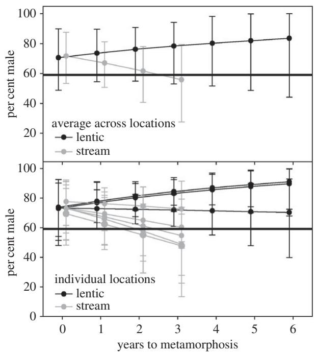

<!-- source: MinerU_markdown_rspb.2017.0262_20260126133236_2015659112688402432.md; mode: auto->qex ; lines: 1-115 -->

# Research

Check for updates

Cite this article: Johnson NS, Swink WD, Brenden TO. 2017 Field study suggests that sex determination in sea lamprey is directly influenced by larval growth rate. Proc. R. Soc. B 284: 20170262. http://dx.doi.org/10.1098/rspb.2017.0262

Received: 8 February 2017  
Accepted: 2 March 2017

# Subject Category:

Ecology

# Subject Areas:

ecology, environmental science, physiology

# Keywords:

sex ratio, sex determination, sex reversal, growth, condition factor, lamprey

# Author for correspondence:

Nicholas S. Johnson

e-mail: njohnson@usgs.gov

Electronic supplementary material is available online at https://dx.doi.org/10.6084/m9.figshare.c.3716293.

# THE ROYAL SOCIETY PUBLISHING

# Field study suggests that sex determination in sea lamprey is directly influenced by larval growth rate

Nicholas S. Johnson1, William D. Swink1 and Travis O. Brenden2

$^{1}$ US Geological Survey, Great Lakes Science Center, Hammond Bay Biological Station, 11188 Ray Road, Millersburg, MI 49759, USA

$^{2}$ Department of Fisheries and Wildlife, Michigan State University, Room 13 Natural Resources Building, East Lansing, MI 48824, USA

NSJ, 0000-0002-7419-6013; TOB, 0000-0002-4373-1503

Sex determination mechanisms in fishes lie along a genetic-environmental continuum and thereby offer opportunities to understand how physiology and environment interact to determine sex. Mechanisms and ecological consequences of sex determination in fishes are primarily garnered from teleosts, with little investigation into basal fishes. We tagged and released larval sea lamprey (Petromyzon marinus) into unproductive lake and productive stream environments. Sex ratios produced from these environments were quantified by recapturing tagged individuals as adults. Sex ratios from unproductive and productive environments were initially similar. However, sex ratios soon diverged, with unproductive environments becoming increasingly male-skewed and productive environments becoming less male-skewed with time. We hypothesize that slower growth in unproductive environments contributed to the sex ratio differences by directly influencing sex determination. To the best of our knowledge, this is the first study suggesting that growth rate in a fish species directly influences sex determination; other studies have suggested that the environmental variables to which sex determination is sensitive (e.g. density, temperature) act as cues for favourable or unfavourable growth conditions. Understanding mechanisms of sex determination in lampreys may provide unique insight into the underlying principles of sex determination in other vertebrates and provide innovative approaches for their management where valued and invasive.

# 1. Introduction

Mechanisms of sex determination in fishes can range from entirely genetic to entirely environmental, and their study provides opportunities for understanding how physiology and environment interact to determine sex [1,2]. Fishes can also exhibit environmental sex reversal, where factors such as social structure and rearing temperature can override the primary genotypic sex, and result in a reversal of phenotypic sex that is then generally fixed for life [2-4]. Environmentally triggered sex determination and reversals (herein termed sex determination) can lead to highly variable population sex ratios and are important when considering management tactics for valued, invasive, and hatchery-reared fishes [4,5].

Mechanisms and ecological consequences of sex determination in fishes are primarily garnered from teleost fishes, and are little studied in basal fishes such as Petromyzontiformes [1], despite their importance for comparative studies [6] and their increasing economic and cultural value [7]. The few studies on Petromyzontiformes suggest that environmentally triggered sex determination occurs and may be influenced by density. For example, prior to the initiation of large-scale efforts to control invasive sea lamprey (Petromyzon marinus) adult populations in the upper Laurentian Great Lakes (Lakes Superior, Huron,

© 2017 The Author(s) Published by the Royal Society. All rights reserved.

Michigan) were predominately male-biased (approx.  $65\%$  male). After control efforts reduced sea lamprey populations by  $90\%$ , adult sea lamprey populations became female-biased (approx.  $40\%$  male), even though there was no evidence that sexes differed in their vulnerability to control efforts [8-11]. Presently, sea lamprey populations are still suppressed to  $10\%$  of historic highs and the adult sea lamprey sex ratio in the Upper Great Lakes is estimated to be  $55\%$  male [12]. Populations of least brook lamprey (Lampetra aepyptera) also have widely varying sex ratios, with high-density populations being more likely to be male-biased than low-density populations [13]; sex-specific differences in mortality is not believed to contribute to the varying sex ratios [13,14].

Lamprey sex differentiation appears to be complete when larvae reach approximately  $90\mathrm{mm}$  [15]. However, some histological analyses of sea lamprey describe a large number of atypical gonads in larvae longer than  $90\mathrm{mm}$ , which could indicate a longer period of indeterminacy than previously thought [15] or even sex reversal [16,17]. Furthermore, gonadal biopsy experiments on sea lamprey found that in some cases sex could be labile until larvae reach  $140\mathrm{mm}$  and capable of changing in 8-16 weeks [18,19], although it is not yet clear whether sex change of larvae greater than  $90\mathrm{mm}$  occurs in natural populations. Once metamorphosis from the larval stage to the haematophagic parasitic stage begins, sex appears to be fixed through adulthood [19].

Although a hypothesis of environmentally triggered sex determination in lampreys has been supported by observational studies, the environmental triggers and physiological mechanisms are still unknown. Incidental to several other experimental studies [20-24], a serendipitous opportunity arose to evaluate sex ratios of adult sea lamprey produced from tagged sea lamprey larvae that were stocked in Great Lake tributaries and those stocked in the Great Lakes themselves near tributary mouths (herein termed lentic areas; electronic supplementary material, table S1). Prior to stocking the larvae, these areas were treated with selective pesticides (herein termed lampricide) to remove wild larvae [25]. As such, the density of larvae in both stream and lentic environments was likely similar and lower than most other streams and lentic areas in the upper Great Lakes. However, larval growth and metamorphosis differed between the stream and lentic environments; larvae stocked in lentic areas grew slower and metamorphosed at smaller sizes, presumably due to lower quality and quantity of food. Annual survival rates did not differ between the environments [22,24] (electronic supplementary material, table S2).

Given observed differences in growth and size at metamorphosis of the larval populations, but that larval densities were presumably similar and low, we conceptualized that evaluating the sex ratio of adults recovered from these two environments could reveal possible environmental triggers of sex determination in lampreys. Accordingly, our objective was to determine whether the sex ratio of adult sea lamprey produced from these populations differed from each other and the sex ratio of at-large untagged adult sea lamprey. Given the underlying hypothesis that sex determination is labile until metamorphosis into the parasitic stage [19] and is influenced by environmental conditions [8], we predicted that introduction of larvae into drastically different environments yielding different rates of growth and metamorphosis would result in the populations expressing different sex ratios at the adult stage. This study was unable to distinguish

between labile sex determination and sex reversal, so we combined the processes of sex determination and sex reversal together under the term sex determination. Many fishes may have labile sex determination, but not sex reversal [2].

# 2. Material and methods

Detailed descriptions of the collection, tagging, release locations, and recovery of sea lamprey used for this study have been published previously [22-24], so what follows is a brief general description of the overall approach and analysis of adult sex ratios.

Larval sea lamprey between 40 and  $140\mathrm{mm}$  were collected via electrofishing from tributaries to Lakes Huron and Michigan several months to one year prior to regularly scheduled lampricide treatments. As such, the larvae used for this study were previously located in productive streams that contained substantial numbers of larvae. These larval sea lamprey were then coded wire tagged (CWT) and released into tributaries of Lakes Huron and Michigan  $(n = 5)$  and into areas of Lakes Huron and Michigan near stream mouths  $(n = 3)$  between 2005 and 2007, after lampricide treatment (electronic supplementary material, figure S1). Between 1500 and 3000 larvae were released per tributary or river mouth. Tagged sea lamprey were recovered in the larval stage during subsequent larval surveys and lampricide treatments. Tagged sea lamprey surviving to adulthood were captured in traps operated in tributaries to Lakes Huron and Michigan. Population parameters associated with tag recovery including survival and metamorphosis probabilities have been previously published [22,24] (electronic supplementary material, table S2). Here, we report the sex of tagged sea lamprey recaptured in the adult stage as determined via visual inspection of the gonad while removing the tag. We also report the overall population sex ratio as determined by visual assessment of untagged adult sea lamprey captured during the same years and in the same traps as tagged sea lamprey [26].

A Bayesian hierarchical logistic regression model was used to estimate adult sea lamprey sex data for the different stream and lentic areas in which sea lamprey were stocked. Whether a tagged sea lamprey from a stream or lentic area captured as an adult in a particular year was male was modelled as a Bernoulli random variable with the probability of being male equal to

$$
\operatorname {l o g i t} (p _ {i, y} ^ {\text {t y p e}}) = \alpha_ {i} ^ {\text {t y p e}} + \beta_ {i} ^ {\text {t y p e}} \cdot y,
$$

where  $i$  indexes an individual stream or lentic area,  $y$  is the number of years after stocking that maturation occurs  $(0\leq y\leq 5)$ , type indexes whether a location is a river or lentic area, and  $\alpha_{i}^{\mathrm{type}}$  and  $\beta_{i}^{\mathrm{type}}$  are the location-specific intercepts and slopes, respectively, relating the probability of being male (on a logit scale) to  $y$ . Location-specific parameters were decomposed into type-specific population averages and location-specific deviations from the averages

$$
\alpha_ {i} ^ {\text {t y p e}} = \alpha_ {0} ^ {\text {t y p e}} + \delta_ {i} \quad \text {a n d}
$$

$$
\beta_ {i} ^ {\text {t y p e}} = \beta_ {0} ^ {\text {t y p e}} + \gamma_ {i},
$$

where  $\alpha_0^{\mathrm{type}}$  and  $\beta_0^{\mathrm{type}}$  are the type-specific population averages for the parameters and  $\delta_{i}$  and  $\gamma_{i}$  are location-specific deviations from  $\alpha_0^{\mathrm{type}}$  and  $\beta_0^{\mathrm{type}}$ , respectively. The following vague priors were specified for the model:  $\frac{\alpha_0^{\mathrm{type}}}{\beta_0^{\mathrm{type}}} \sim \mathrm{MVN}(0, \Sigma^{\mathrm{type}})$ ,

$\delta_{i}\sim N(0,\sigma_{\delta})$ $\gamma_i\sim N(0,\sigma_\gamma)$ $\Sigma^{\mathrm{type}}\sim$  Wish  $(2\times 2$  identitymatrix,3),  $\sigma_{\delta}\sim$  Unif (0,100), and  $\sigma_{\gamma}\sim$  Unif (0,100). The model was estimated using JAGS [27] executed from within R [28] using the R2JAGS package [29]. Three parallel chains, each with two million iterations, were run from overdispersed initialization values. The first one million iterations were discarded as a

Table 1. Per cent of the tagged adult sea lamprey that were male according to the environment they were stocked in. 'At-large' refers to adult sea lamprey without a tag that were captured in the same sea lamprey assessment traps from 2007 to 2014.

<table><tr><td>environment</td><td>n</td><td>% males</td><td>95% CI</td></tr><tr><td>lentic</td><td>171</td><td>79</td><td>73–85</td></tr><tr><td>stream</td><td>209</td><td>66</td><td>60–72</td></tr><tr><td>at-large</td><td>59 522</td><td>59</td><td>58–60</td></tr></table>

burn-in and every 100 [th] iteration was retained, resulting in a total of 30 000 saved samples across all chains. Chain convergence for each parameter was determined by examining trace plots, scale reduction factors, and posterior distribution plots. Effective sample sizes of the chains were also evaluated to ensure there was sufficient independent information for quantifying summary statistics of the saved chains. Medians of the saved Markov Chain Monte Carlo (MCMC) chains were used as point estimates for parameters and derived variables and  $95\%$  highest posterior density (HPD) intervals were used as measures of uncertainty for the point estimates.

# 3. Results

Overall, sex ratios of adult sea lamprey from the lentic, stream and at-large populations differed substantially (table 1; electronic supplementary material, tables S3-S5). Sex ratios of adult sea lamprey stocked as larvae in lentic and stream environments were biased towards males at a ratio of 3.8 males to one female in lentic areas and 2.3 males to one female in streams. Sex ratio of untagged adult sea lamprey captured from the same traps during the same years was 1.4 males to one female.

The population-average parameters relating probability of being male (on a logit scale) to number of years after stocking that maturation occurs for lentic areas were 0.876 (95% HPD: -0.142-2.037) and 0.122 (95% HPD: -0.325-0.577) for the intercept and slope, respectively (electronic supplementary material, Results). Conversely, for stream environments the population-average parameters were 0.930 (95% HPD: 0.048-1.826) and -0.236 (95% HPD: -0.726-0.236) for the intercept and slope, respectively. Based on these point estimates, the probability of being male in lentic and stream environments initially were similar (lentic environments = 71% (95% HPD: 49-90%; stream environments = 72% (95% HPD: 53-88%)). Whereas in lentic environments the probability of being male increased slightly over time, in stream environments the probability of being male decreased over time (figure 1). For sea lamprey that metamorphosed 3 years after stocking, per cent male was 78% (95% HPD: 53-94%) for lentic environments and 56% (95% HPD: 28-79%) for stream environments. From the saved MCMC iterations, we calculated how likely that the probability male would be greater in lentic versus stream environment. Initially after stocking, there was only a 48% chance that the probability of being male would be greater in lentic environments. One year after stocking there was a 73% chance that the probability of being male would be greater in lentic environments. For 2-6 years after stocking, the chance that the probability of being male would be greater in lentic versus stream environments ranged from 89 to 92%.

Figure 1. Predictions from the Bayesian hierarchical logistic model estimating per cent male of CWT adult sea lamprey according to where they were stocked (lentic versus stream) and the year after stocking in which metamorphosis occurred. The top panel shows population-average predictions whereas the lower panel shows predictions for individual locations. The horizontal line on each panel indicates per cent model of adult sea lamprey without CWT that were captured in the same traps from 2007 to 2014 as adults with tags.

Most individual lentic and stream locations exhibited relationships that were similar to the population averages. The only exception was that one of the lentic areas (Carp River) exhibited a decline in probability of being male over time, which was more in line with what was observed for stream environments (figure 1).

The saved MCMC chains for all parameters and derived variables from the estimated Bayesian hierarchical logistic regression model were judged to have converged on stable stationary distributions by all evaluated criteria. The lowest effective sample size for the saved MCMC chains for parameters and derived variables was 11000.

