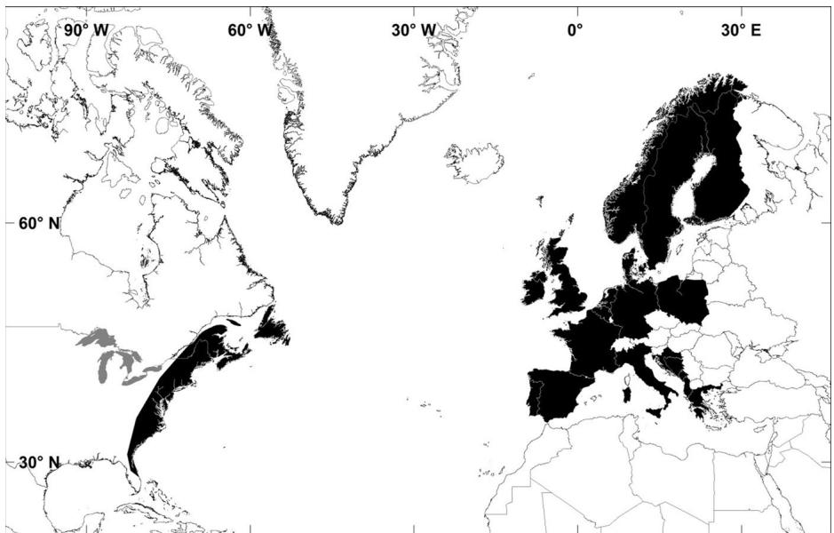
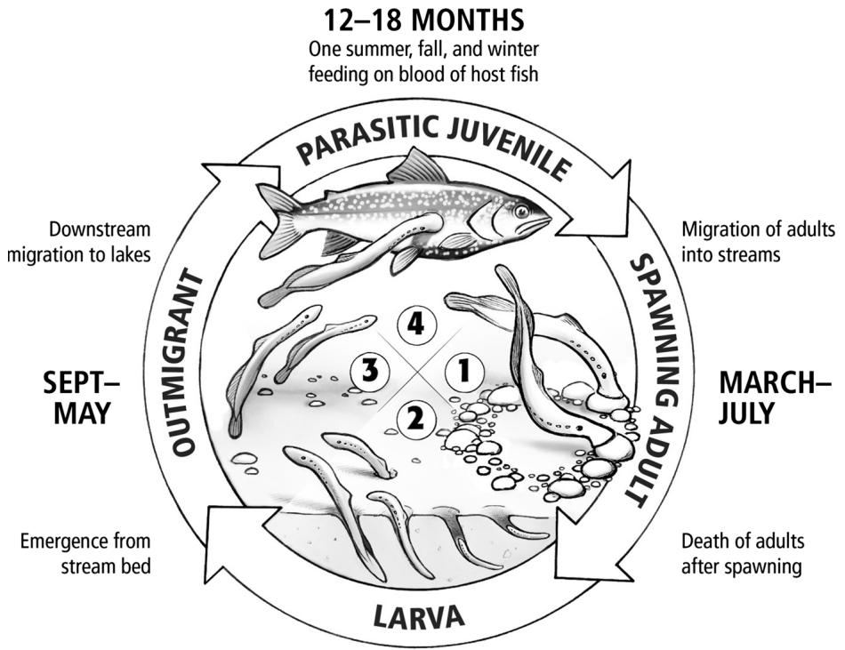
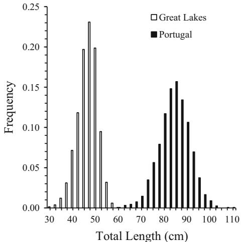

<!-- source: MinerU_markdown_s11160-016-9440-3_20260126133252_2015659179939876864.md; mode: auto->headings ; lines: 1-120 -->

REVEWS

# Population ecology of the sea lamprey (Petromyzon marinus) as an invasive species in the Laurentian Great Lakes and an imperiled species in Europe

Michael J. Hansen  $\cdot$  Charles P. Madenjian  $\cdot$  Jeffrey W. Slade  $\cdot$  Todd B. Steeves  $\cdot$  Pedro R. Almeida  $\cdot$  Bernardo R. Quintella

Received: 3 December 2015 / Accepted: 16 June 2016 / Published online: 22 June 2016  
© The Author(s) 2016. This article is published with open access at Springerlink.com

Abstract The sea lamprey Petromyzon marinus (Linnaeus) is both an invasive non-native species in the Laurentian Great Lakes of North America and an imperiled species in much of its native range in North America and Europe. To compare and contrast how understanding of population ecology is useful for control programs in the Great Lakes and restoration programs in Europe, we review current understanding of the population ecology of the sea lamprey in its native and introduced range. Some attributes of sea

Jeffrey W. Slade was retired from U.S. Fish and Wildlife Service, Ludington Biological Station, 229 S. Jebavy Drive, Ludington, Michigan 49431, USA.

M. J. Hansen (x)   
Hammond Bay Biological Station, Great Lakes Science Center, U.S. Geological Survey, 11188 Ray Road, Millersburg, MI 49759, USA   
e-mail: michaelhansen@usgs.gov

C. P. Madenjian  
Great Lakes Science Center, U.S. Geological Survey, 1451 Green Road, Ann Arbor, MI 48105, USA  
e-mail: cmadenjian@usgs.gov

J.W.Slade Ludington,MI,USA e-mail:17slade17@gmail.com

T. B. Steeves  
Sea Lamprey Control Centre, Fisheries and Oceans Canada, 1219 Queen St. East, Sault Ste. Marie, ON P6A 2E5, Canada  
e-mail: Mike.Steeves@dfo-mpo.gc.ca

lamprey population ecology are particularly useful for both control programs in the Great Lakes and restoration programs in the native range. First, traps within fish ladders are beneficial for removing sea lampreys in Great Lakes streams and passing sea lampreys in the native range. Second, attractants and repellants are suitable for luring sea lampreys into traps for control in the Great Lakes and guiding sea lamprey passage for conservation in the native range. Third, assessment methods used for targeting sea lamprey control in the Great Lakes are useful for targeting habitat protection in the native range. Last, assessment methods used to quantify numbers of all life stages of sea lampreys

P. R. Almeida  
Departamento de Biologia, Escola de Ciências e Tecnologia, MARE - Centro de Ciências do Mar e do Ambiente, Universidade de Évora, Largo dos Colegias, 7004-516 Evora, Portugal  
e-mail: pmra@uevora.pt

B. R. Quintella  
Departamento de Biologia Animal, Faculdade de Ciências, MARE - Centro de Ciências do Mar e do Ambiente, Universidade de Lisboa, Campo Grande, 1749-016 Lisbon, Portugal  
e-mail: bsquintella@fc.ul.pt

would be appropriate for measuring success of control in the Great Lakes and success of conservation in the native range.

Keywords Sea lamprey  $\cdot$  Population ecology  $\cdot$  Management  $\cdot$  Conservation

# Introduction

The sea lamprey Petromyzon marinus (Linnaeus) is both an invasive exotic species in the Laurentian Great Lakes of North America and an imperiled species in much of its native range along the north Atlantic coasts of North America and Europe (Fig. 1). In the Laurentian Great Lakes, the sea lamprey evidently invaded the Great Lakes from the Atlantic Ocean (Christie and Goddard 2003; Eshenroder 2014), and were first found in Lake Ontario in 1835 (although this date has been disputed by Eshenroder 2014), Lake Erie in 1921, Lake Michigan in 1936, Lake Huron in 1937, and Lake Superior in 1938 (Applegate 1950; Lawrie 1970; Smith 1979; Smith and Tibbles 1980; Smith 1985). By the 1950s, sea lampreys were abundant in all Great Lakes, where they imposed high mortality on nearly all teleost species, but especially the lake trout Salvelinus namaycush (Hansen 1999). Control of sea lamprey populations began in the 1950s, initially with mechanical and electrical barriers to upstream

migration, and later with a selective pesticide, 3-trifluoromethyl-4-nitrophenol (TFM; Smith and Tibbles 1980). Suppression of sea lamprey populations continues to rely on TFM, but was expanded to also include use of an integrated program of physical (barriers and traps) and biological (sterile-male releases) control methods (Christie and Goddard 2003), although sterile-male releases were suspended until further research could be completed to confirm its efficacy.

In its native range, the sea lamprey is considered threatened in France, Spain, and Portugal, European countries where the main populations are found, although the species is considered of Least Concern according to the International Union for Conservation of Nature (IUCN) Red List of Threatened Species, and the European Red List of Freshwater Fishes (Mateus et al. 2012). The sea lamprey is highly valued as a food fish where populations are large enough to be exploited (Quintella 2006), so commercial overfishing is a serious threat for the species in areas such as the Iberian Peninsula (Mateus et al. 2012) and elsewhere in Europe (Maitland et al. 2015). In general, however, the sea lamprey has declined over the last 25 years in Europe from a combination of (1) habitat loss associated with dam construction, (2) degradation of water quality from mining, industrial, and urban development, (3) direct loss of habitat by sand extraction and dredging, (4) overfishing, and (5) changes in water quality (temperature) and quantity

Fig.1 Worldwide distribution of native (black shading North Atlantic Ocean) and non-native gray shading Laurentian Great Lakes, North America) sea lamprey populations

associated with climate change (Mateus et al. 2012). To enable population recovery, lost or damaged habitat must be restored, while sustainably managing commercial fisheries (Mateus et al. 2012).

The purpose of this review is to synthesize and relate the state of knowledge concerning the population ecology of sea lamprey between Continents, to increase understanding of how knowledge of population ecology bears on control programs in the Great Lakes and restoration programs in Europe. First, current understanding of the life cycle is reviewed, including adult life stage, reproduction, larval life stage, metamorphosis, juvenile life stage, feeding, and effects on host species, pointing out when present differences between North American versus European populations and/or landlocked versus anadromous form. Second, implications for future status of the species are reviewed, including how global climate change will affect sea lamprey population ecology in the Great Lakes and Europe, which attributes of sea lamprey population ecology can be used to control populations in the Great Lakes, which attributes of sea lamprey population ecology can be used to restore and conserve populations in Europe, which attributes of sea lamprey population ecology are in need of further study for management of the species worldwide, and how understanding of population ecology bears on both control programs in the Great Lakes and restoration programs in Europe. For each topic below, we attempted to include information for both non-native populations in the Laurentian Great Lakes and native populations in Europe, although gaps in available information prevented complete coverage of all topics in both the Great Lakes and Europe.

# Overview

Lampreys have an unusual life cycle for a vertebrate because of a relatively long larval life stage and a relatively short adult life stage. A complete life cycle of a sea lamprey takes at least 4-5 years (range  $= 3 - 10+$  years), including 12-18 months (minimum of 14 months for anadromous populations) in the juvenile and adult life stage (Fig. 2). The long larval life stage, a disadvantage for most anadromous fishes because of increased risk of predation during this vulnerable period, is more beneficial than detrimental to the sea lamprey because larvae spend that period of

life burrowed in river sediments and are mostly sedentary. Osmotic, bioenergetics, and predation-exposure costs in moving between riverine and oceanic or lake ecosystems are compensated by a reduced predation on early life stages in riverine environments and access to greater trophic resources in marine or lake environments (Gross 1987). For the sea lamprey, in particular, richness of the marine or lake diet is measured not only in terms of numbers of potential host species and individuals, but also the size of parasitized species needed to sustain an adult sea lamprey.

Debate regarding the native or non-native origin of sea lampreys in Lake Ontario continues (Siefkes et al. 2013; Eshenroder 2014), but once established in the upper Great Lakes, sea lampreys spread rapidly to reproduce in  $\sim 500$  Great Lakes tributaries (Lake Superior  $= 161$ , Lake Michigan  $= 126$ , Lake Huron  $= 122$ , Lake Erie  $= 23$  and Lake Ontario  $= 66$ ). Following their invasion, sea lampreys spread rapidly throughout the five Laurentian Great Lakes and are now found in streams of Minnesota (Eddy and Underhill 1974), Wisconsin (Becker 1983), Michigan (Applegate 1950), Illinois (Smith 1979), Indiana (Gerking 1955), Ohio (Trautman 1981), Pennsylvania (Emery 1985), New York (Smith 1985), and throughout Ontario (Adair and Sullivan 2013). As evidenced by marking on host fishes, juveniles are distributed throughout open waters of all Great Lakes, and larvae are currently distributed in streams from eastern Lake Ontario to western Lake Superior.

# Adult life stage

Following completion of their 1-2 year-long marine trophic phase (Beamish 1980; Silva et al. 2013a, b), anadromous adult sea lampreys migrate upstream to river stretches where they build nests, spawn, and die (Larsen 1980; Moser et al. 2015). Passage from sea to fresh water is a stressful stage of migration, so adults use estuaries to acclimate from salt-water to freshwater osmoregulation (Bartels and Potter 2007). The spawning migration ranges from September to March along the east coast of North America (Beamish 1980); begins in December, peaks in February-March, and ends with spawning in April-June in Southwestern Europe Portuguese rivers (Almeida et al. 2000;

Fig. 2 Duration of and general habitat characteristics used by spawning adult, larval, outmigrating, and parasitic juvenile sea lamprey life stages in the Great Lakes (Great Lakes Fishery Commission)

3-10+ YEARS

Oliveira et al. 2004); and begins in February, continues through May-June, and ends with spawning between the end of May and early July in the Northwestern Europe Severn River, Britain (Hardisty 1986). Upstream spawning migration is triggered by flow variation and temperature, so increased migratory activity in periods of high discharge is likely a behavior adopted by sea lampreys to overcome difficult passage stretches to reach upstream spawning areas (Almeida et al. 2002a; Andrade et al. 2007; Binder et al. 2010). Regulated increased river discharge at night (i.e. hydropeaking) seems to stimulate lamprey movement, although reduced ground speed of upstream movement has also been observed (Almeida et al. 2002a).

Adult sea lampreys do not appear to home to natal streams (Bergstedt and Seelye 1995; Waldman et al. 2008; Swink and Johnson 2014), but rather, select spawning streams through innate attraction using other sensory cues (Sorensen and Vrieze 2003; Li et al. 2003; Vrieze et al. 2010, 2011). In the Great Lakes, adults from the same stream and cohort migrate into numerous streams throughout one or more of the Great

Lakes, and tagged juveniles have been recaptured as adults in streams more than  $400\mathrm{km}$  from their natal stream (Swink and Johnson 2014; Johnson et al. 2014; U.S. Fish and Wildlife Service, unpublished data). Mechanistic factors driving these movements are still unknown, although adults locate spawning streams using a three-phase odor-mediated strategy that includes searching a shoreline while casting vertically, followed by stream-water-induced turning toward a stream mouth, where they ascend using rheotaxis (Vrieze et al. 2011; Meckley et al. 2014). In the Great Lakes, adult sea lampreys are highly selective in the choice of spawning streams (Morman et al. 1980), and choose streams with high larval density (Moore and Schleen 1980), signaled by bile acid-based pheromones released by larvae (Bjerselius et al. 2000). Lack of homing is also evident from genetic studies of spawning migrants returning from the Atlantic Ocean (Bryan et al. 2005; Waldman et al. 2008). However, fatty acids and morphology of sea lampreys from major Portuguese rivers indicate that dispersion in the ocean may be limited, which suggests some degree of geographical fidelity when adults return from feeding

areas (Lanca et al. 2014). Further, absence of genetic exchange among sea lamprey populations spawning in the western and eastern Atlantic suggests adults do not intermingle (Rodriguez-Munoz et al. 2004).

Adult sea lampreys congregate at stream mouths from January through March each year, but the precise timing of upstream migration differs with latitude (Moser et al. 2015). In the Great Lakes, upstream migration of adults begins in March–April (Applegate 1950) when water temperature reaches  $\sim 15^{\circ}\mathrm{C}$  (Binder et al. 2010). In Europe, adult begin to migrate into streams in December–January, with the peak of migration in February–April, and spawning in April–May. Migratory activity is stimulated when water temperature increases daily, and is suppressed when water temperature decreases daily (Binder et al. 2010). Migration distance depends on river size, location of suitable spawning areas, and length of river stretches downstream of impassable barriers (Hardisty 1986). In Great Lakes streams without natural or man-made barriers, adult sea lampreys migrate more than  $100\mathrm{km}$  upstream. In the Iberian Peninsula,  $80\%$  of accessible sea lamprey habitat was lost by obstruction of lower stretches of all major rivers: historical available habitat in the main stretch of the larger rivers was  $516\mathrm{km}$  in the Douro,  $633\mathrm{km}$  in the Tagus,  $648\mathrm{km}$  in the Guadiana,  $394\mathrm{km}$  in the Guadalquivir, and  $680\mathrm{km}$  in the Ebro (Mateus et al. 2012). In Portugal, the present distribution of the sea lamprey is quite limited, with spawning areas located below impassable dams, with the upstream limit ranging between  $27\mathrm{km}$  (Cávado River) and  $150\mathrm{km}$  (Tagus River) (Almeida et al. 2002b; Mateus et al. 2012). In Britain, spawning habitat lies within  $10-100\mathrm{km}$  of the tidal limit (Hardisty 1986). Sea lampreys historically migrated upstream  $850\mathrm{km}$  in the Rhine River, Europe (Hardisty 1986) and  $320\mathrm{km}$  in the Delaware and Susquehanna rivers, North America (Bigelow and Schroeder 1948), until construction of the Conowingo Dam near the mouth of the Susquehanna in 1928 obstructed migration (Waldman et al. 2009).

Adult sea lampreys migrating upstream have ceased feeding, the digestive system has atrophied and is non-functional, and the sea lamprey invests remaining energy in gamete production, nest construction and spawning. Lampreys are negatively phototaxic, so move upstream in fresh water primarily during dusk and darkness (Almeida et al. 2000, 2002a) and seek refuge before dawn (Andrade et al. 2007). The adaptive

value of nocturnal behavior might be related to the greater protection afforded by darkness. When swimming through slow river stretches, adult sea lampreys can maintain constant activity at an average ground speed of 0.76 body lengths/s (Quintella et al. 2009), although typical swimming is at a ground speed of 0.2-0.4 body lengths/s (Andrade et al. 2007). Adults seek cool, well-oxygenated water with a unidirectional flow over rock, gravel, and sand substrate (Applegate 1950; Hardisty and Potter 1971b). Nests are typically constructed by males using their mouth to move stones, while flushing smaller particles from the nest with rapid body movements. Spawning pairs intertwine in the nest, and with a series of convulsions, release milt and eggs into the nest. Sea lampreys are semelparous, so they die shortly after spawning (Applegate 1950; Johnson et al. 2015a, b).

Mortality of adult sea lampreys prior to spawning is poorly understood, but has been observed (Applegate 1950), although dead carcasses observed in one stream may have been caused by spawning or chemostabilization (Hanson and Manion 1980). Natural mortality of adult sea lampreys introduced into two Lake Ontario tributaries ranged from 6 to  $30\%$  and mortality from predation ranged from 1 to  $11\%$  (O'Connor 2001). Mortality from predation, particularly on nest sites has been assumed to be relatively small, although predators could prevent successful spawning in streams with few adults (Applegate 1950; Morman et al. 1980). The Eurasian otter (Lutra lutra Linnaeus) commonly prey sea lamprey adults during spawning period with estimated predation rates around  $8\%$  (Andrade et al. 2007; Maitland et al. 2015). Emigration of adult sea lampreys introduced into streams ranged from 8 to  $49\%$  within a spawning season (Manion and McLain 1971; Hanson and Manion 1980; Kelso and Gardener 2000; Dolinsek et al. 2014). Depending upon their state of maturation, sea lampreys that emigrated from streams may die (Applegate 1950; Applegate and Smith 1951) or move to another stream to spawn (Dolinsek et al. 2014).

Lamprey can use their oral disc to attach to substrate and rest between bouts of swimming, a strategy referred to as "burst-and-attach" (Quintella et al. 2009). In areas of fast water velocity, a combination of intermittent burst swimming and periods of rest when attached to the substrate is characteristic behavior (Applegate 1950; Hardisty and Potter 1971b; Haro and Kynard 1997; Mesa et al.

2003; Quintella et al. 2004). This highly active swimming is the most energy-inefficient form of activity (Beamish 1978) and can only be achieved for short periods. Nevertheless, absence of a swim bladder to sustain neutral buoyancy (Hardisty and Potter 1971b) and less-efficient anguilliform propulsion used by lampreys (Webb 1978; van Ginneken et al. 2005) makes this pattern the most energetically conservative for overcoming rapid flow or man-made obstacles (Quintella et al. 2004).

Adult anadromous sea lampreys are larger in Europe than in North America, and exhibit latitudinal and temporal trends, with body size increasing from north to south, and length of spawners increasing from 1980 to 2005 (Beaulaton et al. 2008). In Europe, adults are the largest in Portugal (Beaulaton et al. 2008), where they averaged  $85~\mathrm{cm}$  in TL and  $1.2\mathrm{kg}$  in weight (Fig. 2). In North America, adult anadromous sea lampreys averaged nearly  $20\mathrm{-cm}$  shorter  $(66~\mathrm{cm})$  in the East Machias River, Maine (Davis 1967) and nearly  $15~\mathrm{cm}$  shorter in the Connecticut River  $(71~\mathrm{cm})$ , St. John  $(72~\mathrm{cm})$  River, and New Brunswick Rivers (Beamish and Potter 1975; Stier and Kynard 1986) than in Portugal. In the Laurentian Great Lakes, adult sea lampreys are even smaller, and averaged only  $48~\mathrm{cm}$  in TL  $(\mathrm{SD} = 4.5~\mathrm{cm})$  over all lakes (Fig. 3), with small variation among lakes Superior  $(44~\mathrm{cm};\mathrm{SD} = 4.2~\mathrm{cm})$ , Huron  $(48~\mathrm{cm};\mathrm{SD} = 3.9~\mathrm{cm})$ , Michigan  $(49~\mathrm{cm};\mathrm{SD} = 3.8~\mathrm{cm})$ , Erie  $(51~\mathrm{cm};\mathrm{SD} = 4.2~\mathrm{cm})$ , and Ontario  $(49~\mathrm{cm};\mathrm{SD} = 4.4~\mathrm{cm})$ .

Fecundity of landlocked sea lampreys, measured as the number of eggs per gram of body weight, ranged from 339 eggs/g for Lake Ontario populations (O'Connor 2001) to 670 eggs/g for a Lake Superior population (Manion 1972). This measure of relative fecundity depends on when gravid females are collected, because adult sea lampreys stop feeding, so females collected later in the spawning run expended more energy and body mass searching for mates and building nests. Consequently, wet weight is lower late in the spawning run, so the ratio of eggs to gram of body mass increases (Manion 1972). Absolute fecundity is proportional to sea lamprey size, so larger sea lampreys in Great Lakes with warmer water (Michigan, Erie, and Ontario) are more fecund than in Great Lakes with colder water (Superior and Huron, Sullivan and Adair 2014). Absolute fecundity is also related to diet quality, so female sea lampreys are more fecund in Lake Superior (67,000 eggs/female), with a

Fig. 3 Length-frequency distributions of adult sea lampreys caught during upstream spawning migrations in streams throughout the Laurentian Great Lakes basin, North America, 2000-2015 (N = 50,348; USFWS and DFO unpublished data), and in Europe (Portugal) in rivers Minho, Lima, Cávado, Douro, Vouga, Mondego, Tagus and Guadiana, 2000-2014 (N = 1580; Quintella et al. 2003)

large population of lake trout, than in Lake Huron (46,000 eggs/female) or Cayuga Lake (43,000 eggs/female), with fewer preferred prey (Manion 1972). This difference in absolute fecundity among lakes may be lower since the 1960s, because sea lamprey control continued to suppress sea lamprey populations while host populations increased (Heinrich et al. 1980).

In the Laurentian Great Lakes, lake-wide adult sea lamprey abundance has been a primary metric used to evaluate success of the bi-national sea lamprey control program since the late 1970s and early 1980s. Lakewide estimates are generated by summing estimates of adult sea lamprey abundance from tributaries that sea lampreys use for spawning. In streams with traps, stream-specific estimates are generated using mark-recapture or measures of trap efficiency. Estimates for streams without traps are generated using a model that incorporates five independent variables (Mullett et al. 2003). Since the onset of sea lamprey control in the Great Lakes, lake-wide estimates of adult sea lamprey abundance ranged from 261,000 in 1981 to 12,000 in 1994 in Lake Superior, 169,000 in 2004 to 29,000 in 1997 in Lake Michigan, 450,000 in 1993 to 42,000 in 1997 in Lake Huron, 33,000 in 2009 to 1700 in 2002 in Lake Erie, and 297,000 in 1982 to 23,000 in 1994 in Lake Ontario.

In Europe, abundance of the anadromous sea lamprey has rarely been measured or monitored, although abundance and exploitation of the population in the Garonne River basin in France, a river with one of the largest populations and fisheries for the species in Europe, have been estimated (Beaulaton et al. 2008). The average catch of sea lampreys from the Garonne basin was  $72\mathrm{t}$  ( $\sim 67,000$  individuals) during 1985-2003. Abundance, estimated using a generalized linear model (GLM) of catch per unit of effort (CPUE) during 1943-2000, peaked at  $10 - 15\mathrm{kg/day}$  (weighted average) in 1957-1965. From 1973 through the 1990s, abundance was stable at  $35 - 40\%$  of the maximum in 1957-1965. Since the end of the 1990s, abundance increased, and by 2000, reached abundance levels last observed in the 1960s. Portuguese rivers also support large populations of sea lampreys, but lack of good records from annual catches makes accurate estimation of population abundance difficult for most rivers. In the River Minho, northern Portugal, official records of landings dating back to 1914 show an increase in the number of sea lampreys caught by professional fisherman, with a peak in 2009 of about 60,000 specimens (Mota 2014). For the River Mondego, central Portugal, a professional fisheries survey in 2014 enabled an estimate of annual harvest of 30,000 individuals and a total estimate of 100,000 individuals that entered the river during the spawning migration (ICES 2014).

