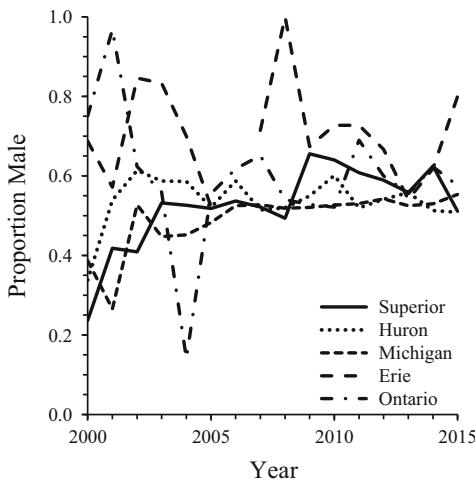

<!-- source: MinerU_markdown_s11160-016-9440-3_20260126133252_2015659179939876864.md; mode: auto->headings ; lines: 121-195 -->

# Reproduction

Physical factors essential for successful reproduction include steady, unidirectional water flow, and suitable sand and gravel (0.9-5.1 cm diameter) substrates, water velocity (0.5-1.5 m/s), depth (13-170 cm), and temperature (10.0-26.1 °C) (Manion and Hanson 1980). Nest building begins when water temperature warms to  $\sim 15^{\circ}\mathrm{C}$  (Applegate 1950). Nest construction is usually initiated by males, but females may initiate nest construction near the end of the spawning season when numerically dominant. Nest construction takes 1-3 days, with activity increasing after females join males (Applegate 1950). Mature spermiated males release a potent sex pheromone that induces preference and searching behavior in ovulated females ascending to upstream spawning areas (Li et al. 2002). On average, spawning lasts  $\sim 2 - 5$  s and is repeated

every  $4 - 5\mathrm{min}$  (see Johnson et al. 2015a, b for a thorough review of spawning behavior). Spawning activity is typically monogamous (Applegate 1950; Manion and McLain 1971; Hanson and Manion 1978, 1980), although polyandry may increase when the adult sex ratio is skewed away from 1:1 (Hanson and Manion 1978, 1980). Genetic evidence suggests that both polyandry and polygyny are widespread (Scribner and Jones 2002). In the upper Great Lakes, each female produces an average of  $\sim 60,000$  eggs, and fertilization and survival of eggs in the nest can be as great as  $90\%$  (Manion and Hanson 1980). Egg development depends on temperature (Piavis 1961) and hatching success typically averages only  $\sim 6.3\%$  (Manion 1968). After eggs incubate for about 2 weeks, pro-larvae emerge from the nest at night over a period of several weeks and range  $5 - 12\mathrm{mm}$  in length (Applegate 1950; Derosier et al. 2007).

# Larval life stage

After hatching, blind, poor-swimming larvae are carried downstream from nests to depositional areas of sand, silt, and detritus, where they burrow into soft sediments to feed on suspended organic matter (Sutton and Bowen 1994; Dawson et al. 2015). Dispersal from nests is highly variable and is influenced by larval density and water temperature (Derosier et al. 2007). Age-0 larvae can remain within a few hundred meters of the nest in their first year of life (Manion and McLain 1971), or they may move downstream after emerging to reduce density-dependent effects on recruitment (Derosier et al. 2007). Although larval sea lampreys seldom leave their burrows, some larvae move downstream spontaneously in response to hydrologic conditions or at night (Hardisty and Potter 1971a, b). Downstream movement is stimulated more in streams with higher gradient, particularly during periods of high water discharge (Quintella et al. 2005), which may lead to the observation of larger (older) larvae in the lower reaches of some streams where spawning habitat is limited (Hardisty and Potter 1971a, b; Quintella et al. 2003). Redistribution of larvae over short distances may result in burrowing in more suitable habitat (Hardisty and Potter 1971a, b; Yap and Bowen 2003). Depth of the burrow is directly correlated with lamprey size (Hardisty and Potter 1971a). Habitat selection, indexed as larval density, is

correlated with water velocity and substrate hardness (Thomas 1962). Age-1-and-older larvae are also known to migrate from silty substrates to locations with coarser substrates in summer, presumably as temperature increases and oxygen concentration declines in depositional areas (Sullivan 2003). Larvae are sensitive to light, and withdraw into burrows during daytime. Larvae remain burrowed for 3-5 years on average, and filter-feed on seston, diatoms, and biofilm (Sutton and Bowen 1994; Quintella et al. 2003). Larvae are able to move upstream against relatively slow currents  $(< 0.2\mathrm{m / s})$  (Quintella et al. 2005).

Overlap in habitat among lamprey species may lead to interspecific competition that affects survival and growth of sea lamprey larvae (Beamish and Lowartz 1996). For example, Northern brook lamprey (Ichthyomyzon fossor) select habitats that leads to higher-quality diet (Yap and Bowen 2003), and consequently, they may compete with sea lamprey larvae for resources. Year-class strength is driven by both density-independent and density-dependent forces, so environmental variation plays a large role in determining year-class strength that is not explained by adult abundance (Jones et al. 2003; Dawson 2007; Dawson and Jones 2009). Density-independent recruitment variation leads to occasionally strong year classes of larvae even when adult abundance is low (Jones et al. 2003). Strong year classes can be produced by adult density as low as 1.0 female/  $100\mathrm{m}^2$  of larval habitat, but evidently not at adult density sizes below 0.2 females/  $100\mathrm{m}^2$  (Dawson and Jones 2009). Therefore, control programs could aim to reduce adult female density to fewer than 0.2 females/  $100\mathrm{m}^2$  of suitable nursery habitat for recruits, and

conversely, recovery programs could seek to increase adult female density to more than 0.2 females/100 m² of nursery habitat for recruits.

Typical larval habitat is protected from major fluctuations in water levels or stream flow, where current velocity is slow. Such conditions are often found in eddies or backwaters at bends in a river, where soft silt and sand accumulate to provide suitable substrate for burrowing larvae (Table 1). Such habitat is often partially shaded, so diatoms often encrust the interface between silt and water, thereby contributing to stability of such microenvironments (Hardisty 1979). Most importantly, existence of suitable conditions for larval colonization depends on stream gradients that determine overall current velocity, the size of deposited substrate particles, and accumulation of organic debris (Hardisty and Potter 1971a). Suitable river substrate is essential for development of larval lampreys, to enable burrow construction and to maintain water flow (Hardisty 1979; Kainua and Valtonen 1980; Malmqvist 1980; Morman et al. 1980; Potter 1980; Young et al. 1990a, b; Kelso and Todd 1993; Beamish and Jebbink 1994; Ojutkangas et al. 1995; Beamish and Lowartz 1996; Sugiyama and Goto 2002; Goodwin et al. 2008). Larvae depend on unidirectional water flow through their branchial chamber, to provide detritus food and to exchange respiratory gases and metabolic wastes (Hardisty and Potter 1971a). Small larvae  $(20 - 60\mathrm{mm}$  TL) prefer small-grained substrate (silt-sand), medium-sized larvae  $(60 - 140\mathrm{mm}$  TL) prefer medium-grained substrate (gravel-silt-sand), and large larvae  $(140 - 200\mathrm{mm}$  TL) prefer coarse-grained sediments (gravelly-sand and sand) (Almeida and Quintella 2002; Sullivan 2003; Table 4). Small

Table 1 Habitat variables important for larval sea lamprey at different spatial scales (adapted from Dawson et al. 2015)

<table><tr><td>Variables</td><td>Study type</td><td>Source</td></tr><tr><td>Substrate (medium-fine sand)</td><td>Laboratory</td><td>Lee (1989)</td></tr><tr><td>Substrate (sand)</td><td>Field</td><td>Young et al. (1990a)</td></tr><tr><td>Substrate (silt-sand)</td><td>Field</td><td>Young et al. (1990b)</td></tr><tr><td>Substrate (sand)</td><td>Field</td><td>Almeida and Quintella (2002)</td></tr><tr><td>Substrate/distance from stream mouth/slope of the lake bottom</td><td>Field</td><td>Fodale et al. (2003)a</td></tr><tr><td>Substrate (sand/fine organic matter)</td><td>Field</td><td>Slade et al. (2003)</td></tr><tr><td>Geomorphic features (river slope – radius of curvature)</td><td>Field</td><td>Neeson et al. (2008)</td></tr><tr><td>Substrate (fine-medium sand)/water depth (&gt;2 m)/current (slow)/macrophyte roots</td><td>Field</td><td>Taverny et al. (2012)</td></tr></table>

a Lentic habitat

larvae are often found in fine-grained sediments, likely because soft sediments allow young larvae with reduced swimming capacity to propel their head and branchial region into the substrate (Quintella et al. 2007). In contrast, large larvae colonize a wider range of sediments because their ability to burrow is considerably higher (Quintella et al. 2007), and because they have had a greater amount of time to colonize multiple habitats (Sullivan et al. 2008). Because selection of sediment is size-dependent, differences in preference for distinct sediment types within the same age group may have resulted from larval redistribution at the end of each annual growing season, perhaps as a strategy to avoid high density in areas colonized by younger individuals to reduce intraspecific competition for space and food (Almeida and Quintella 2002). Larval distribution is also associated with slow current, although sediment particle size is strongly determined by current velocity, thereby confounding the relative importance of current and substrate particle size in determining larval distribution (Young et al. 1990b; Almeida and Quintella 2002).

Small-scale studies of larval lamprey habitat have been useful for developing a general understanding of the biology of lampreys. However, conservation and management of lamprey populations requires the ability to evaluate and predict spatial patterns in larval abundance at several scales (Torgersen and Close 2004). The evaluation of ecological patterns and processes at multiple scales may reveal causal factors that are important at one scale, but are less important or have an opposite effect at other scales (Torgersen and Close 2004). Studies of lamprey ecology in streams and rivers have addressed the interplay of macro- and micro-environmental factors as influences on larval distribution (Baxter 1957; Hardisty and Potter 1971a, b). Broad-scale distribution patterns of larval lampreys, including the juxtaposition of adult spawning habitat upstream of larval habitat, is related to variation in channel gradient within and among streams (Baxter 1957; Young et al. 1990a). For example, larval sea lamprey density varies longitudinally with channel gradient, and the influence of channel gradient on larval density increases with spatial scale (Torgersen and Close 2004).

Larval abundance is directly linked to environmental variables, but biological factors, such as the spawning distribution of adults, also plays an

important role in larval distribution (Torgersen and Close 2004). For example, larval distribution along a river is strongly associated with spawning areas, with larval density inversely related to distance downstream from spawning areas (Morman et al. 1980; Almeida and Quintella 2002; Quintella et al. 2003; Derosier et al. 2007). Similarly, adults must have access to spawning habitat, so the presence of migration barriers influences larval abundance and distribution (Goodwin et al. 2008). Last, metamorphosing lampreys are often found in the same sites where larvae of all sizes are found (Potter 1980; Quintella et al. 2003). During the initial stage of metamorphosis, transforming juveniles are relatively more sedentary than larvae (Quintella et al. 2005), whereas later on, juveniles burrow less, so are found hiding between pebbles, and under aquatic vegetation, rocks, and other structures (Dawson et al. 2015).

Prior to burrowing, larval mortality from predation is likely high (Potter 1980), although estimates of age-specific larval survival are limited by a lack of age estimates. Larval survival was  $96\%$  between age 1 and age 4 (Morman 1987), although this estimate was likely too high because caged larvae were protected from mortality (Johnson et al. 2014). In contrast, results from modeling studies have yielded estimates of much lower larval survival in streams of Lake Erie  $(39.5\%, \text{Irwin et al. 2012})$ , Lake Michigan  $(45\% \text{Jones et al. 2009})$ , and Lake Ontario  $(51.8\% \text{Irwin et al. 2012})$ . In the St. Marys River, estimates of survival have ranged from  $35 - 49\%$  (Haeseker et al. 2003) to  $66 - 91\%$  (Jones et al. 2012). Variability among estimates may reflect environmental conditions or uncertainty associated with using multiple parameters to simulate the response of sea lamprey populations to management actions with management strategy evaluation (MSE) models. Regardless, the wide range of survival estimates is consistent with a large range in variation of density-independent survival (Jones et al. 2003).

Larval sea lampreys hatch at  $\sim 9\mathrm{mm}$  in length, and growth depends on biotic and abiotic factors like population density and water temperature (Table 2; Morman 1987; Murdoch et al. 1992). In a Lake Ontario tributary, the first year class to infest a stream following lampricide treatment grew faster than subsequent year classes (Weise and Pajos 1998), which suggests growth was density dependent (Dawson et al. 2015). In the

Table 2 Minimum, maximum, and mean lengths of sea lampreys at larval (minimum and maximum only), recently metamorphosed juvenile, feeding juvenile (minimum and maximum only), and spawning adult life stages in the

Laurentian Great Lakes (landlocked form; USFWS and DFO unpublished data) and North American and European rivers draining to the Atlantic Ocean (anadromous form; Quintella et al. 2003; doi:10.1006/jfbi.2000.1465)

<table><tr><td rowspan="2">Life stage</td><td colspan="2">Total length (mm)</td><td rowspan="2">Mean</td></tr><tr><td>Minimum</td><td>Maximum</td></tr><tr><td>Laurentian Great Lakes—landlocked</td><td></td><td></td><td></td></tr><tr><td>Larvae</td><td>9</td><td>196</td><td></td></tr><tr><td>Recently Metamorphosed Juvenile</td><td>100</td><td>196</td><td>135</td></tr><tr><td>Feeding Juvenile</td><td>100</td><td>639</td><td></td></tr><tr><td>Spawning Adult</td><td>49</td><td>624</td><td>477</td></tr><tr><td>Europe—anadromous</td><td></td><td></td><td></td></tr><tr><td>Larvae</td><td>9</td><td>200</td><td></td></tr><tr><td>Recently Metamorphosed Juvenile</td><td>105</td><td>188</td><td>149</td></tr><tr><td>Feeding Juvenile</td><td>-</td><td>-</td><td></td></tr><tr><td>Spawning Adult</td><td>607</td><td>1113</td><td>853</td></tr></table>

River Mondego, Portugal, larval sea lampreys averaged  $59\mathrm{mm}$  in TL (range  $= 53 - 74\mathrm{mm}$ ) at age  $0+$  (<9 months post-hatch),  $95\mathrm{mm}$  in TL (range  $= 58 - 144\mathrm{mm}$ ) at age  $1+$  (9-21 months post-hatch),  $140\mathrm{mm}$  in TL (range  $= 93 - 179\mathrm{mm}$ ) at age  $2+$  (21-33 months post-hatch),  $166\mathrm{mm}$  in TL (range  $= 142 - 190\mathrm{mm}$ ) at age  $3+$  (33-45 months post-hatch), and  $184\mathrm{mm}$  in TL (range  $= 179 - 188\mathrm{mm}$ ) at age  $4+$  (>45 months post-hatch; Quintella et al. 2003). Larval growth is nearly  $0\mathrm{mm}$  in some years, and some individuals may stay 1 year in a river to accumulate fat needed to metamorphose (i.e. sometimes termed the "retarded growth phase"). Larvae from the River Mondego, Portugal, had shorter larval stage duration (Quintella et al. 2003) than in more northerly river basins, such as anadromous populations in Canada (range  $= 6 - 8$  years; Beamish and Potter 1975) and Great Britain (average  $= 5$  years; Hardisty 1969a, b), likely because higher productivity associated with warmer water enhances feeding efficiency and growth (Morman 1987). As expected for a poikilothermic organism, growth of sea lamprey larvae is correlated with water temperature (Potts et al. 2015), and varies among geographic regions with different climatic conditions, with faster growth in more favorable climates (Potter 1980; Dawson et al. 2015).

Age estimation of sea lamprey larvae, particularly in controlled populations, initially relied on analysis of length-frequency data (Table 3) but can be supplemented by knowing the number of years since known

recruitment (Weise and Pajos 1998; Hansen et al. 2003; Dawson et al. 2015). However, growth rates vary greatly within and among cohorts within stream populations, so age cannot be accurately assigned from length-frequency histograms (Dawson et al. 2009), especially for older age classes (Hardisty and Potter 1971a; Hardisty 1979). Statoliths, like otoliths in teleosts, are calcium carbonate structures that accumulate annuli for use in age estimation of sea lampreys (Volk 1986; Hollett 1998; Henson et al. 2003). Although statolith-based age estimates may be biased for sea lamprey larvae (Dawson et al. 2009), accurate estimates of age can be obtained by combining length-frequency information with a sample of bias-corrected statolith-based age in a statistical model of larval growth. Statolith-based age estimation is not reliable for populations that do not form cohesive statoliths (Barker et al. 1997) or for larvae that resorb statoliths (Lochet et al. 2013). In addition, age estimates vary greatly among readers (Dawson et al. 2009).

Although analysis of length-frequency distributions and statolith readings are the only method for estimating larval sea lamprey age, growth rate can be estimated with other methods, such as in situ cages (c.f. Malmqvist 1983; Morman 1987; Zerrenner 2004), laboratory growth experiments (c.f. Murdoch et al. 1992; Rodriguez-Muñoz et al. 2003), release of adult spawners into naturally inaccessible streams or stream reaches (Dawson et al. 2009), and surveys

within lampricide-treated streams in years following treatment (Griffiths et al. 2001). Use of in situ cages and laboratory methods to measure larval growth rate have been useful for assessing effects of factors such as density (Malmqvist 1983; Mallatt 1983; Morman 1987; Murdoch et al. 1992; Rodriguez-Muñoz et al. 2003; Zerrenner 2004) and temperature (Mallatt 1983; Holmes 1990; Rodríguez-Muñoz et al. 2001). Most such studies confirmed that larval growth was inversely related to larval density (Malmqvist 1983; Morman 1987; Murdoch et al. 1992; Rodriguez-Muñoz et al. 2003), although one study of larvae held for 1 year in  $0.16\mathrm{-m}^2$  circular cages suggested larval growth was independent of density (Zerrenner 2004). In the Great Lakes, larval sea lampreys are present in streams where winter water temperatures near  $0^{\circ}\mathrm{C}$  (USFWS and DFO unpublished data). Growth was highest in streams with mean annual water temperature of  $\sim 8^{\circ}\mathrm{C}$ , discharge of  $0.5 - 2.0\mathrm{m}^3/\mathrm{s}$ , and  $>300~\mu\mathrm{S}$  conductivity (Griffiths et al. 2001) and larvae reach a maximum length of  $196\mathrm{mm}$  in total length (Table 1). In Europe,  $8^{\circ}\mathrm{C}$  is close to the minimum temperature where the sea lamprey is present, and growth is highest in systems with higher average temperatures, with some larvae attaining  $190\mathrm{mm}$  in total length (Quintella et al. 2003).

Gonadogenesis in larval sea lampreys usually begins when larvae are  $40 - 60\mathrm{mm}$  TL and ages 1-2 and gonadal differentiation is usually complete when larvae are  $90 - 100\mathrm{mm}$  TL and ages 3-4 (Hardisty 1969a; Docker 1992; Wicks et al. 1998). Biotic and abiotic factors are thought to contribute to sex determination in lamprey species, such as larval density, temperature, pH, and when physiological resources are diverted into somatic growth, although mechanisms are not well established (Hardisty 1965a, b; Barker et al. 1998; Neave 2004; Dawson et al. 2015). In Great Lakes sea lamprey populations, selection pressure from pesticide application is implicated in sex determination (Smith 1971; Heinrich et al. 1980; Wicks et al. 1998). For example, males predominated in high pre-control sea lamprey populations (Smith 1971), with  $70\%$  males in Lake Superior and  $68\%$  males in lakes Huron and Michigan, whereas sex ratios shifted toward females after years of treatment, with only  $28\%$  males in Lake Superior and  $21\%$  males in Lake Michigan (Heinrich et al. 1980). A similar shift in the sex ratio in Lake Huron began before treatment reduced larval density,

and was as low as  $31\%$  males by 1975, likely because of environmental conditions and extremely low abundance of lake trout in the 1950s (Purvis 1979; Heinrich et al. 1980). Contemporary sex ratios have typically been  $50 - 70\%$  males in the Great Lakes (Fig. 4), although the increase in the proportion of males in Lake Erie in 2007 and 2008 corresponds to record-high abundance of adult lampreys in those years, despite consecutive years treating sea lamprey producing streams in 2008-2009 and 2009-2010. In French rivers, the sex ratio favors females for both exploited and unexploited rivers (Beaulaton et al. 2008). For North American anadromous sea lamprey populations, males typically outnumber females (Beamish 1980). Estimates of adult sex ratio are fraught with uncertainty, depending on sampling time and methods (see Johnson et al. 2015a, b).

Abundance of larval sea lampreys was estimated in most Great Lakes tributaries during 1995-2013 using quantitative assessment methods, which were generally greater than those estimated by mark-recapture (Slade et al. 2003; Hansen and Jones 2008; Dawson et al. 2015). Stream-specific estimates of abundance ranged from less than 50 to more than 6-million larvae. Larval abundance has also been estimated in small to mid-sized tributaries using mark-recapture techniques, with estimates ranging from 3,000 to nearly 2-million larvae (Steeves 2002; Hansen and Jones 2008). Estimates of maximum larval abundance in

Fig. 4 Proportion of adult male sea lampreys caught during upstream spawning migrations in streams throughout the Laurentian Great Lakes basin, North America, 2000-2015  $(\mathrm{N} = 50,348$  USFWS and DFO unpublished data)

Great Lakes tributaries currently infested with larval sea lampreys suggest that these streams are capable of producing nearly 69 million larvae, with 2.7 million in Lake Superior, 15 million in Lake Michigan, 22 million in Lake Huron, 0.5 million in Lake Erie, and 4.5 million in Lake Ontario.

