<!-- source: MinerU_markdown_3745533.3745748_20260126145107_2015678871962271744.md; mode: auto->bishe ; lines: 1-267 -->

Latest updates: https://dl.acm.org/doi/10.1145/3745533.3745748

RESEARCH-ARTICLE

# The Ecological Significance of Sex Ratio Regulation as an Adaptive Strategy in Lampreys

ZIXUAN WANG, Hefei University of Technology, Hefei, Anhui, China

PEISENG ZHANG, Hefei University of Technology, Hefei, Anhui, China

MOTONG LI, Hefei University of Technology, Hefei, Anhui, China

Open Access Support provided by:

Hefei University of Technology

PDF Download

3745533.3745748.pdf

Total Citations: 0

Total Downloads: 173

Published: 21 March 2025

Citation in BibTeX format

CAMMIC 2025: 2025 5th International

Conference on Applied Mathematics,

Modelling and Intelligent Computing

March 21 - 23, 2025

Shanghai, China

# The Ecological Significance of Sex Ratio Regulation as an Adaptive Strategy in Lampreys

Zixuan Wang*  
Hefei University of Technology  
Xuancheng, Anhui, China  
wangzixuan_hfut@163.com

Peiseng Zhang  
Hefei University of Technology  
Xuancheng, Anhui, China  
2021217927@mail.hfut.edu.cn

Motong Li  
Hefei University of Technology  
Xuancheng, Anhui, China  
2022216361@mail.hfut.edu.cn

# Abstract

Most species' populations are primarily composed of either male or female individuals, but the sex ratio is not always 1:1. This adaptive variation in sex ratios has been observed in many species, such as the American alligator and lampreys. The sex ratio of lampreys changes with environmental conditions. To understand the impact of sex ratio variation on the ecosystem and its components, this paper proposes three models:

1.Sex Ratio Study Based on the Logistic Model: This model explores how the environment influences the growth rate, which in turn affects the sex ratio of lampreys. The study quantitatively analyzes how sex ratios in lampreys populations change under varying levels of food availability. The results show that with increased food abundance, the proportion of females in the lampreys population increases, which helps improve reproductive rates and expand population size.

2.Population Dynamics Analysis Based on the LotkaVolterra Model:The interaction between lampreys and predators is modeled using ordinary differential equations (ODEs). Using the ode45 algorithm in MATLAB, population dynamics curves under different sex ratio gradients were constructed. The study analyzes how varying sex ratios impact the population dynamics between lampreys and their predators.

3. Comprehensive Indicator Analysis of Lampreys Populations: The Logistic model is expanded by introducing more variables, simulating the population's responses to various advantages and disadvantages under different sex-dominated scenarios through a random process. In a new scoring algorithm, the model undergoes multiple iterations, with the cumulative scores plotted in a bar chart to assess the effects of different sex ratios on the population.

The findings provide valuable insights into how sex ratio variations affect population dynamics and ecological interactions, contributing to our understanding of species adaptation strategies in changing environments.

# CCS Concepts

- Computing methodologies  $\rightarrow$  Modeling and simulation; Model development and analysis.

# Keywords

Lampreys, Sex Ratio,Logistic Model, Lotka-Volterra Model, Population Dynamics, Ecological Impact

# ACM Reference Format:

Zixuan Wang, Peiseng Zhang, and Motong Li. 2025. The Ecological Significance of Sex Ratio Regulation as an Adaptive Strategy in Lampreys. In 2025 5th International Conference on Applied Mathematics, Modelling and Intelligent Computing (CAMMIC 2025), March 21-23, 2025, Shanghai, China. ACM, New York, NY, USA, 7 pages. https://doi.org/10.1145/3745533.3745748

# 1 INTRODUCTION

The adaptive regulation of sex ratios in lampreys presents a critical ecological phenomenon with cascading impacts on population dynamics and ecosystem stability. As a parasitic species exhibiting environmental sex determination, sea lampreys (Petromyzon marinus) demonstrate remarkable plasticity in sex ratios under varying resource conditions. Notably, their dual ecological roles—as invasive disruptors in the North American Great Lakes and native components in Baltic food webs—highlight the urgency of modeling sex ratio-driven interactions. Current studies reveal that female-biased ratios under high food availability enhance reproductive output, whereas male dominance in resource-scarce environments may alter predation patterns. These dynamics necessitate quantitative frameworks to assess sex ratio effects on ecosystem resilience [1].

The sex ratio of lampreys (Lamprey) varies with environmental changes, and this dynamic variation in sex ratio may have profound impacts on ecosystems. This paper aims to investigate the effects of changes in lamprey sex ratios on their population size, survival ability, reproductive success, and ecosystem stability. Specifically, we address the following questions: 1) How do natural resources (e.g., food resources) influence the sex ratio of lampreys? 2) How do population dynamics between lampreys and predators change under different sex ratios? 3) How does the change in sex ratio affect the ecosystem services provided by lamprey populations? 4) How do changes in sex ratio influence the interactions between lampreys and their parasites?

To address these questions, we developed three main models: 1) a sex ratio variation model based on the Logistic model, used to study the impact of environmental resources on lamprey sex ratios; 2) a predator-prey relationship model based on the Lotka-Volterra model, used to analyze the population dynamics of lampreys and predators under different sex ratios; and 3) a composite indicator model, used to evaluate the impact of lamprey populations under different sex ratios on the ecosystem. Through these models, we reveal the ecological significance of changes in lamprey sex ratios and provide new insights into their adaptive strategies in ecosystems.

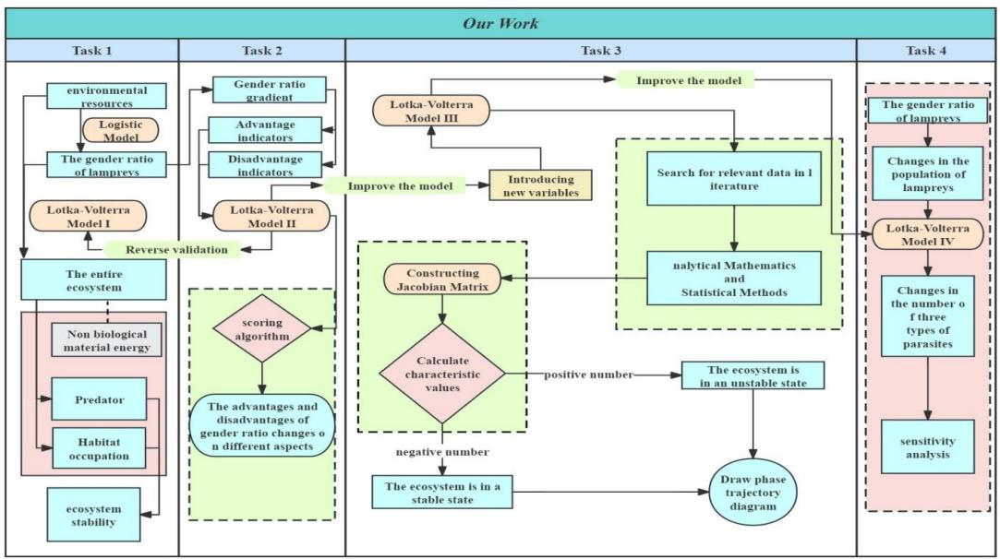

Figure 1: Our work.

# 2 The Advantages and Disadvantages of the Change in the Sex Ratio of the Tetra Population to Itself and Its Impact on the Larger Ecosystem

In the life cycle of lampreys, the sex determination mechanism is significantly influenced by the growth rate during the juvenile stage [2]. Individuals that grow faster are more likely to develop into females. This suggests that environmental resources play an important role in sex determination: when resources are abundant, the growth of lampreys accelerates, and the proportion of females increases.

This mechanism may be an adaptive response of lampreys to environmental changes, helping to optimize their survival and reproductive strategies, and offers a new perspective for understanding the biological mechanisms of sex determination. This section will use the Logistic model and Lotka-Volterra model to study the impact of the sex ratio of lampreys on the ecosystem. The model development approach is shown in Figure 1.

# 2.1 Modeling the effects of environmental resources on lamprey sex ratios

The Logistic model is commonly used in biology to describe population growth, but it can also be suitably modified to simulate changes in sex ratios. In this scenario, we assume that the availability of food resources directly affects the growth rate of larvae, which in turn influences the sex ratio. [3]

The equation of the Logistic model and the analytical expression of the model we constructed are as follows:

$$
\frac {d P}{d t} = r \cdot P \left(1 - \frac {P}{K}\right) \tag {1}
$$

$$
P (t) = \frac {K}{1 + \left(\frac {K - P _ {0}}{P _ {0}}\right) e ^ {- r t}} \tag {2}
$$

where:  $\mathrm{P(t)}$  is the male proportion at time t. K is the maximum possible value of the male proportion, based on the availability of food resources. r is the growth rate, reflecting the impact of food availability on the rate of change in the sex ratio. e is the base of the natural logarithm.

We simulated the changes in the sex ratio under two conditions: food scarcity and food abundance, displaying these changes through Figure 2.

# 2.2 Own advantages and disadvantages of changing sex ratios in lampreys

Changes in the sex ratio of lampreys in an ecosystem may affect their position in the food chain, competition and resource utilization, ecosystem stability, reproductive success, and other factors. We explored this by developing a Lotka-Volterra model.

2.2.1 Lotka-Volterra Model Foundation. The Lotka-Volterra model consists of the following two differential equations:

1.Female and Male prey population equation:

$$
\frac {d x _ {f}}{d t} = \alpha_ {f} x _ {f} - \beta_ {f} x _ {f} y \quad \frac {d x _ {m}}{d t} = \alpha_ {m} x _ {m} - \beta_ {m} x _ {m} y \tag {3}
$$

2. Predator population equations:

$$
\frac {d y}{d t} = \left(\delta_ {f} \beta_ {f} x _ {f} + \delta_ {m} \beta_ {m} x _ {m}\right) y - \gamma y \tag {4}
$$

Among them, xf and xm represent the number of female and male prey, respectively.  $\alpha f$  and  $\alpha m$  are the natural growth rates of female and male prey, respectively.  $\beta f$  and  $\beta m$  are the probabilities of female and male prey being preyed upon, respectively. y is the number of predators, and  $\delta f$  and  $\delta m$  are the energy conversion efficiencies for predators preying on female and male prey, respectively.  $\gamma$  is the natural mortality rate of predators.

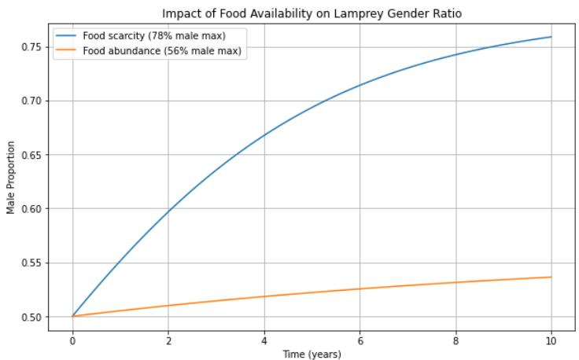

Figure 2: Impact of Food Availability on Lamprey Gender Ratio.

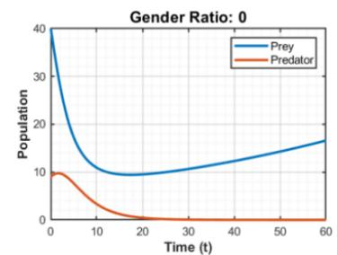

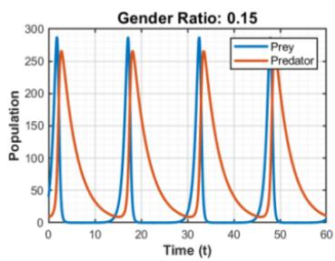

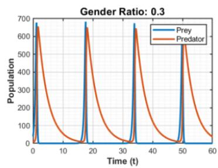

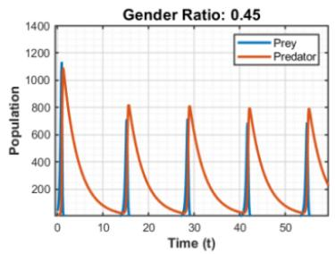

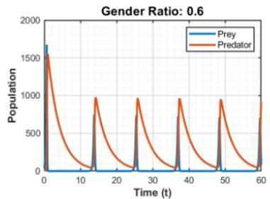

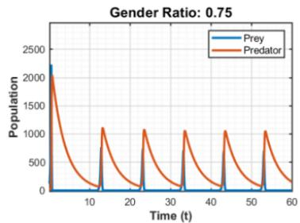

Figure 3: Population size relationships between lampreys and predators at different sex ratios.

The model predicts cyclical fluctuations in the populations, where an increase in prey leads to a rise in predators, and an increase in predators causes a decrease in prey, forming a cycle.

To solve Problem 1, we used the ode45 method in MATLAB, based on the Runge-Kutta algorithm, to solve the differential equation model of sea lamprey population dynamics. ode45 adapts the computational step size for accuracy and efficiency, facilitating the study of how resource availability impacts sex ratios and their effects on the ecosystem.

The simulation results from ode45 were further analyzed to examine population dynamics under different parameter settings, including the influence of sex ratio on reproductive capacity, resource competition, and predator-prey balance.

The simulation results from ode45 were further analyzed to examine population dynamics under different parameter settings, including the influence of sex ratio on reproductive capacity, resource competition, and predator-prey balance.

2.2.2 Modeling of the problem. Fluctuations in the sex ratio of lampreys in the ecosystem affect their position in the food chain, competition and resource utilization, ecosystem stability, reproductive success, and other factors. [4]

1.Dynamic adjustment of the food chain

Fluctuations in the sex ratio of lampreys in the ecosystem have an important impact on their role in the food chain. At different sex ratios, lampreys exhibit different dietary habits and behavioral patterns, leading to adjustments in the structure of the food chain.

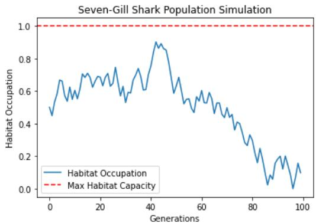

Figure 4: Seven-Gill Shark Population Simulation.

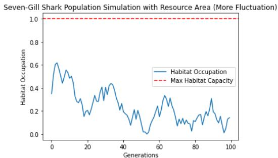

Figure 5: More Fluctuation.

Such changes have the potential to affect the survival and reproductive strategies of other species, which in turn affect the balance of the entire ecosystem.

As shown in Figure 3, the model constructed six subplots showing the population dynamics of the sea lampreys and predator population size relationships between the sea lampreys and the predator when the sex ratio was on a gradient, with periodic fluctuations in the numbers of both under most sex ratio conditions, suggesting that the system maintains a relatively stable dynamic equilibrium under these conditions. However, under some sex ratios, there was no apparent periodic relationship between prey and predator populations, suggesting that the system may exhibit unstable dynamics under these conditions.

# 2. Habitat Utilization

To analyze the habitat occupancy, a mathematical model was used to simulate the changes in the lamprey population's habitat occupancy over a certain number of generations. The model is based on several simplified assumptions and uses a random process to simulate changes in the sex ratio.

$$
O _ {i} = C O _ {i} = C x _ {i} \tag {5}
$$

$$
x _ {i + 1} = x _ {i} + \text {r a n d} (- 0. 1, 0. 1) \tag {6}
$$

$$
x _ {i + 1} = \max  (0, \min  (1, x _ {i + 1})) \tag {7}
$$

The results show the changes in habitat occupancy of the lamprey population over a certain number of generations, considering the

impact of the sex ratio. The sex ratio fluctuates randomly each generation, affecting the habitat occupancy level, which is determined by the current female proportion and the total habitat capacity (set to 1.0, representing maximum capacity).

In Figures 4 and 5, the blue line represents the habitat occupancy at different generations. This occupancy fluctuates over time, likely due to changes in the sex ratio and/or other ecological factors. The red dashed line represents the maximum habitat capacity, which is not exceeded in the simulation, suggesting that the population size is limited by habitat capacity. Initially, habitat occupancy fluctuates significantly but remains generally high. However, after about 40 generations, occupancy shows a continuous decline, possibly indicating a long-term decrease in population size or a reduction in habitat quality.

3.Ecosystem stability

Ecosystem stability Solved by modeling with Lotka-Volterra model.

By setting up four sets of species numbers of prey (lampreyss) and predators, as well as six sex ratios, a plot of the phase trajectory between prey and predators is shown, as presented in Figure 6.

Population cycling: each subplot shows periodic fluctuations between predator and prey numbers, which is typical of the Lotka-Volterra model. This cycle shows that population numbers rise and fall over time, reflecting predator-prey interactions in nature.

Different starting conditions: each subplot contains trajectories under different starting conditions, showing different possible evolutionary paths of the system. The initial size of the population affects the dynamic behavior of the system, including the size and duration of the cycle.

Effect of natural growth rate: as the natural growth rate  $\alpha$  increases, the prey population grows faster. This may lead to faster population size fluctuations and may increase the instability of the system.

The sex ratio of prey is critical to the stability of the food chain because it directly affects key ecological processes such as reproduction, behavior, and resource use. However, accurately assessing the effects of sex ratio also requires the direct incorporation of sex-related ecological and behavioral factors into the model, so the model remains to be optimized.

# 3 Changes in the sex ratio of lamprey populations, implications for ecosystem stability

In the life cycle of lampreys, the sex determination mechanism is significantly influenced by the growth rate during the juvenile stage. Individuals that grow faster are more likely to develop into females. This suggests that environmental resources play an important role in sex determination: when resources are abundant, the growth of lampreys accelerates, and the proportion of females increases. [5] This mechanism may be an adaptive response of lampreys to environmental changes, helping to optimize their survival and reproductive strategies, and offers a new perspective for understanding the biological mechanisms of sex determination. This section will use the Logistic model and Lotka-Volterra model to study the impact of the sex ratio of lampreys on the ecosystem. The model-building approach is as follows:

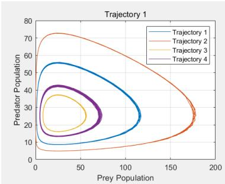

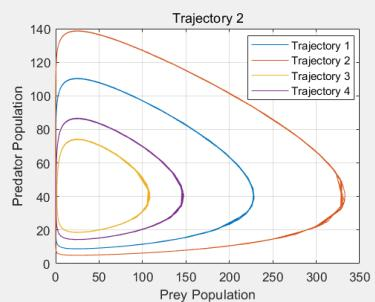

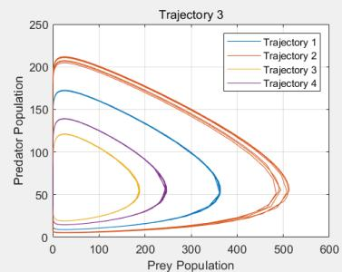

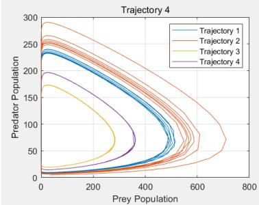

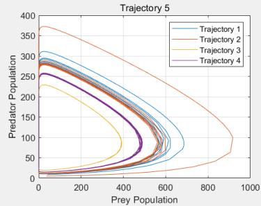

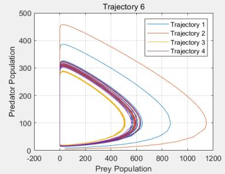

Figure 6: The phase trajectory diagram of prey and predator.

