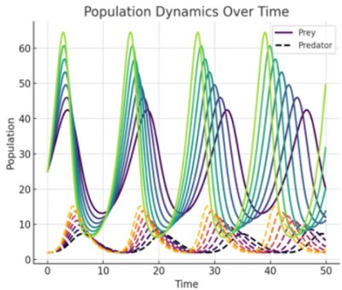
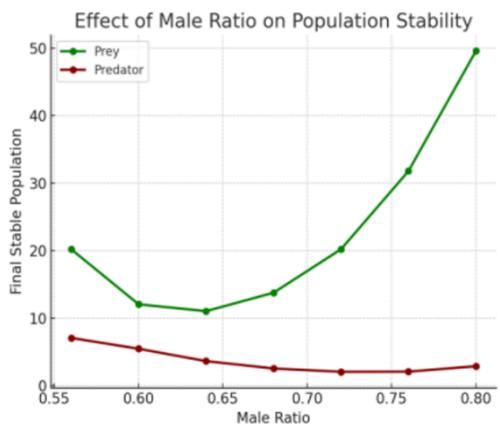
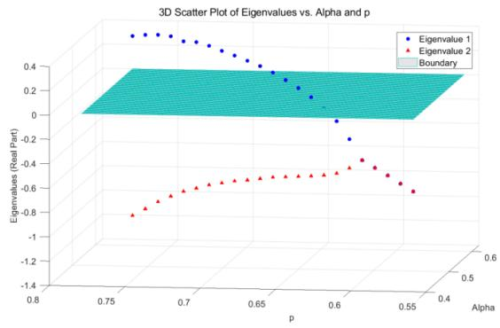
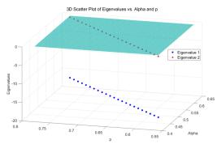
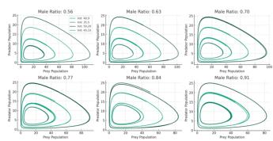
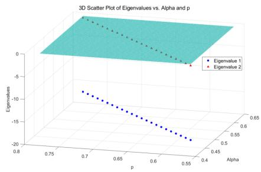
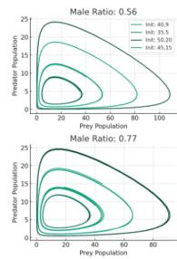
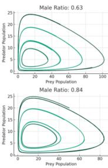
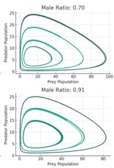

<!-- source: MinerU_markdown_3745533.3745748_20260126145107_2015678871962271744.md; mode: auto->bishe ; lines: 308-420 -->

# 3.2 Specific problem solving

For the binary population system that only considers lampreys (as prey) and their natural enemies (predators), the population dynamic curves were plotted based on the Lotka - Volterra model (Figure 7). In the figure, the line colors from dark to light correspond to the change in the male ratio from 0.55 to 0.80. Figure 8 illustrates the

Figure 7: Population Dynamics Over Time.

Figure 8: Effect of Male Ratio on Population Stability.

curve of the final stable average population size of the binary population varying with the sex ratio, visually presenting the stability change trend.

Population dynamic patterns: From the figure, it can be observed that as the male ratio increases, the population sizes of sea lampreys and predators exhibit periodic fluctuations, indicating that changes in the sex ratio have not led to significant phase differences between sexes or a dominance of a single sex. The fluctuations in the predator population lag behind those of the sea lamprey population, suggesting that predator numbers are primarily driven by food resources (prey abundance) rather than being directly influenced by the sex ratio.

Stability threshold: After the ratio  $>0.70$ , the stability gradually weakens.

We also constructed the Jacobian matrix and plotted the model in Figure 9.

The 3D plot illustrates the relationship between the male ratio (p), the natural growth rate (Alpha), and the real part of the eigenvalue. Assuming a linear relationship between Alpha and p, the results show that when  $\mathrm{p} > 0.65$ , the real part of the eigenvalue shifts from

Figure 9: 3D Scatter Plot of Eigenvalues vs. Alpha and p.

Figure 10: 3D Scatter Plot of Elgenvalues vs. Alpha and p.

negative to positive  $(\mathrm{Re}(\lambda) > 0)$ , indicating that the system enters an unstable state.

Expanding the model to a ternary population system consisting of sea lampreys, prey, and predators, simulations using the Jacobian matrix revealed that both eigenvalues are less than  $0\left(\mathrm{Re}(\lambda) < 0\right)$ . This indicates that when the food chain remains intact, the negative impact of the sex ratio on ecosystem stability is relatively small, as shown in Figure 10 and Figure 11.

According to the analysis of the phase diagram, the above conclusion can also be drawn.

# 4 Conclusions

The dynamic regulation of sex ratios in lampreys serves as a critical adaptive strategy to environmental changes. Key findings include:

1. Resource-driven sex ratios: Increased food abundance elevates female proportions, enhancing reproductive efficiency, while male dominance under resource scarcity destabilizes predator-prey dynamics (system instability occurs when male ratio  $>0.70$ ).

2. Dual ecological effects: Female-biased ratios boost reproduction but intensify resource competition, whereas male-biased ratios reduce short-term predation pressure but elevate long-term instability risks (male ratio  $>0.65$  marks a stability threshold).

3. Practical implications: Models quantify sex ratio-mediated feedback mechanisms in population dynamics, offering theoretical support for invasive species management, though environmental heterogeneity must be integrated to refine predictions.

Future studies should explore linkages between sex determination mechanisms and ecological functions, validating model applicability in complex environments. This work provides a novel framework for understanding adaptive strategies and ecosystem resilience.

Figure 11: The phase trajectory diagram of prey and predator.

# Acknowledgments

Zixuan Wang & Peiseng Zhang & Motong Li contributed equally to this work and should be considered co-first authors.

# References

[1] Li, Sinuo, Kaiqi Hu, and Wenshu Hou. "Dynamics of Lampreys Populations: Unraveling Ecological Mysteries and Gender Ratio Adjustments." Advances in Engineering Technology Research 12.1 (2024): 995-995.

[2] Zhai, Mingming, et al. "Discussion on the effect of sex ratio change in lamprey." Theoretical and Natural Science 48 (2024): 88-99.

[3] Bijman, Vincent. "The Sea Lamprey (Petromyzon marinus) Invasion: The Construction of an Invasive Animal Threatening a "Healthy" Great Lakes Ecosystem." Journal of the History of Medicine and Allied Sciences (2025): jrae046.

[4] Huang, Yiwei, and Zhetong Zhao. "Sex Ratio Dynamics of Lamprey Populations: Implications for Ecosystem Stability and Conservation." BIO Web of Conferences. Vol. 142. EDP Sciences, 2024.

[5] Tan, Ningxin. "Resource-Dependent Sex Ratios in Lampreys: Implications for Ecological Stability and Economic Impact." E3S Web of Conferences. Vol. 573. EDP Sciences, 2024.

