<!-- source: MinerU_markdown_2025年美赛A题完整论文—郭老师_20260125140854_2015305855361236992.md; mode: auto->bishe ; lines: 1-462 -->

# 揭开楼梯磨损的秘密

# 摘要

楼梯磨损度的研究可用于考古学中的遗址保护、材料分析和年代推算，通过磨损分析、修复策略和人流模式研究，帮助考古学家更好地理解和保护古代遗址。本文分析了楼梯的磨损情况，重点关注了不同人流量和使用方式对台阶磨损的影响，针对考古学需求提供了建模。

首先，本文通过结构光扫描仪对楼梯表面进行了详细的测量，收集了关于使用年限、人流量、材料特性等数据，并生成了热力图进行可视化。使用了阿基米德磨损模型来计算材料的磨损速率，考虑了接触力、滑动距离等因素，并进一步分析了上下楼的不同受力情况，其中上楼的等效用力为1.1倍体重，下楼为1.33倍体重。经过受力修正后，我们的预测结果误差为  $5.18\%$  。

之后，我们考虑了楼梯在多人同时使用时的磨损情况，采用聚类分析识别出不同人数使用楼梯时的磨损模式。通过蒙特卡罗仿真方法，我们对台阶的磨损进行了预测，并得出了磨损体积与时间的关系。在考虑了体重，人次，使用方式的波动后，我们的模型的预测结果误差为  $4.2\%$  ，十分贴近真实情况。

研究最后讨论了如何利用现有数据对台阶的磨损年限进行估计，并通过最小二乘法反推材料特性，误差为  $2.06\%$  。对于不同的使用模式，文章还探讨了短期多次与长期少次使用对磨损的影响，并采用图像梯度分析了表面光滑度与磨损程度之间的关系，对短期多次与长期少次的磨损形式进行了有效区分。

综上所述，本文建立了有效的阶梯磨损模型，预测准确，且可以对多种情况进行区分，在考古学领域具有参考意义。

关键词：楼梯磨损，阿基米德磨损模型，聚类分析，蒙特卡罗仿真，最小二乘法

# 一、问题重述

# 1.1 问题背景

石头常因其坚固耐用被选作建筑材料用于建造台阶，但即便如此，台阶所用材料仍会遭受长期且可能不均匀的磨损。像古老寺庙和教堂的台阶，中心部位磨损可能甚于边缘，踏面出现弯曲变形。由于建筑结构特性，其居住时间跨度长，且特定地点人类活动早于建筑建造，导致确定建筑建造日期困难。若建筑施工期长、有翻修或随时间新增部分，情况更为复杂。目前团队需为考古学家提供从磨损台阶获取信息的指导。

# 1.2 问题提出

1. 针对由石材、木材等各种材料构成的磨损台阶，开发一个模型，基于台阶的磨损模式，对以下问题作出基本预测：

1) 这些台阶的使用频率如何？

2) 使用这些台阶的人们是否有行走方向偏好？

3) 有多少人同时使用这些台阶（如人们是成对并排上楼还是单列行进）？

2. 在已知台阶大致年龄估计、台阶井使用方式及结构中日常生活模式估计的情况下，确定能为以下问题提供哪些指导：

1) 磨损情况与现有信息是否相符？

2) 台阶井的年龄是多少，该估计的可靠程度如何？

3) 进行过哪些修复或翻新工作？

4) 能否确定材料的来源（如石材是否与原始采石场材料一致，木材是否与假定树木的年龄和类型相符）？

5) 关于每天使用台阶的人数能确定哪些信息（是短时间大量人员使用还是长时间少量人员使用）？

# 二、问题分析

A 题是一个关于历史建筑物的楼梯磨损分析问题，其主要目的是根据楼梯的磨损模式，帮助考古学家推断出建筑使用的情况。题目中涉及的几个关键任务包括：对楼梯磨损的分析、建立关于楼梯使用模式的模型，以及通过数据推测楼梯的使用频率和人群特征。问题的解决流程可以大致分为以下三部分：判断可用的数据类型，磨损模式分析与模型建立，实际情况的验证。为了有效地解决该问题，参赛团队需要掌握以下几方面的知识和技能：

判断可用的数据类型，这一部分要求团队进行非破坏性的测量，可能需要使用一些非破坏性的工具来采集楼梯的磨损数据。这里我认为选择可以提供更多数据细节的的测量工具，如激光扫描仪，结构光扫描仪，超声波测量等手段，来获取表面形变，磨损程度等等会便于建模。并且还要对材料本身性质进行测量。

磨损模式分析与模型建立，这一部分涉及对磨损数据的分析，并通过建立数学模型来推断出楼梯的使用频率、使用方向及人数。这可能涉及统计分析、回归模型等技术，参赛者需要对数据分析方法（如回归分析、聚类分析）以及基础的机器学习模型（如分类模型）有所了解。在附录中我们提供了一个简单的聚类算法。

第三，历史背景推测与验证，团队需要结合已有的历史资料、估计的楼梯年龄以及磨损数据，进行相关的推测工作。这一部分可能需要应用统计推断、模拟建模等技术，以便评估磨损与历史记录之间的一致性。此外，参赛者还需要对古建筑的材料（如石材或木材）有一定的了解，以判断磨损是否符合材料的历史特征。

因此，解决这一问题不仅需要考古学和历史学方面的知识，还需要具备较强的数据分析能力以及合适的建模技巧。

那么我们首先对模型的三个要求进行考虑

这些台阶使用的频率如何？

使用这些台阶的人们是否偏好某个方向的行走？

3. 有多少人同时使用这些台阶？

针对模型要求一，阶梯使用的频率，我们知道这个显然是和阶梯的磨损程度是严格相关的。并且这些与材料本身的性质也是严格相关的，所以说，我们在这里要考虑的是各种不同的材料，在使用时候的磨损。在这里我们可以先用一个简单的材料磨损模型，对该问题进行一个简单的分析。

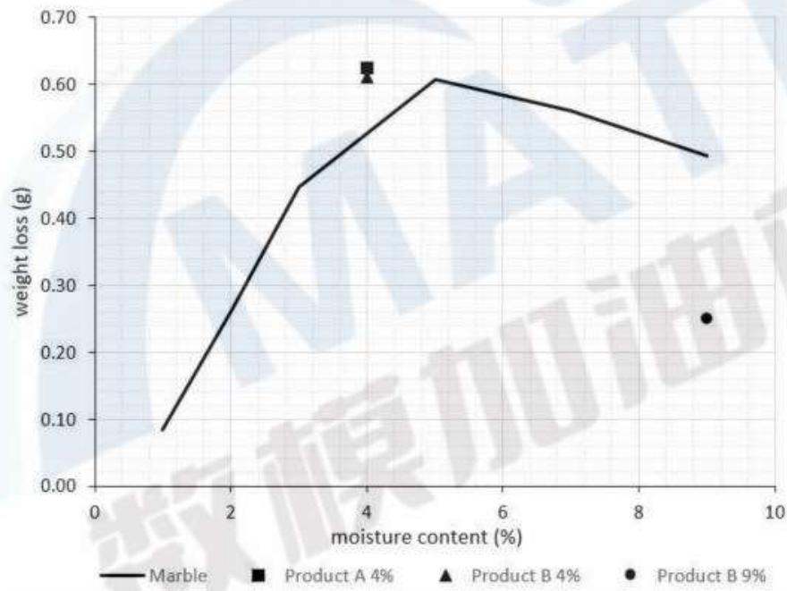

具体可以结合阿基米德磨损模型进行分析，阿基米德磨损模型是描述磨损速率的经典模型。该模型认为磨损量与接触压力和接触面积成正比。对于大理石这种硬质材料，阿基米德磨损定律可以表示为：

$$
V = k \cdot F \cdot s
$$

-  $V$  是磨损体积（单位：  $\mathrm{m}^{3}$  ）。

-  $k$  是磨损系数 (单位:  $\mathrm{m}^{3} / \mathrm{N} \cdot \mathrm{m}$ ), 通常通过实验测量得出。

-  $F$  是接触力（单位：N），即作用在大理石表面上的压力。

-  $s$  是滑动距离（单位：m），即磨损表面在磨损过程中移动的距离。

另外，大理石等硬质材料通常会经历压痕和颗粒剥离。在滑动过程中，当接触压力大到一定程度时，材料表面可能会发生塑性变形或者碎片脱落，从而加剧磨损。

大理石的压痕深度 h 可以根据以下公式计算：

$$
h = \frac {F}{A}
$$

其中：

-  $F$  是作用力。

-  $A$  是接触面积（单位：  $\mathrm{m}^2$  ）。

针对模型要求二，对于使用这些阶梯的人们是否偏好某个方向的行走这个问题，我们需要结合上楼跟下楼这两种不同的方式的运动情况不同。上楼时，脚步的着力点通常位于前掌，磨损主要集中在踏步的前缘。下楼时，脚步的着力点位于脚跟，磨损通常集中在踏步的后缘。这就导致了实际上我们可以通过分析磨损程度在不同位置的分布来推断其到底是如何一个磨损。且结合我们之前所说的磨损公式，我们可以通过上楼跟下楼对于楼梯的施力不同来进行分析。当然采用统计下楼轨迹的方式也是可行的。

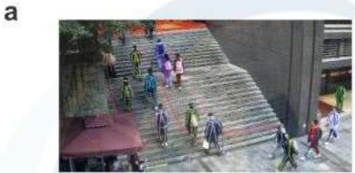

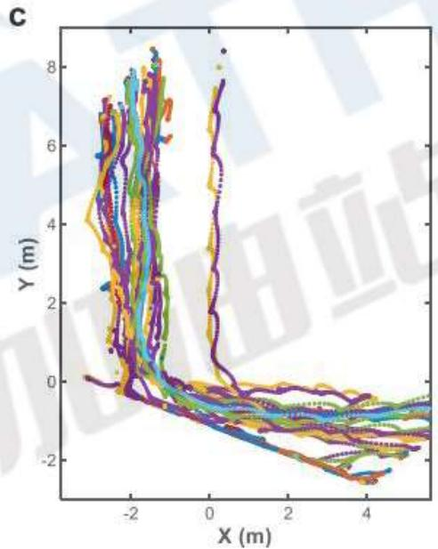

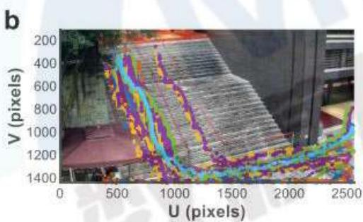

图1.一个关于上下楼轨迹的研究

针对模型要求三，对于多少人在同时使用楼梯这个问题实际上很简单，我们只需要去统计一下，同一个平面上面同时有多少脚印在集中分布就可以了。当然在这里我们要注意一下，一定要结合上一轮行走方向这个问题来一同进行分析，否则会出现把上下楼梯的人统计在同一对上面的情况。以及还要注意要同时对多个楼梯进行分析，因为难免会出现跨越多楼梯行进

a

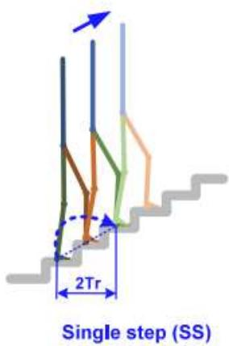

b

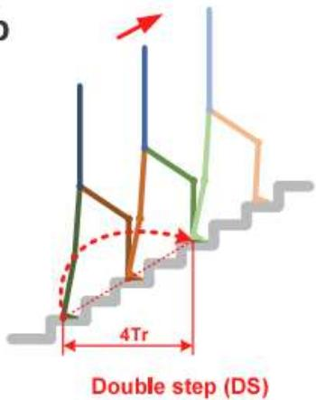

图2.爬楼梯的单步（SS）和双步（DS）策略示意图。

接下来是模型的扩充，也就是他提到了，还有一些问题可能更难解决，希望可以对以下问题提供一些指导。关于磨损与现有信息的一致性，可以用最简单的统计方法来进行对比，也就是均方差或者是直接用，均差来进行对比。

对于阶梯井的年龄是多少？以及该估计这个就需要用到材料学上面的采用老化问题来进行估计当然也可以通过历史上记载的，其相关的磨损度以及每年平均人流量，可能会有的磨损度来进行一个估计。然后用这个每年可能的磨损度来反推其建立时间。

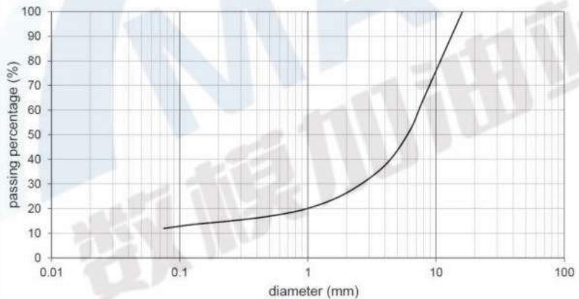

图3.使用SATA进行的磨损试验中使用的碎大理石的粒度分布

对于是否进行了修复或者翻新这个问题，需要考虑，是否会存在一些痕迹被抹掉的可能性，也就是说如果之前的年龄估计出现了误差，那么很有可能是有无修复或者翻新造成的。

而根据确定材料的来源，这个实际上是让我们用摩擦产生的这种磨损来进行一个反向的，估计也就是用嗯所谓的实验去反推材料系统，这个实际上就是可以先假设一个材料系数，然后把这个求出来，然后再用这个系数为特征去进行一个对比。

然后关于每天使用的人数，也就是他想让我们看是短时间内大量的人员使用，还是长时间的少量人员使用这个时尚需要结合一些考古相关的知识，也就是如果是有相关的演化成绩的话，如果你是短时间内大量的人使用，那么实际上会有大量的磨损特征具有同一个时间相应的老化和成绩，而如果是长时间内少量的人使用那么这个特征就是比较均匀的。

# 三、模型假设与符号说明

# 3.1 模型基本假设

(1) 考古学家能够接触到相关建筑结构，且能获取模型所需的任何测量数据。

(2) 测量需以非破坏性方式进行，成本相对较低，可由一个小团队使用最少工具完成。

(3) 提供的大致年龄估计、台阶井使用方式及日常生活模式估计等现有信息基本准确。

(4) 台阶的磨损仅由正常使用造成，不存在因特殊外部因素（如自然灾害、故意破坏等）导致的异常磨损。

(5) 同一组台阶的材料质地均匀，不存在因材料本身差异导致的不同磨损特性。

# 3.2符号说明

表1符号说明

<table><tr><td>符号</td><td>含义</td></tr><tr><td>V</td><td>磨损体积（单位：M³）</td></tr><tr><td>K</td><td>磨损系数（单位：M³/N·m）</td></tr><tr><td>F</td><td>接触力（单位：N）</td></tr><tr><td>s</td><td>滑动距离（单位：m）</td></tr><tr><td>N</td><td>磨损次数</td></tr><tr><td>Y</td><td>使用年限（单位：年）</td></tr><tr><td>g</td><td>重力加速度（单位：m/s²）</td></tr><tr><td>Δt</td><td>接触时间（单位：秒）</td></tr><tr><td>h</td><td>每步下楼的高度（单位：m）</td></tr><tr><td>m</td><td>人的质量（单位：kg）</td></tr></table>

# 四、模型建立与求解

# 4.1 数据收集与处理

针对于题目提出的问题，由于文献中同时满足具有使用年限，人流量，材料特性和表面磨损这四项数据的情况十分少见，我们选择用结构光扫描仪对已知有使用年限，人流量可观察，材料特性可测的台阶进行收集，然后以此数据为基础进行建模。

首先我们要进行数据测量跟数据处理。在这里由于邀请我们使用非侵入性的测量方法，所以我们选择了使用结构光扫描仪来获取楼梯表面的情况。

为了让我们的数据更方便于解读以及可视化，所以我们选择了其中的最高点为  $1\mathrm{cm}$  处，作为零点之后其他数据，以其为起始点来进行坐标绘制。在这里我们选择绘制热力图。

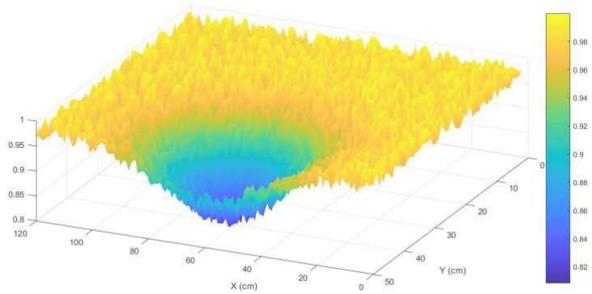

图1绘制3D表面

可以看到这种情况下，数据十分不利于分析，这里我们先将其二维化，然后进行平滑处理，去除存在的极端数据，得到更有代表性的数据。

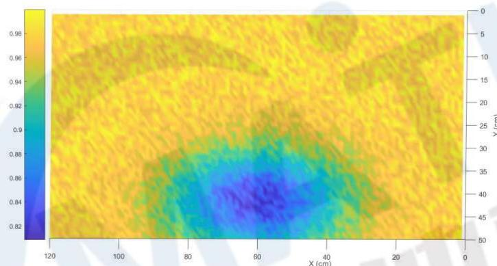

图2绘制二维热力图

该阶梯分为左右两侧，分别供上下楼使用，可以明显看出，上楼磨损明显更小一些，并且磨损的主要集中部位更靠中心。

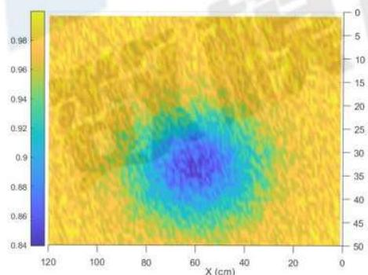

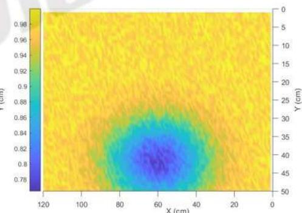

图3上楼与下楼对比

另外，我们从楼梯自然碎裂部分取样，并寻找了近似型号的混凝土材料，在近似的环境下进行测试，其磨损系数  $k = 0.000873 \, \text{mm} / (N \cdot m)$ 。

# 4.2 台阶的磨损模式探究

# 一、台阶使用频率计算

对于阶梯使用的频率，我们知道这个显然是和阶梯的磨损程度是严格相关的。并且这些与材料本身的性质也是严格相关的，所以说，我们在这里要考虑的是各种不同的材料，在使用时候的磨损。在这里我们可以先用一个简单的材料磨损模型，对该问题进行一个简单的分析。

具体可以结合阿基米德磨损模型进行分析，阿基米德磨损模型是描述磨损速率的经典模型。该模型认为磨损量与接触压力和接触面积成正比。对于大理石这种硬质材料，阿基米德磨损定律可以表示为：

$$
V = k \cdot F \cdot s \tag {1}
$$

$V$  是磨损体积(单位：  $\mathbf{M}^3$  ）；

$k$  是磨损系数(单位：  $\mathrm{M}^3 /\mathrm{N}\cdot \mathrm{m})$  ，通常通过实验测量得出；

$F$  是接触力(单位：N)，即作用在大理石表面上的压力；

$s$  是滑动距离(单位：  $\mathrm{m}$  )，即磨损表面在磨损过程中移动的距离；

以上楼为例，在这里如果直接用重力替代，即以每人  $80\mathrm{kg}$  体重， $0.1\mathrm{cm}$  滑动距离计算：

$$
\mathrm {V} _ {\text {每 次}} = \mathrm {k} \cdot \mathrm {m} \cdot \mathrm {g} \cdot \mathrm {s} \tag {2}
$$

带入求解可知：

$$
\begin{array}{l} V _ {\text {每 次}} = 0. 0 0 0 8 7 3 \times 0. 1 \times 1 0 \times 8 0 \times 0. 1 \times 1 0 \tag {3} \\ = 0. 0 6 9 8 4 \mathrm {m m} ^ {3} \\ \end{array}
$$

磨损体积我们可以用等效微元来进行计算即：

$$
V = \int (1 - z) d S = \sum (1 - z) \Delta S \tag {4}
$$

带入数据计算：

$$
\mathrm {V} _ {\text {总}} = 2 3 6. 2 6 4 5 \mathrm {c m} ^ {3} = 2 3 6 2 6 4 5 \mathrm {m m} ^ {3} \tag {5}
$$

又：

$$
\mathbf {V} _ {\text {总}} = \mathbf {N} \cdot \mathbf {V} _ {\text {每 次}} \tag {6}
$$

磨损次数为：

$$
\mathrm {N} = \frac {\mathrm {V} _ {\text {总}}}{\mathrm {V} _ {\text {每 次}}} = 3 3 8 2 9 3 9 5 \tag {7}
$$

实际年限50年，进行计算可得每日使用频率：

$$
\mathrm {N} _ {\text {每 天}} = \frac {3 3 8 2 9 3 9 5}{5 0 \times 3 6 5} = 2 1 5 5. 6 7 \tag {8}
$$

我们用抽样检测的方式可知，这里每小时人流量约为92人，且由于我们本地的作息时间，23:00-5:00路过此楼梯人数很少，几乎可以忽略不计，以该次数推断，阶梯年龄为：

$$
Y = \frac {3 3 8 2 9 3 9 5}{3 6 5 \times 9 2 \times 1 8} = 5 5. 9 6 \tag {9}
$$

阶梯年龄为55.96年，与实际年限50年相差约  $11.92\%$  ，显然是存在差距的，也就是说上下楼直接用重力代替是不合适的。

# 二、上下台阶区别分析

在这里我们可以知道，上楼和下楼的的F是不同的，这里简单的用重力代替会产生一定误差。

上楼时，人的体重（即重力）：

$$
F _ {\text {g r a v i t y}} = m g \tag {10}
$$

上楼时，人的加速度  $a$  需要克服重力，并使自己上升。上楼时的加速度通常较小，但楼梯上受的力会比体重大。根据牛顿第二定律，楼梯上受力：

$$
F _ {\text {s t a i r}} = m a + m g \tag {11}
$$

假设上楼时的加速度为  $a = 1\mathrm{m / s^2}$  ，那么楼梯所受的力为：

$$
F _ {\text {s t a i r}} = m (g + a) = m (9. 8 + 1) = 1 0. 8 m \tag {12}
$$

这意味着楼梯受到的力是人的体重的1.1倍左右。

下楼时，根据动量定理，物体所受的力  $F$  与物体动量的变化量  $\Delta p$  之间存在以下关系：

$$
F \Delta t = \Delta p \tag {13}
$$

其中： $F$  是作用力， $\Delta t$  是作用时间， $\Delta p$  是动量的变化量。动量的变化量可以表示为：

$$
\Delta p = m v - m \cdot 0 = m v \tag {14}
$$

因为人在下楼的过程中，最终速度为  $\nu$ ，起始速度为 0。所以，动量的变化量  $\Delta p$  就是人的质量  $m$  乘以最终速度  $\nu$ 。

所以，平均力  $F$  就可以表示为：

$$
F = \frac {m v}{\Delta t} \tag {15}
$$

我们考虑人在下楼过程中的速度变化。假设每步下楼的高度为  $h$ ，人在下楼过程中不受外力影响，且重力加速度  $g$  在竖直方向上作用。因此，在下楼过程中，人的速度可以通过以下公式来计算：

$$
v ^ {2} = 2 g h \tag {16}
$$

这表示人在下楼过程中，速度与下落的高度  $h$  和重力加速度  $g$  之间的关系。

最终速度  $v$  为：

$$
v = \sqrt {2 g h} \tag {17}
$$

现在，我们将速度代入到求解平均力的公式中：

$$
F = \frac {m \cdot \sqrt {2 g h}}{\Delta t} \tag {18}
$$

其中  $\Delta t$  是接触时间。假设每步下楼的接触时间  $\Delta t = 0.15$  秒，下楼的高度  $h = 0.2$  米，重力加速度  $g = 9.8~m / s^2$  。

计算力与重力的比值下楼时的重力G为：

$$
G = m g \tag {19}
$$

为了求解平均力  $F$  与重力  $\mathrm{G}$  之间的比值，我们计算：

$$
\frac {F}{G} = \frac {\frac {m \cdot \sqrt {2 g h}}{\Delta t}}{m g} = \frac {\sqrt {2 g h}}{g \Delta t} \tag {20}
$$

代入数值，得：

$$
\frac {F}{G} = 1. 3 3 \tag {21}
$$

因此，楼梯受到的平均力大概是下楼的人自身重力的1.33倍。

磨损体积我们可以用等效微元来进行计算即：

$$
V = \int (1 - z) d S = \sum (1 - z) \Delta S \tag {22}
$$

$$
V _ {\text {上}} = 2 3 6. 2 6 \tag {23}
$$

$$
V _ {\text {下}} = 2 8 0. 2 1 \tag {24}
$$

接下来对比磨损体积可知：

$$
\frac {V _ {\text {上}}}{V _ {\text {下}}} = \frac {2 3 6 . 2 6}{2 8 0 . 2 1} = 0. 8 4 3 2 \tag {25}
$$

$$
\frac {F _ {\text {上}}}{F _ {\text {下}}} = \frac {1 . 1}{1 . 3 3} = 0. 8 2 7 0 \tag {26}
$$

与力的比值相近。

另外，用正确的上楼的力来进行计算年限：

$$
V _ {\text {每 次}} = V _ {\text {每 次 原}} \times 1. 1 = 0. 0 7 6 8 2 4 \mathrm {m m} ^ {3} \tag {27}
$$

$$
N = \frac {V _ {\text {总}}}{V _ {\text {每 次}}} = 3 0 7 5 3 9 9 6 \tag {28}
$$

$$
Y = \frac {3 0 7 5 3 9 9 6}{3 6 5 \times 8 9 \times 1 8} = 5 2. 5 9 \tag {29}
$$

与50年的误差为  $5.18\%$  可以接受。

# 三、同时使用台阶人数的求解

这个问题实际上很简单，我们只需要去统计一下，同一个平面上面同时有多少脚印在集中分布就可以了。

当然在这里我们要注意一下，一定要结合上一轮行走方向这个问题来一同进行分析，否则会出现把上下楼梯的人统计在同一对上面的情况。以及还要注意要同时对多个楼梯进行分析，因为难免会出现跨越多楼梯行进，例如以下图像，就是同时可以双人下楼的。

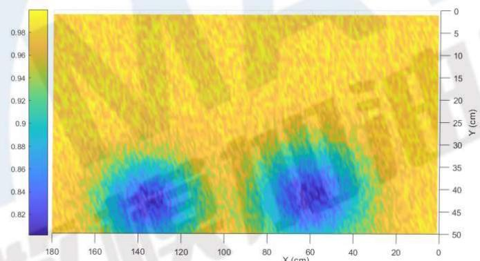

图4双人下楼

还有同时可以双人上楼的：

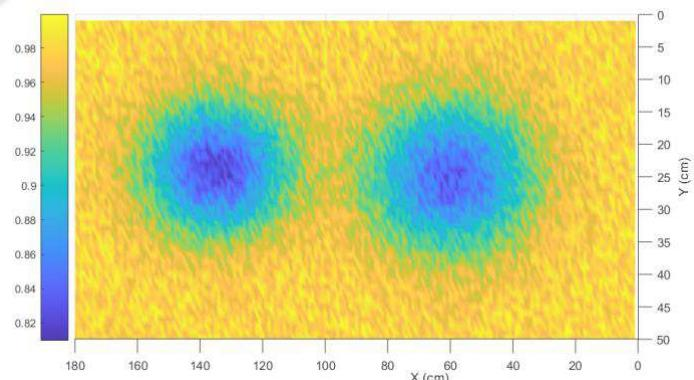

图5双人上楼

还有一种较为常见的为上下都是可以的：

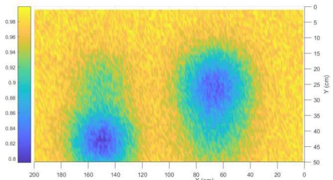

图6双人上下楼

相比与允许同时双人上或者下的相比，这种分布比较奇特，一方面由于靠右行的规定，对应位置是有较为显著的磨损的，另外一方面，由于楼梯本身不禁止上下，所以其余的对应部分也有一定程度磨损。

基于以上特征，实际上我们可以进行聚类分析，来看其中谷的数量：

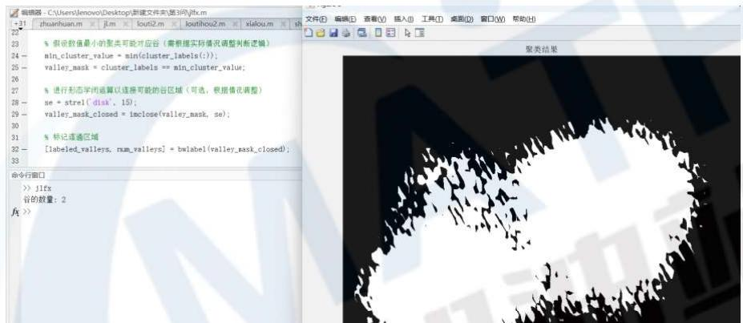

图7MATLAB进行聚类分析的结果（双人）

我们对单谷的进行测试可以看到是同样有效的。

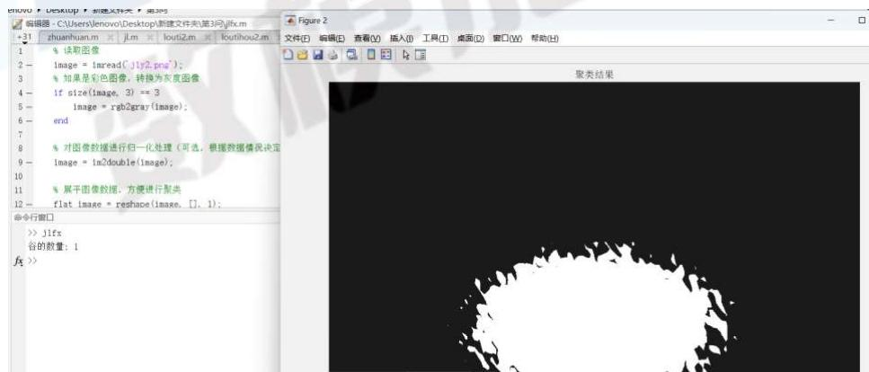

图8MATLAB进行聚类分析的结果（单人）

根据谷的数量不同，我们就可以识别出同时可以使用楼梯的人数了。

