<!-- source: MinerU_markdown_2025年美赛A题完整论文—郭老师_20260125140854_2015305855361236992.md; mode: auto->bishe ; lines: 463-705 -->

# 4.3 台阶多方面要素考析

# 一、现有信息对比下的台阶磨损与年龄评估

根据我们之前的分析，我们可以模拟每天楼梯的使用情况，根据使用人数、每个人的体重、上下楼梯的情况计算磨损。

接着，按月份进行累积，最终得到  $n$  年期间的台阶磨损体积。

同理，如果我们有磨损体积，那么我们也可以进行倒退，寻找可能的年份。以下为台阶磨损体积的蒙特卡罗仿真伪代码演示。

台阶磨损体积的蒙特卡罗仿真

# 1. 参数设置

1.1 将摩擦位移设置为  $0.1\mathrm{cm}$  转换后的米数（ $0.001\mathrm{m}$ ）

1.2设置磨损系数为0.000876（单位：  $\mathrm{mm}^2 /(\mathrm{N}\cdot \mathrm{m})$  ）

1.3 设置使用年限为50年

1.4 设置每月使用人数范围为[1900,2100]

1.5 设置体重均值为  $80\mathrm{kg}$ ，标准差为  $5\mathrm{kg}$

1.6 设置上楼梯和下楼梯的倍数均为 1.1

# 2. 计算总月数

2.1 将使用年限乘以 12 得到总月数

# 3. 初始化变量

3.1 将总磨损体积初始化为 0

3.2 创建一个长度为总月数的数组，用于存储每月的磨损体积，初始值均为0

# 4. 蒙特卡罗仿真

4.1 对于每个月（从第 1 个月到总月数）

4.1.1 将每月磨损体积初始化为 0

4.1.2 假设每个月有 30 天

4.1.3 对于每一天（从第 1 天到 30 天）

4.1.3.1 随机生成当天的使用人数，范围在每月使用人数范围内

4.1.3.2 为每个用户随机生成符合正态分布的体重

4.1.3.3 为每个用户随机生成是上楼梯还是下楼梯（ $50\%$  的概率）

4.1.3.4 计算每个用户的磨损力（力 - 体重 * 9.81）

4.1.3.5 对于每个用户

4.1.3.5.1 如果用户是上楼梯

4.1.3.5.1.1 计算该用户的磨损体积并累加到每月磨损体积中

4.1.3.5.2 如果用户是下楼梯

4.1.3.5.2.1 计算该用户的磨损体积并累加到每月磨损体积中

4.1.4 将每月磨损体积转换为  $\mathrm{mm}^3$  并存储到相应数组位置

4.1.5 将每月磨损体积累加到总磨损体积中

# 5. 输出结果

5.1 输出台阶的总磨损体积（单位： $\mathrm{mm}^3$ ）

# 6. 可视化结果

6.1 创建一个新的图形窗口

6.2 在图形窗口的第一个子图中绘制每月磨损体积随月份变化的曲线

6.3 在图形窗口的第二个子图中绘制累计磨损体积随月份变化的曲线

运行程序可以输出结果我们进行了仿真，获得了以月份为单位的磨损情况。

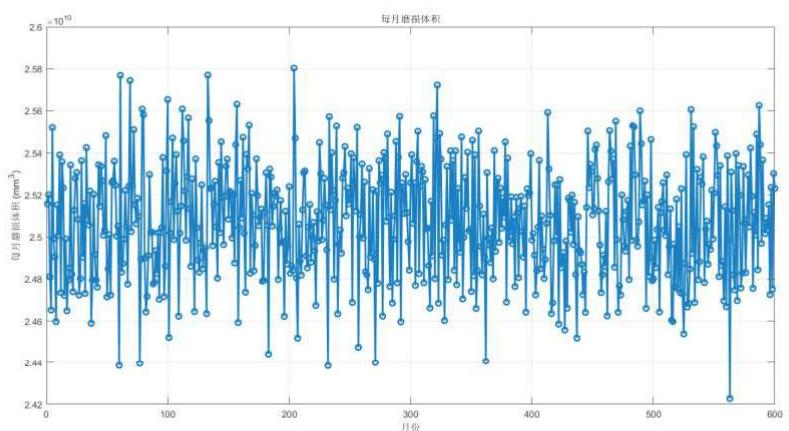

图9MATLAB各个月的磨损预测

对其进行累计即可得到一个磨损关于时间的关系。

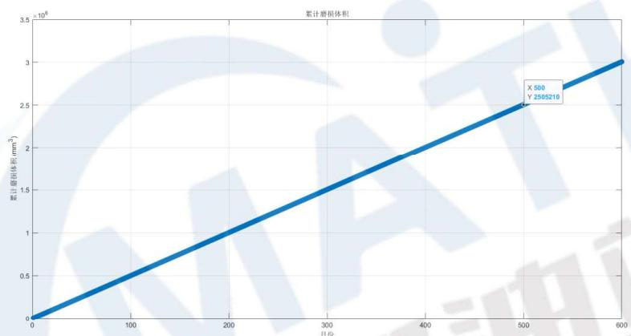

图10MATLAB各个月的累计磨损预测

通过仿真进行计算后，我们得到了50年时既有上又有下的情况下的混合楼梯可能的磨损程度。该数值介于  $V_{\text{上}} = 236.26$ ，  $V_{\text{下}} = 280.21$  之间，是符合现实的。

另外修改参数我们还可以获得只上楼的数据，带入  $V$  磨损，可以找到对照年份。

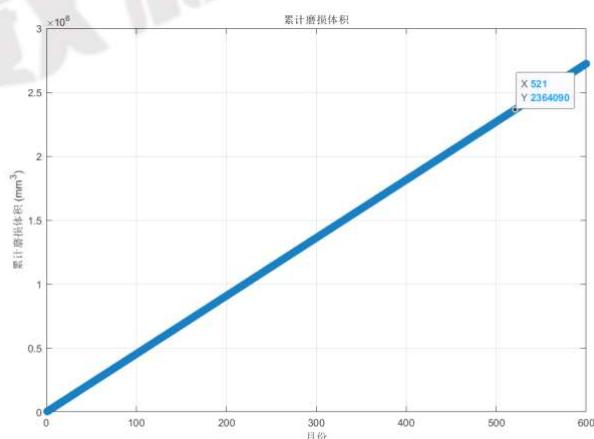

图11MATLAB各个月的单上楼磨损预测

只要我们有人次，体重分布，上下楼模式，摩擦系数，我们就可以很好的估计造成的磨损，以及逆推经过的年份52.1年，误差约  $4.2\%$

# 二、修复或翻新鉴定

我们对于附近的有进行过翻新的阶梯进行了采样，以下对于部分翻新进行讨论，全面翻新的可以依据此方法和其他未翻新砖块对比，以下是一个损坏后修复的阶梯。

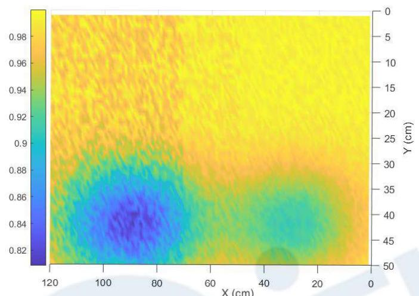

图12部分翻新的台阶

可以看到，未修复的部分和修复的部分磨损程度明显不同，大致在  $0 - 68\mathrm{cm}$  左右的范围里面进行了修复，这种修复显然是可知的，修复完之后，磨损程度明显减低，并且纹路显然更加平整，风化程度显著降低。

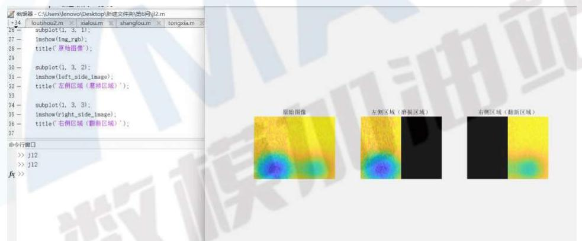

图13部分翻新的台阶进行聚类判别

# 三、材料来源确定

这个实际上是让我们用摩擦产生的这种磨损来进行一个反向的，估计也就是用实验去反推材料性质，这个实际上就是可以先假设一个材料系数，然后把这个求出来，然后再用这个系数为特征去进行一个对比。

当我们有多节台阶时，由于这些材质理论上应该来自同一批材料，所以我们可以利用最小二乘法进行拟合，得到该组楼梯的磨损系数。

假设我们有  $n$  个磨损体积  $V_{\mathrm{total1}}, V_{\mathrm{total2}}, \ldots, V_{\mathrm{totaln}}$ ，每个磨损体积对应的残差为：

$$
r _ {i} = \left| V _ {\text {t o t a l i}} - k \cdot F \cdot d \cdot T \right| \tag {30}
$$

总残差是所有这些残差的和：

$$
R (k) = \sum_ {i = 1} ^ {n} \left| V _ {\text {t o t a l i}} - k \cdot F \cdot d \cdot T \right| \tag {31}
$$

我们的目标是通过最小化这个总残差  $R(k)$  来得到最优的磨损系数  $k$  。

以我们测量的第一组楼梯来看：

$$
V _ {\text {t o t a l}} = \left[ 2 3 6 2 6 4 5, 2 2 5 6 7 8 9, 2 1 8 7 6 5 4, 2 3 8 4 5 6 7 \right] \tag {32}
$$

利用程序计算得到  $k = 0.087135 \, \text{mm}^2 / (N \cdot m)$ ，与  $k = 0.000873 \, \text{mm} / (N \cdot m)$  十分接近，误差为  $2.06\%$ 。

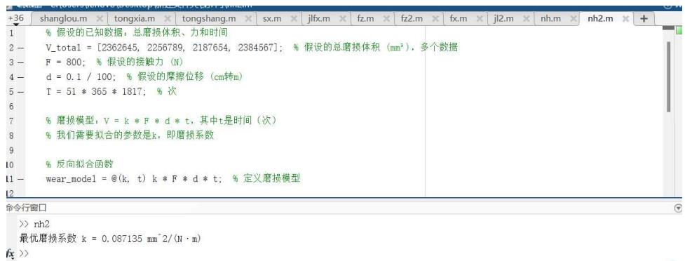

图14最小二乘法寻找最贴合的磨损参数

据此，我们只需要根据该特性，反向推出磨损系数然后和附近矿场的磨损系数对比即可。

# 四、台阶使用频率分析：短期多次或长期少次

要对此进行区分，可以根据表面纹理和细节，以及磨损的均匀性与集中度。其特点对比如下。

<table><tr><td>对比</td><td>短时间内大量人员使用</td><td>长时间内少量人员使用</td></tr><tr><td>磨损的均匀性与集中度</td><td>图像中，如果磨损区域明显集中在台阶的中心或两侧，并且呈现较为局部的磨损模式，可能是因为大量人员重复踏步导致的局部磨损。这些区域的磨损可能较深、较为规则。</td><td>图像中的磨损往往较为均匀，整个台阶表面的磨损程度相似，没有特别集中的区域。磨损深度较浅，且通常呈现细微的表面磨损，没有明显的压痕或突出的区域。</td></tr><tr><td>表面纹理和细节</td><td>大量人员的踩踏会导致较强的表面磨光现象，图像中可能看到台阶表面非常光滑或有细微的抛光迹象。表面纹理会显得更加模糊，缺乏细小的结构或纹路。</td><td>如果是少量人员长期使用，磨损通常表现为较浅且微小的裂纹或细微的表面粗糙感。图像中可能依然能观察到较为清晰的表面纹理，并且这些纹理不容易被磨平。</td></tr></table>

那么根据以上特征，我们可以认为短时间内大量人员使用会具有更大的深度，以及更好的平滑性。长时间内少量人员使用深度较浅，且平滑性更差。

这里我们选择用梯度来体现光滑程度，图像的梯度反映了图像像素值的变化情况，可以用来评估图像的光滑性。较大的梯度值通常表示图像的变化较剧烈，说明图像较为粗糙。

图像的梯度可以通过计算水平方向和垂直方向上的变化来得到：

$$
\nabla I (x, y) = \left(\frac {\partial I}{\partial x}, \frac {\partial I}{\partial y}\right) \tag {33}
$$

$\frac{\partial I}{\partial x}, \frac{\partial I}{\partial y}$  分别表示图像在水平方向和垂直方向上的导数。

梯度的幅值（即图像的“变化率”）表示为：

$$
| \nabla I (x, y) | = \sqrt {\left(\frac {\partial I}{\partial x}\right) ^ {2} + \left(\frac {\partial I}{\partial y}\right) ^ {2}} \tag {34}
$$

其中  $\frac{\partial I}{\partial x}$  和  $\frac{\partial I}{\partial y}$  通常使用 sobel、prewitt 等边缘检测算子来近似计算。平均梯度幅值作为光滑性度量，可以通过以下公式计算：

$$
\text {A v e r a g e G r a i n t M a g n i t u d e} = \frac {1}{N} \sum_ {x, y} | \nabla I (x, y) | \tag {35}
$$

我们采集了两个年代相近的建筑的台阶（相差大概5年），其中图（1）是短时间内大量人员使用，（2）为长时间内少量人员使用

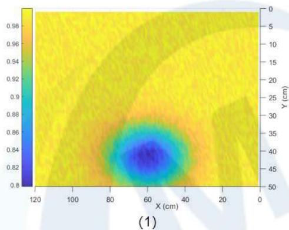

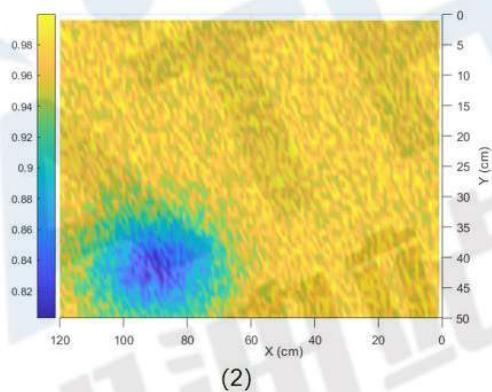

图15短时间内大量人员使用和长时间内少量人员使用对比

之后我们对其求了梯度，具体方法为：

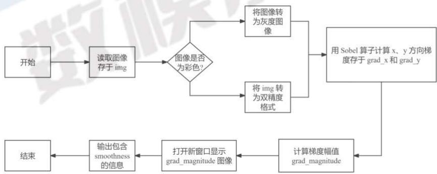

图16梯度计算流程

进行输出结果如下：

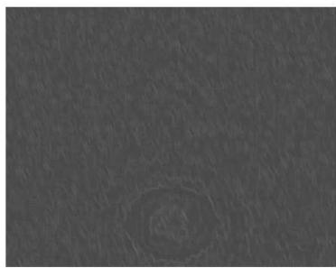

Average Gradient Magnitude : 1.8666 lowest: 0.7989

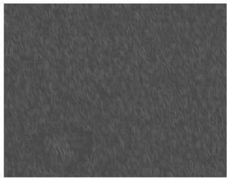

Average Gradient Magnitude: 4.5895 lowest:0.8018

图17梯度计算结果

可以看到短期多人的梯度确实更低，表面更加光滑，在长期少次的样品使用时间多短期多次的5年左右的情况下，短期多次深度依旧更低。

# 五、模型评价与推广

