# Q2 耗尽时间预测（Time-to-Empty predictions）——中文插入稿（汇总）

（这是讲解内容，论文中可删除）  
本文件将 `MCM_Sim/26A/论文/理论模型/论文阶段/Q2材料/` 下各图对应的“中文可直接粘贴段落”按推荐顺序汇总到一个文档中，便于你快速浏览与整体润色。  
如果你要把图插入到最终英文论文，请使用各子文件夹 `other/paper_fragment_en.md`（英文段落）；如需核对数值/复现作图，可同时参考 `other/data.csv` 与 `other/about.md`。  

## Q2.1 不同初始电量与使用场景下的耗尽时间（TTE）

基于第 4 节建立的连续时间 SOC 模型，我们在若干具有代表性的使用场景以及多个初始电量水平下计算耗尽时间 TTE（Time-to-Empty）。本文将 TTE 定义为系统首次触发关机边界的时间（见第 4.2.2 节）：（i）欠压截止 $V_{term}(t)\le V_{cut}$，（ii）能量耗尽 $SOC(t)\le SOC_{min}$，或（iii）供电不可行 $\Delta(t)<0$。

为同时反映参数不确定性与用户/后台行为的随机性，我们采用蒙特卡洛过程：对每个（场景，$SOC_0$）抽样关键不确定参数（例如 $V_{cut}$、$\eta_{PMIC}$、各组件功耗缩放因子等），并模拟后台随机唤醒。图 Q2-1 给出了每个单元格的 TTE 均值（单位：小时）。

图 Q2-1：不同场景 × 初始电量下的平均耗尽时间 TTE（小时）。

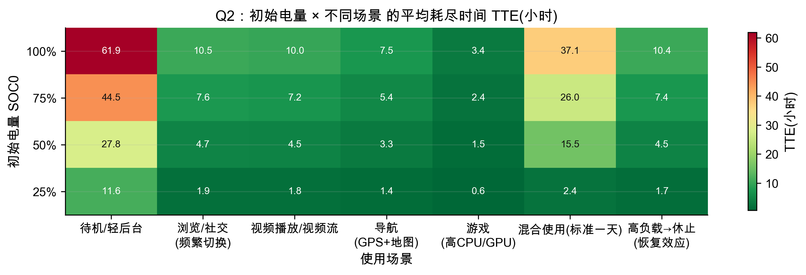

图 Q2-1 呈现两个清晰规律。其一，不同场景会带来数量级差异：当 $SOC_0=1.0$ 时，模型预测待机/轻后台约 **61.5 h**，标准一天的混合使用约 **36.2 h**，视频流约 **9.7 h**，导航（GPS+地图数据）约 **7.2 h**，而高 CPU/GPU 负载的游戏仅约 **3.4 h**。其二，初始电量降低会近似按比例缩短 TTE，但并非严格线性；原因在于关机事件通常由端电压动态触发（欠压提前关机），而不仅由 SOC 线性耗尽决定。

## Q2.2 哪些活动/条件会最大幅度缩短续航？（scenario variants）

为识别**哪些活动或外部条件会造成电池续航的最大幅度缩短**，我们针对每个代表性场景构造一组 *scenario variants*：在保持核心活动不变（例如视频、导航）的前提下，仅改变少量条件（网络模式：Wi‑Fi vs 蜂窝；信号质量：good vs poor；亮度；环境温度：cold/hot 等），并重新运行连续时间仿真以比较 baseline 与各个变体的 TTE。

图 Q2-2 汇总了 $SOC_0=1.0$ 时的结果；误差棒表示由后台随机过程（例如后台唤醒、网络尾态触发）导致的 5%–95% 波动区间。

图 Q2-2：同一场景 baseline 与 variants 的 TTE 对比（$SOC_0=1.0$）。

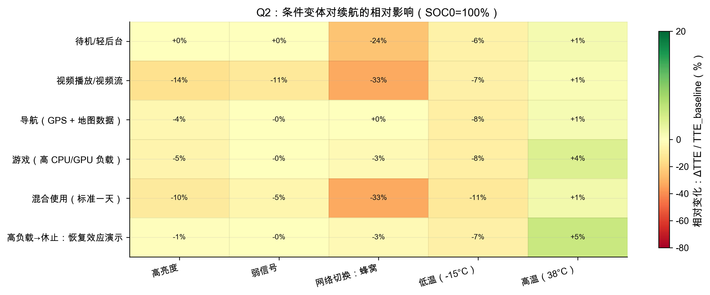

从各场景对比可以看到，TTE 的最大降幅通常来自两类因素：（i）**网络相关压力**（例如弱信号、蜂窝网络模式下的持续数据传输），（ii）**环境极端**（低温户外、炎热夏季）。其物理机理在于：弱信号会显著抬升单位数据能耗并更易触发/延长 RRC 尾态；低温则会提高内阻 $R_0$，两者都会加速端电压下跌，从而更早触发欠压截止。相对地，一些单因子改动（例如在“算力主导”的游戏场景中做小幅亮度调整）对 TTE 的影响可能低于直觉预期，这一点我们在图 Q2-6 中给出可检验的“surprisingly little”口径。

## Q2.3 不确定性：TTE 的分布而非单值（UQ）

在实际使用中，TTE 并非一个确定值：一方面，关键参数（例如 $V_{cut}$、$\eta_{PMIC}$、网络单位能耗、基线功耗等）存在个体差异与温度/老化带来的漂移；另一方面，后台唤醒与网络事件具有随机性。为量化这种不确定性，我们对不确定参数进行抽样，并对随机过程进行多次仿真，从而得到每个场景下 TTE 的经验分布。

图 Q2-3 展示了在 $SOC_0=1.0$ 时，各场景 TTE 的分布（箱线图/密度），其中中位数反映“典型续航”，而分布宽度反映“可预测性”。

图 Q2-3：$SOC_0=1.0$ 时不同场景的 TTE 分布（不确定性量化）。

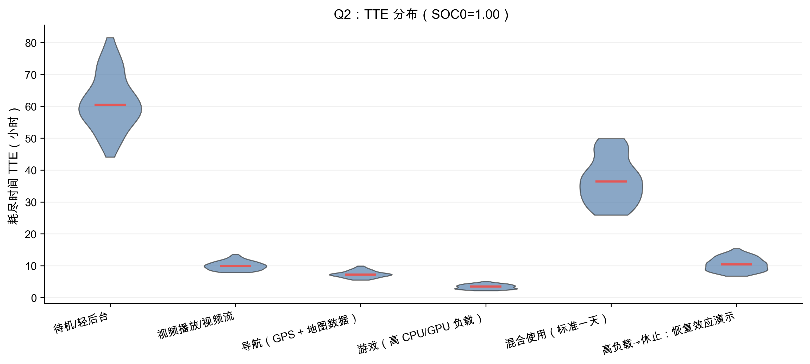

总体而言，重负载场景（如游戏）虽然 TTE 更短，但由于行为更稳定，分布相对更集中；而待机/轻后台场景由于后台事件随机、尾态触发不确定，分布更宽，体现出“长续航但更不确定”的现实体验。

## Q2.4 “模型好/差边界”：不确定性宽度的场景排名

为更清晰地指出模型在哪些方面表现较好或较差，我们进一步比较不同场景的 TTE 不确定性宽度（例如 5%–95% 区间宽度）。图 Q2-4 给出了不确定性宽度的排名，帮助识别哪些情形下 TTE 更可预测、哪些情形下更难预测。

图 Q2-4：各场景 TTE 不确定性宽度排名（越宽越不确定）。

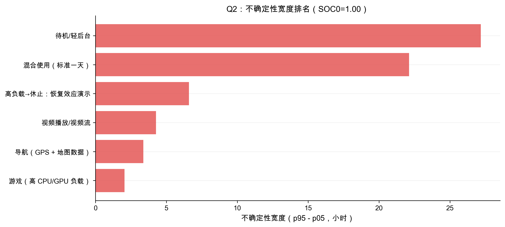

该排名为“模型优劣讨论”提供了量化依据：当不确定性宽度主要由随机后台事件与网络尾态主导时，模型在单次轨迹上的误差更难避免；相反，在持续高负载且相对稳定的场景中，模型更容易给出稳定预测。

## Q2.5 解释差异：每种情形下导致“电量快速消耗”的驱动因素（drivers）

赛题 Q2 要求我们解释不同场景下 TTE 差异的原因，并识别每种情形下导致“电量快速消耗”的具体驱动因素。为此，我们对每个场景进行组件级能量分解与反事实消融：对某个组件/机制（如屏幕、CPU/GPU、网络传输、GPS、后台唤醒等）进行“移除/削弱”，重新仿真并比较 $\Delta TTE$，从而得到每个场景下的 driver 排名。

图 Q2-5 汇总了各场景的 drivers 矩阵。

图 Q2-5：drivers 矩阵（不同场景下各组件对 $\Delta TTE$ 的贡献）。

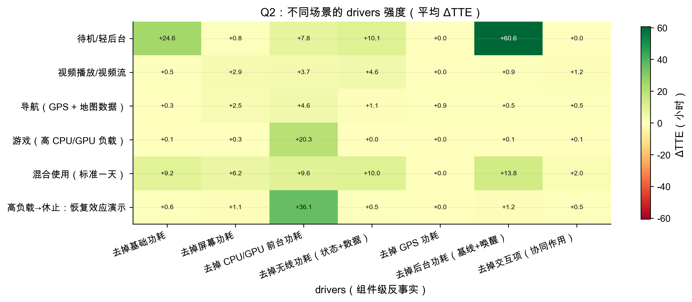

结果显示，drivers 具有强场景依赖性：在游戏/高算力场景中，CPU/GPU 是主导 driver；在导航场景中，GPS 与网络共同显著缩短 TTE；在视频与社交等网络活跃场景中，网络单位能耗与尾态机制成为重要 driver；而在待机/轻后台场景中，基线功耗与随机后台事件的累积贡献更明显。

## Q2.6 哪些因素对 TTE 的影响出乎意料地小？（surprisingly little）

在识别 drivers 之外，赛题还要求指出**哪些因素对模型输出的影响出乎意料地小**。为避免主观判断，我们定义“小影响带（little-effect band）”：
\[
|\Delta TTE| \le \max\bigl(\tau_{abs},\; \tau_{rel}\cdot TTE_{baseline}\bigr),
\]
其中 $\tau_{abs}$ 为绝对阈值（例如 $0.25$ 小时），$\tau_{rel}$ 为相对阈值（例如 $2\%$）。当某个因素的反事实改动导致 $\Delta TTE$ 落入该带内，我们判定其为“surprisingly little”。

图 Q2-6：不同场景下“大影响因素 vs 小影响因素”的 $\Delta TTE$ 对比；虚线表示该场景的小影响带。

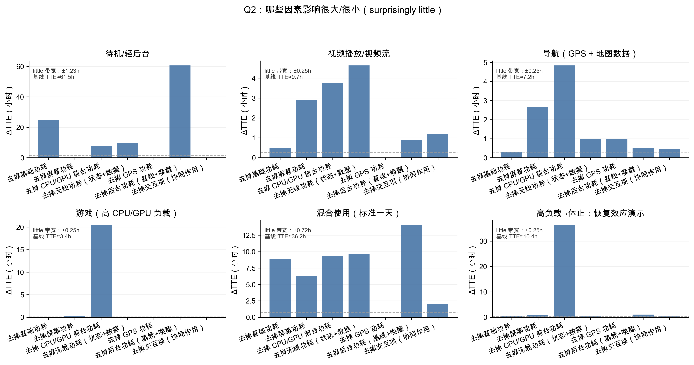

图中显示，“surprisingly little”具有显著的场景依赖性：在算力主导的游戏场景中，相比 CPU/GPU 持续负载，屏幕/网络的微调常常对 TTE 边际影响很小；而在长时程待机/轻后台场景中，主导因素更可能转向基线功耗、后台唤醒与网络尾态等低幅但累积效应显著的机制。

## Q2.7 观测对照：短时间总功耗量级（AndroWatts）

为确保负载侧功耗模型在真实量级上成立，我们使用公开数据集 AndroWatts 进行对照：将测试样本记录的设备状态映射为模型输入，并计算平均功耗预测值。图 Q2-7 给出了观测总功耗与模型预测总功耗的对照散点密度图。

图 Q2-7：AndroWatts 观测对照——观测总功耗 vs 预测总功耗。

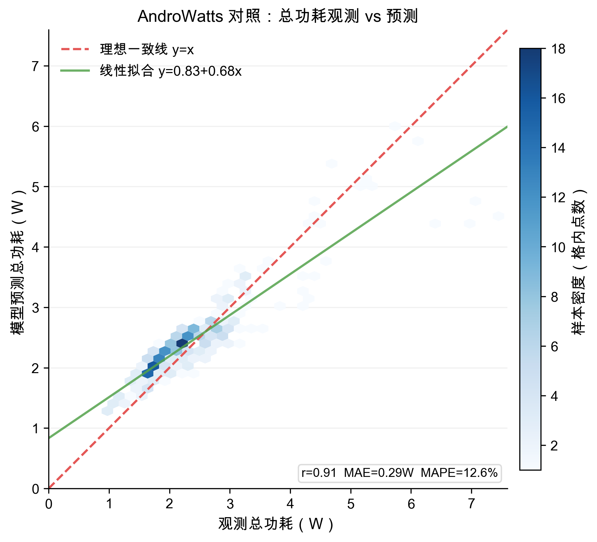

对照结果显示模型在量级与相对排序上具有较好一致性（例如 $r\approx0.91$，MAE $\approx0.29$ W），但在高功耗尾部仍存在偏差，提示极端使用下的映射仍可改进。

## Q2.8 观测对照：通信单位能耗（J/MB）与网络耗电机理（SmartphoneMeasurements）

我们用 SmartphoneMeasurements 的 Monsoon+吞吐率日志计算单位数据能耗（J/MB），并用其约束无线电模型中的 $e_{per\_MB}$ 参数：$P_{data}=e_{per\_MB}\cdot \dot{D}$。该观测也支持将网络耗电视为场景相关且不确定的机制。

图 Q2-8：SmartphoneMeasurements 网络单位能耗（J/MB）观测分布。

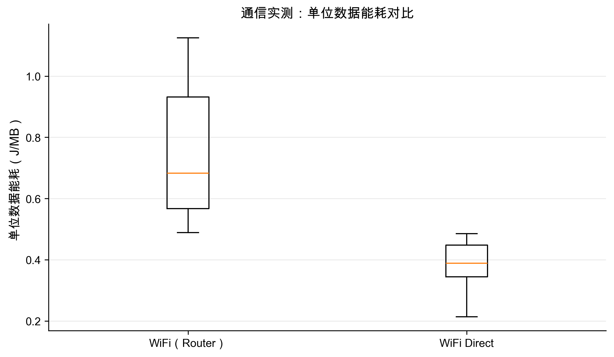

## Q2.9 观测对照：在 TTE 层面对齐（基于 SmartphoneMeasurements 的可复现 proxy）

我们基于受控实验的平均功耗构造观测 TTE proxy：
\[
TTE_{obs}^{equiv}=\frac{E_{batt}}{\bar{P}_{obs}}.
\]
并在模型中构造匹配的“常条件”场景得到 $TTE_{model}$。图 Q2-9 对比两者，散点偏离 $y=x$ 的方向与大小用于指出模型在何处表现较好或较差。

图 Q2-9：TTE 层面对照（观测 proxy vs 模型预测）。

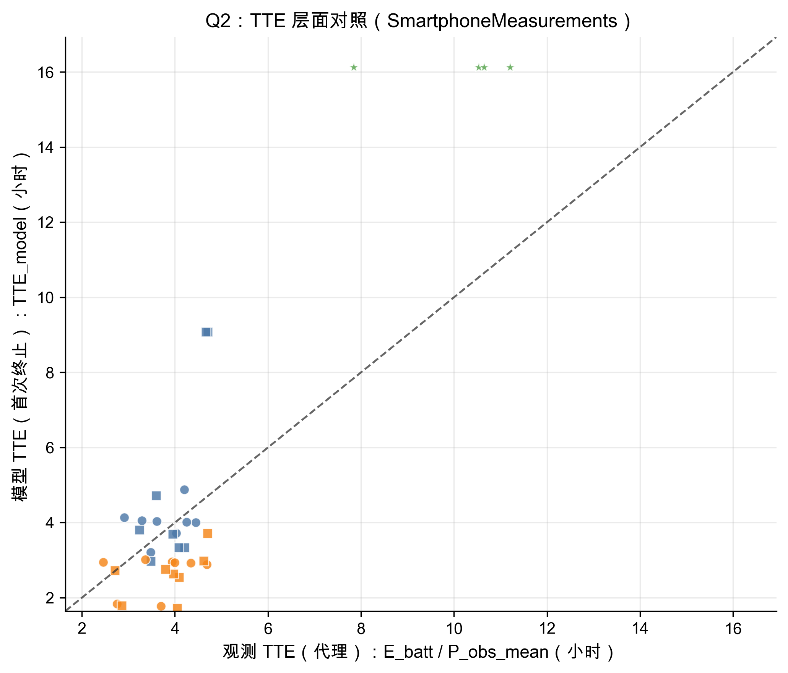

该对照显示模型能复现定性排序，但在网络重负载情形下倾向高估 TTE，提示网络单位能耗与/或尾态功耗仍需加强。

## Q2.10 合理行为对照：长时间尺度的续航分布（user\_behavior\_dataset）

为补充实验室短时功耗对照，我们进一步使用一个长时程、用户层面的公开数据集 **user\_behavior\_dataset.csv**，其中记录了人群层面的“日均电量消耗（mAh/day）”与亮屏时长等统计量。由于数据以“天”为粒度而非连续放电轨迹，我们将日耗电转换为 **daily 口径等效续航时间**：
\[
TTE_{day}^{equiv}=\frac{C_{batt}}{\text{daily consumption}(mAh/day)}\times 24\ \text{hours}.
\]
该对照的目标不是逐用户逐场景的精确拟合，而是提供一条赛题允许的 **plausible behavior（合理可解释行为）** 证据链：我们的“标准一天/轻后台待机”等场景，是否落在真实人群日常强度的合理分位区间。图 Q2-10 同时给出（a）$TTE_{day}^{equiv}$ 分布与（b）日耗电（mAh/day）分布，并在横轴顶部标注观测分位（0%–100%），以增强可解释性。

图 Q2-10：长时程 TTE 合理性对照——用户层面观测分布 vs 模型场景预测。

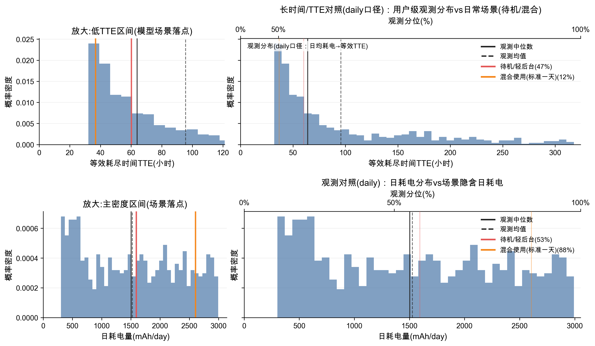

## Q2.11 历史/老化作为 TTE 变化的额外驱动因素（TTE vs SOH）

将 SOH 作为对有效容量与内阻的物理扰动并重新仿真，图 Q2-11 显示 TTE 随 SOH 下降近似单调缩短，从“新电池”到“寿命末期”约可带来 30% 的续航降低。

图 Q2-11：电池老化对续航的影响——不同负载下的 TTE vs SOH。

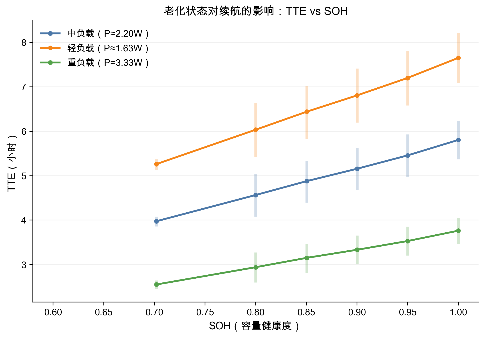

## Q2.12 提前关机的机理证据：关机时剩余 SOC 与 SOH 的关系

关机往往由欠压保护触发而非 SOC 耗尽。图 Q2-12 显示在低 SOH 与高负载下更易提前触发欠压终止，从而在关机时留下更高比例的剩余 SOC（未使用电量）。

图 Q2-12：提前关机证据——终止时剩余 SOC vs SOH。

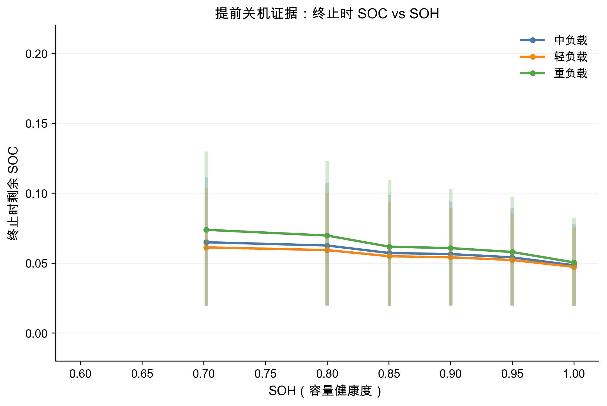

## Q2.13 解释性轨迹：待机/轻后台场景的连续时间演化

图 Q2-13 显示待机场景下 SOC 缓慢下降、功耗存在由后台唤醒/尾态导致的随机尖峰，端电压最终触碰 $V_{cut}$ 触发关机。尖峰的随机性解释了待机场景 TTE 的较大不确定性。

图 Q2-13：待机/轻后台场景轨迹。

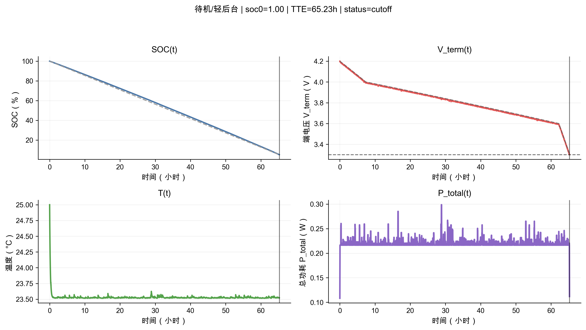

## Q2.14 解释性轨迹：游戏（高 CPU/GPU 负载）场景的连续时间演化

图 Q2-14 显示游戏场景下 SOC 更快下降、温度更快上升，端电压更早接近欠压截止阈值，关机更可能由欠压边界主导。该轨迹说明高负载下小幅额外功耗也可能导致不成比例的 TTE 缩短。

图 Q2-14：游戏场景轨迹。

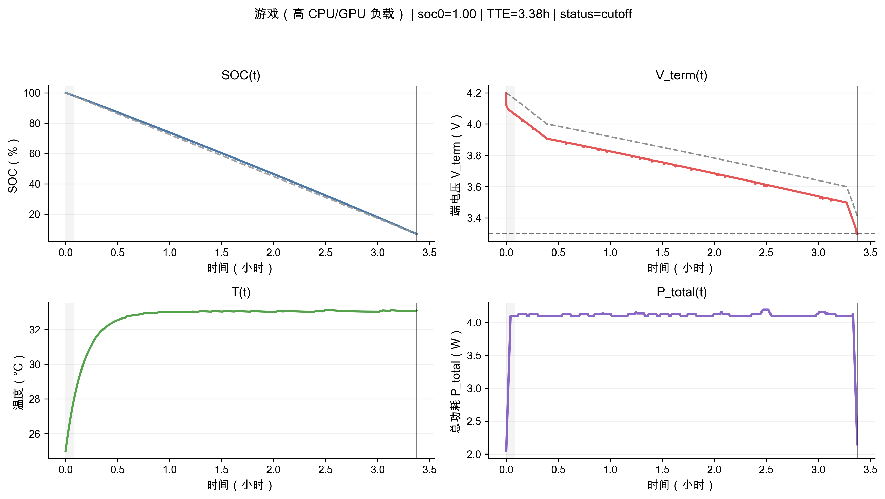
