# 7 Sensitivity and Assumptions (Q3)

This section addresses the requirement of Q3: *examine how predictions vary* when we change (i) **modeling assumptions**, (ii) **parameter values**, and (iii) **fluctuations in usage patterns**. We follow a **data-as-support** principle: the core prediction comes from our continuous-time mechanistic model (ODE + cutoff event), while open datasets are used only to anchor magnitudes, validate directions, and improve interpretability.

## 7.0 Overview and Output Metrics

To keep all Q3 experiments comparable, we use consistent outputs throughout:

- **Primary output**: Time-to-Empty (TTE).
- **Risk-type output**: undervoltage/collapse risk is quantified by a continuous metric, the **minimum headroom margin**, which measures how close the system is to the “insufficient-power boundary” (closer to 0 means higher risk).
- **Usage-fluctuation modeling**: within the same macro scenario we inject micro stochastic events (background wake-ups, radio tail energy, bursty interactions, etc.) and run multiple seeds to obtain distributions, thereby quantifying “unpredictability.”

Accordingly, we answer Q3 with three complementary blocks:

1. **Sensitivity to parameter values**: global PRCC (rank partial correlation) + local tornado (dimensionless marginal sensitivity) + aging/SOH scans.
2. **Sensitivity to modeling assumptions**: mechanism ablation + model-complexity comparison (Model-1/2/3) + structural hypothesis (1RC vs 2RC).
3. **Sensitivity to usage fluctuations**: seed-only distributions + variance decomposition + observed-data anchoring (measured power traces and “usage × aging” decomposition).

### 7.0.1 Prior Ranges and Data Sources

Sensitivity/UQ results depend strongly on the *prior ranges*. To avoid the critique that conclusions are purely subjective, we summarize default prior ranges and their data-anchoring sources in Table Q3-12: power-chain scaling factors are anchored by open power decomposition datasets, battery health (SOH) is anchored by an open battery state table, and other parameters without unified public calibration are assigned conservative engineering priors with explicit notes.

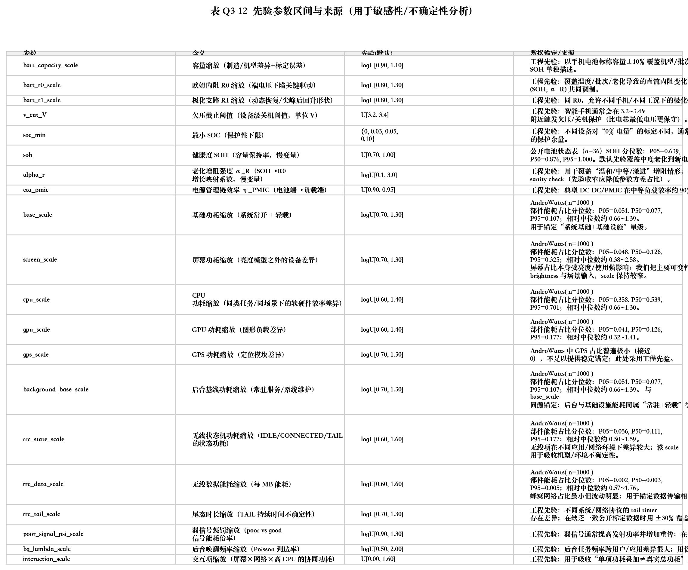

---

## 7.1 Sensitivity to Parameter Values (Global + Local)

### 7.1.1 Global Sensitivity (PRCC): Mean TTE

To examine how predictions vary with parameter values, we sample key parameters (capacity/SOH and resistance scaling, cutoff threshold, aging resistance-growth strength, PMIC efficiency, and component-level power scaling factors) within reasonable prior ranges, simulate the continuous-time ODE model, and compute the **mean TTE**. To reduce stochastic noise from usage fluctuations, each sample is averaged over multiple random seeds.

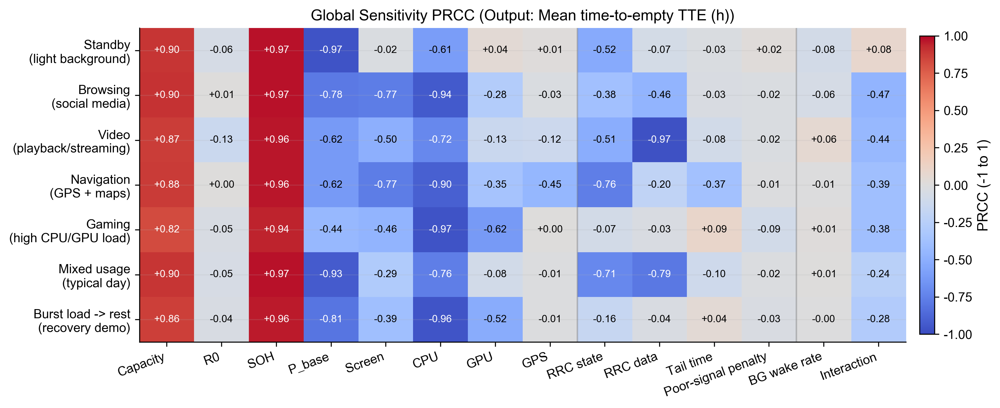

Figure Q3-1 reports PRCC (Partial Rank Correlation Coefficient). PRCC measures the strength and direction of a parameter’s monotone influence *after controlling for other parameters*: positive PRCC indicates increasing the parameter tends to increase TTE, and negative PRCC indicates the opposite. The ranking is scenario-dependent: capacity/SOH tends to dominate in most scenarios, while wireless and load-related scaling factors become dominant in network- or compute-heavy scenarios. This provides a global basis for “which parameters to calibrate first” and “which subsystems to optimize first.”

### 7.1.2 Global Sensitivity (PRCC): Undervoltage Risk via Headroom Margin

Mean TTE alone cannot explain the user-perceived “sudden drain/shutdown.” In realistic use, the phone may shut down at a non-extreme SOC because a burst load causes a transient voltage sag that hits the cut-off voltage. We therefore introduce a continuous risk metric: the **minimum headroom margin** along the trajectory. A smaller margin (closer to 0) means the system is closer to the undervoltage/insufficient-power boundary.

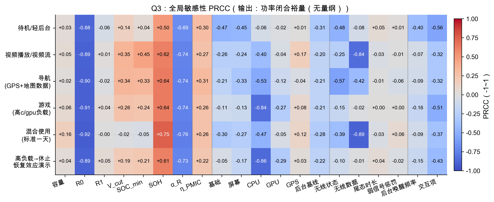

Figure Q3-2 shows that resistance-related parameters (e.g., the scale of \(R_0\), and aging resistance-growth strength) systematically reduce the margin and thus increase “early cut-off” risk. This highlights that risk-type outputs can be more sensitive than mean TTE in bursty/high-power regimes, and they connect more directly to the “unpredictable rapid drain” phenomenon.

To align the risk mechanism with observable physics, we also cite an open dataset from NASA PCoE with random/pulsed loads. The voltage exhibits a fast sag under pulses and a rebound during rests, which is consistent with our headroom-margin interpretation.

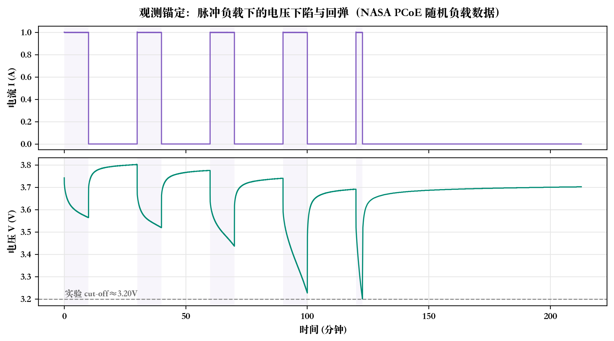

### 7.1.3 Aging Sensitivity: SOH Scan

To quantify the effect of battery history/aging, we scan SOH and observe how mean TTE changes. This makes the aging effect explicit and scenario-comparable.

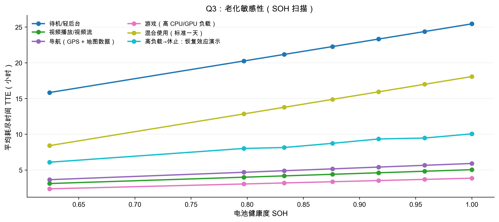

### 7.1.4 Local Sensitivity (Tornado): A Representative High-Load Scenario

Global sensitivity captures nonlinearity and interactions but can be abstract. We therefore complement it with a dimensionless local tornado plot around a baseline point (symmetric perturbations for each parameter).

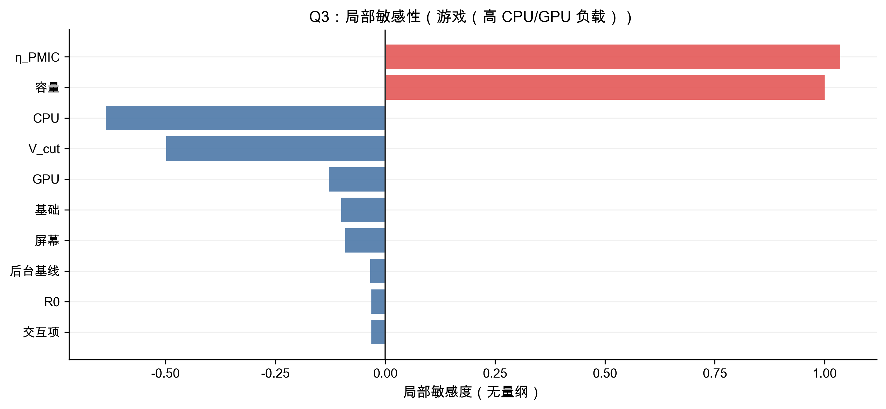

---

## 7.2 Assumptions (Ablation Tests)

### 7.2.1 Mechanism Ablation (Power-Side)

We remove one mechanism at a time and measure \(\Delta\)TTE (and associated risk changes) to answer both “drivers of rapid drain” and “surprisingly little” factors.

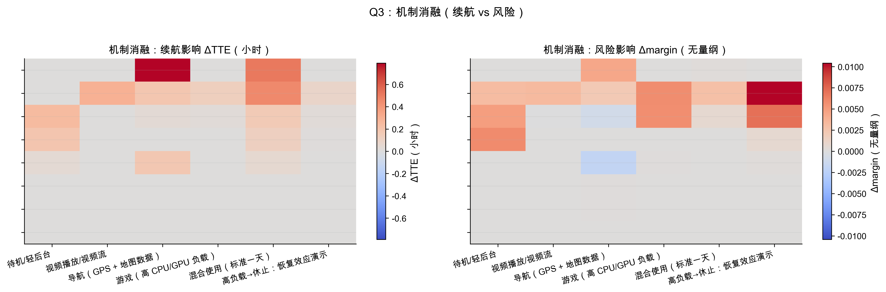

### 7.2.2 Battery-Model Complexity (Model-1/2/3)

Under identical power inputs, we vary only battery-model complexity:

- Model-1: ECM (electrical only)
- Model-2: thermo-electric coupling
- Model-3: thermo + aging (slow health states)

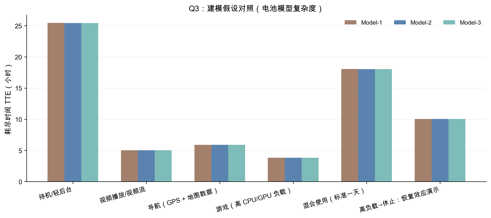

### 7.2.3 Structural Hypothesis: 1RC vs 2RC

We test whether a single polarization time constant (1RC) is sufficient for TTE-level prediction, versus a two-branch (fast+slow) polarization structure (2RC). Even when \(\Delta\)TTE is small, the waveform/risk behavior may differ and should be discussed.

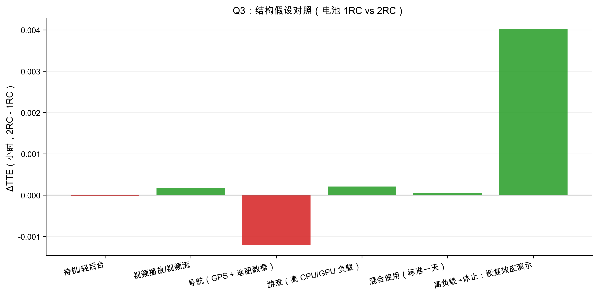

---

## 7.3 Fluctuations and Uncertainty

### 7.3.1 Fixed-Parameter Seed-Only Distributions: \(\Delta\)TTE(\%)

To reflect the statement “same usage but sometimes drains faster,” we keep parameters fixed and vary only the random seed. We present the distribution in relative terms \(\Delta\)TTE(\%) to make fluctuations visible across scenarios.

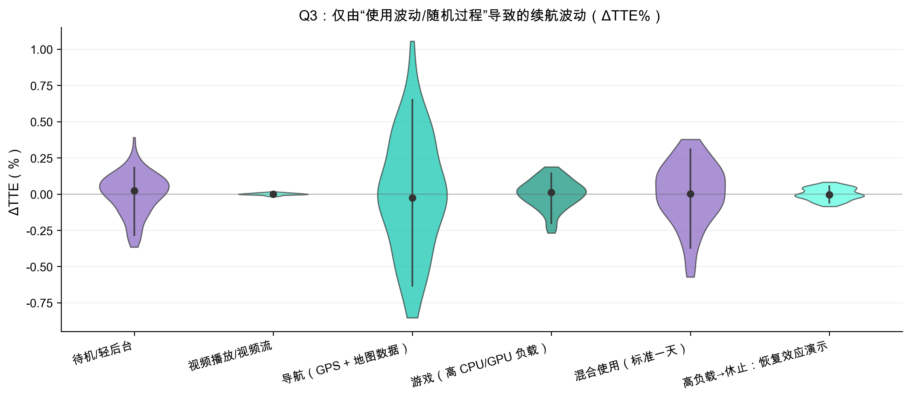

### 7.3.2 Where Does “Unpredictability” Come From? Total Variance Decomposition

Unpredictability may come from (i) uncertain slow variables/parameters (health state, calibration, environment) and/or (ii) intrinsic stochastic usage fluctuations. Using the law of total variance:

\[
\mathrm{Var}(TTE)=\mathrm{Var}(\mathbb{E}[TTE\mid \theta])+\mathbb{E}(\mathrm{Var}(TTE\mid \theta)),
\]

where \(\theta\) denotes the slow-variable/parameter set. The first term represents between-parameter variability; the second term represents within-parameter stochastic variability.

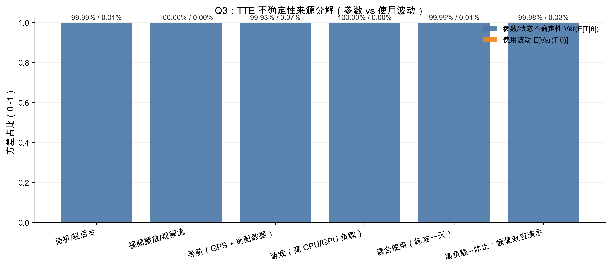

This decomposition depends on prior width: under wide priors, parameter uncertainty often dominates; as calibration tightens priors, usage-fluctuation contributions become relatively more important, aligning with real user experience.

### 7.3.3 Observed Anchoring I: \(\alpha\)-Sweep on Measured Power Traces (Mean Fixed)

Following “data as support, not substitute,” we use open measured smartphone power traces (Monsoon) to anchor the importance of fluctuation structure. For each trace \(P(t)\), we construct a family with the same mean but different fluctuation strength:

\[
P_{\alpha}(t)=\bar{P}+\alpha\cdot(P(t)-\bar{P}),\quad \alpha\in[0,1].
\]

We then compute TTE for each \(\alpha\) and summarize \(\Delta\)TTE(\%) relative to \(\alpha=0\).

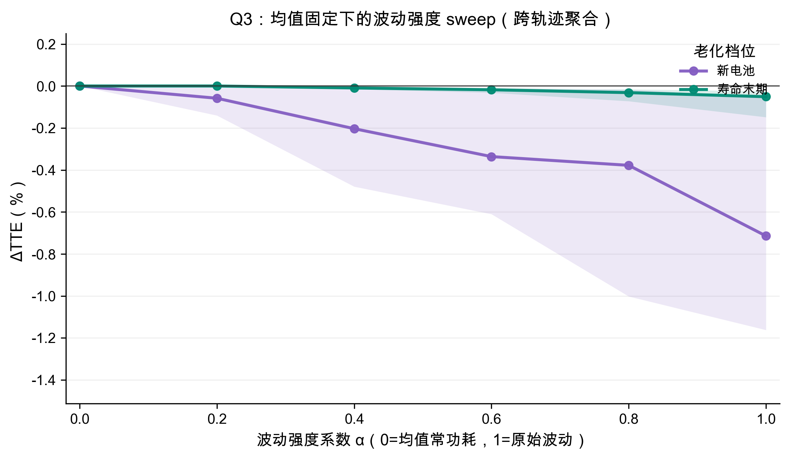

The trend is consistent: stronger fluctuations (larger \(\alpha\)) typically reduce endurance even at the same mean power, especially near the undervoltage boundary where transient sags matter.

### 7.3.4 Observed Anchoring II: Variance Decomposition of Usage × Aging × Interaction × Stochasticity

Because the statement emphasizes both **realistic usage conditions** and **battery history/aging**, we anchor both the usage-state distribution and aging-state distribution using open datasets, and run a balanced simulation design over (usage state \(\times\) aging state) with repeated seeds inside each cell. The total variance in TTE is decomposed into four parts: usage main effect, aging main effect, their interaction, and stochastic residual.

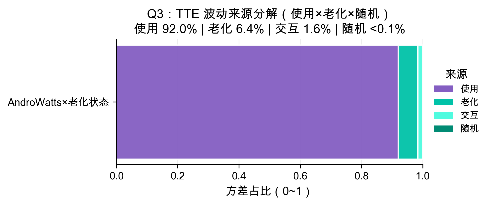

Figure Q3-11 shows that usage differences explain most TTE variability, while aging contributes a smaller but non-negligible portion and can interact with usage intensity (high-power states are more sensitive to resistance growth and undervoltage). This provides a *data-anchored, quantitative* interpretation: day-to-day endurance differences are driven primarily by switching among usage states, with aging modulating risk and shortening TTE under demanding conditions.

To make the interaction more “paper-readable” (and to avoid overly crowded high-dimensional plots), we further add four enhanced evidence pieces from the same observed-anchoring report:

**(a) Decomposition by observed power-intensity quantiles (low/medium/high load)**: we split phone\_tests by observed total power terciles and repeat the same decomposition inside each group, to show how the importance of aging changes with usage intensity.

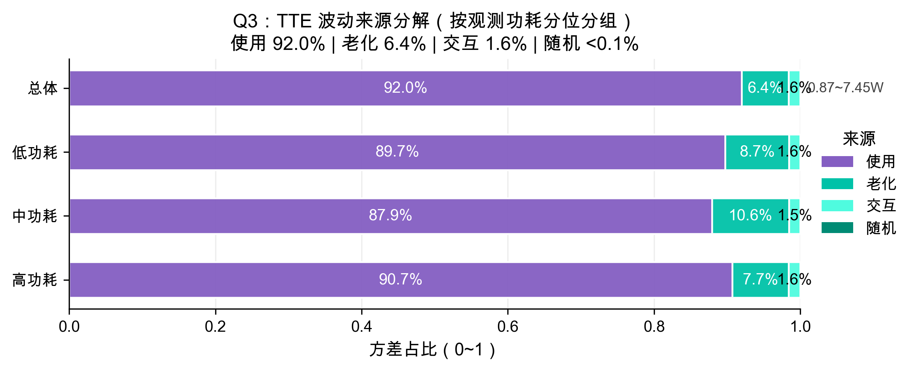

**(b) Sampling uncertainty (Bootstrap 95\% CI)**: we perform cluster bootstrap over phone\_tests to obtain 95\% CIs of the decomposition fractions. Even if CIs are not extremely tight, the ordering (usage dominates, aging is second, interaction is smaller) remains stable under resampling.

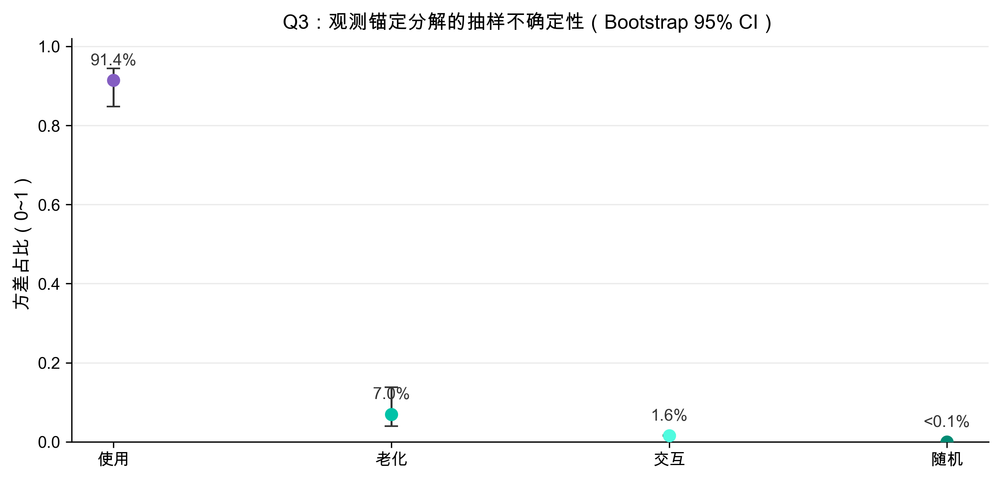

**(c) Interaction is clearer in a risk metric: \(\Delta\)margin vs observed power (new vs eol)**: mean TTE often scales approximately proportionally, which can make interaction appear small in TTE-mean space. However, the **headroom margin** (more directly tied to “sudden shutdown”) exhibits a stronger aging penalty under high power: the margin drops more, meaning the system is closer to the undervoltage boundary. This directly visualizes the “high-load × resistance growth” mechanism.

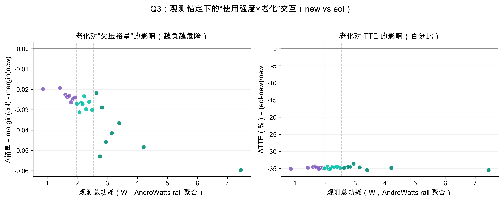

**(d) Low-dimensional summary heatmap (3×6): power-quantile × aging-level**: we compress the original 24×6 cells into a 3×6 heatmap (low/medium/high power × six aging levels) with values printed in each cell, so the trend can be read quickly in the main text.

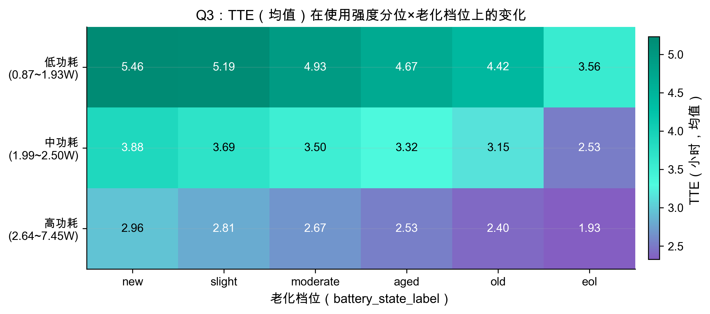

**(e) Cross-cell robustness (Cell01/02/03)**: to avoid the critique “the conclusion only holds for one cell,” we repeat the experiment on Cell01/02/03 under the same battery dataset and obtain similar decomposition structures. This strengthens generalizability and credibility (often suitable for an appendix or a small supporting figure).

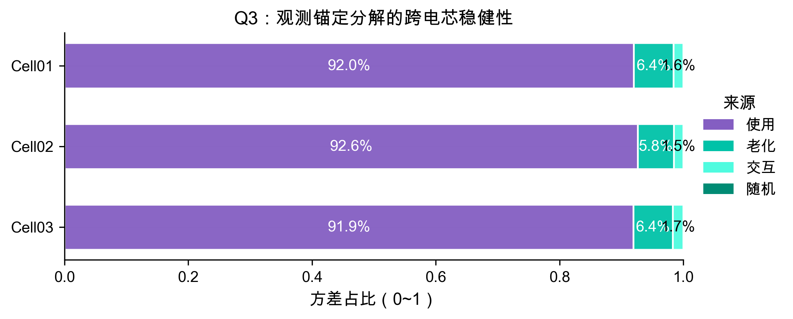

---

## 7.4 Unified Answer to Q3

Combining the above evidence, we summarize Q3 as follows:

1. **Changing parameter values changes predictions substantially**: capacity/SOH typically dominates mean TTE, while \(R_0\) and aging-related resistance growth more directly control headroom margin and early cut-off risk.
2. **Not all modeling assumptions matter equally**: ablation tests identify the largest drivers of rapid drain and also reveal factors with surprisingly little impact; thermal/aging mechanisms are especially important for risk-type outputs under high loads.
3. **Usage fluctuations introduce irreducible “unpredictability”**: seed-only distributions show that micro stochastic events can explain day-to-day variation; observed anchoring (\(\alpha\)-sweep and usage×aging decomposition) supports that the effect exists at realistic magnitudes and is consistent with the nonlinear undervoltage mechanism.
