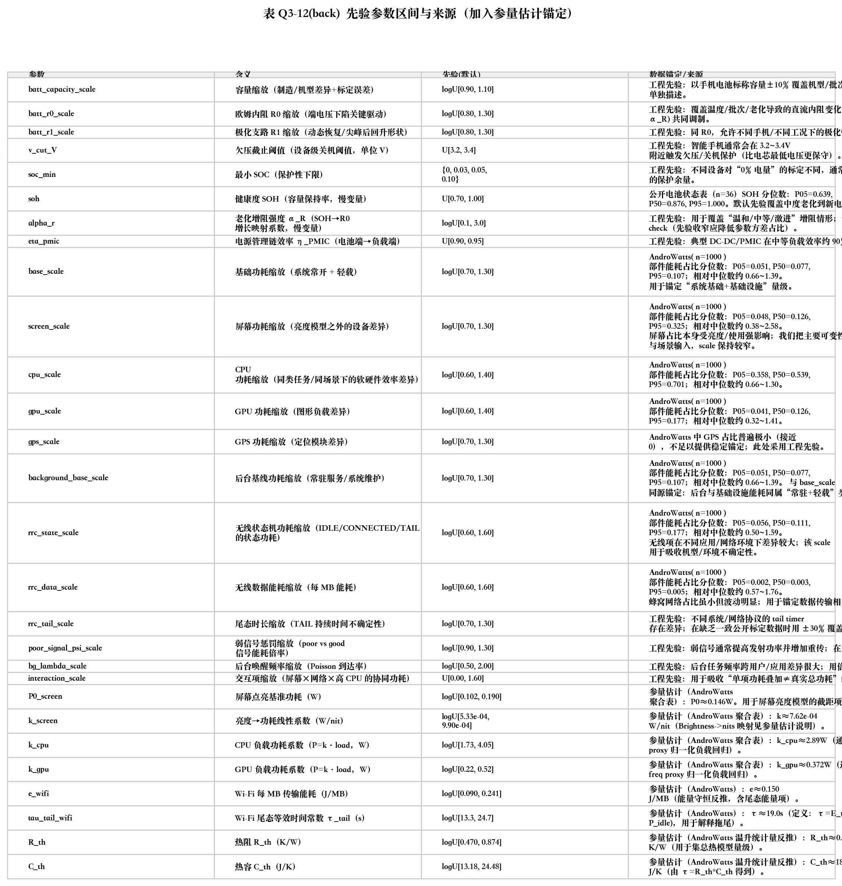

# 7.X(back) 先验区间与来源（加入参量估计锚定）

本 back_ 版本用于在论文中强化赛题 Q3 的“可审查先验来源”口径：除原先的工程先验与公开数据锚定外，我们进一步引入了 **参量估计** 结果（来自公开 AndroWatts 聚合表），把亮度–屏幕功耗、负载–CPU/GPU 功耗、网络单位能耗/尾态时间常数、以及温升–热模型量级等关键参数的点估计与来源明确写入先验表中，作为敏感性与不确定性分析的可引用支撑。

写作提示（放在表后 1~2 句即可）：
- 说明：增补行的“点估计”用于提供物理量级锚定；敏感性分析仍使用保守的区间先验（避免把回归点估计当作真值）。
- 强调：先验来源可追溯（表中给出数据文件路径与许可），并形成“公开数据→参量估计→先验区间→敏感性结论”的完整证据链。

