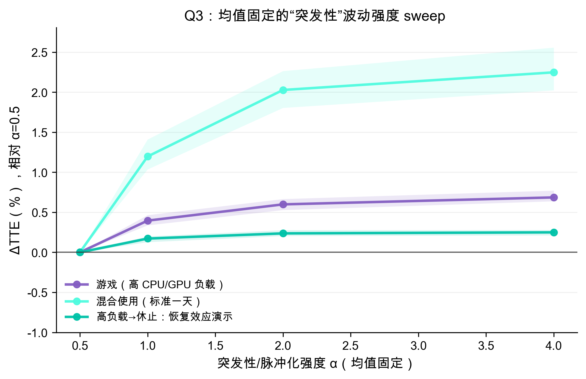

# 7.X 使用波动敏感性：均值固定的“突发性/脉冲化”强度 sweep（α）

赛题 Q3 需要我们研究 **fluctuations in usage patterns** 对预测的影响。为避免把“平均功耗变了”与“波动结构变了”混为一谈，我们在功耗模型内部构造一个 **均值近似固定** 的对照实验：通过调整随机过程的“突发性/脉冲化”强度 α，只改变事件的集中程度与时间相关结构，而尽量保持单位时间的平均工作量不变。随后在相同电池参数与相同场景下重复仿真，统计 ΔTTE 的变化。

图 Q3-14 显示：当波动更“突发/集中”（α 增大）时，续航预测会出现系统性变化，且场景依赖明显。其物理原因在于电池端存在非线性：突发负载会提高瞬时电流，从而放大 \(I^2R\) 压降与极化效应，并更频繁地把系统推向低裕量区域；在接近欠压边界的阶段，这类突发更可能触发提前截止（cut-off），使得仅用平均功耗估计 TTE 会产生偏差。

写作建议（可用 1~2 句概括方法）：
- 我们采用“幅度×α、到达率/α”的方式调制 Poisson 类突发（后台唤醒/网络 burst），并同时缩放马尔可夫切换速率来改变时间相关结构，从而在 **均值近似固定** 的前提下研究波动强度对预测的影响。

