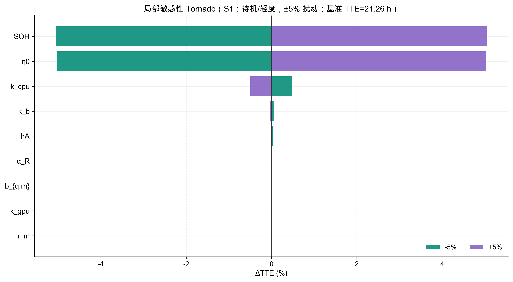
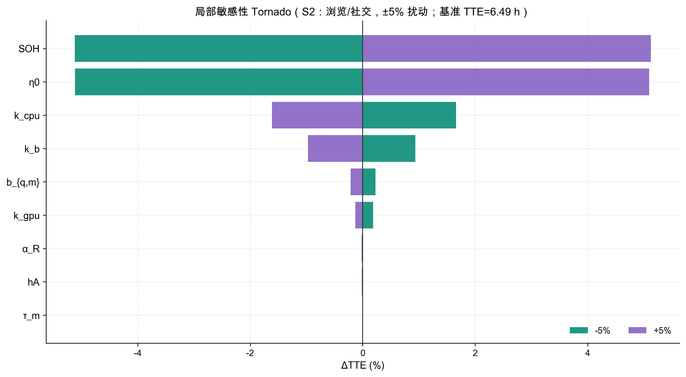
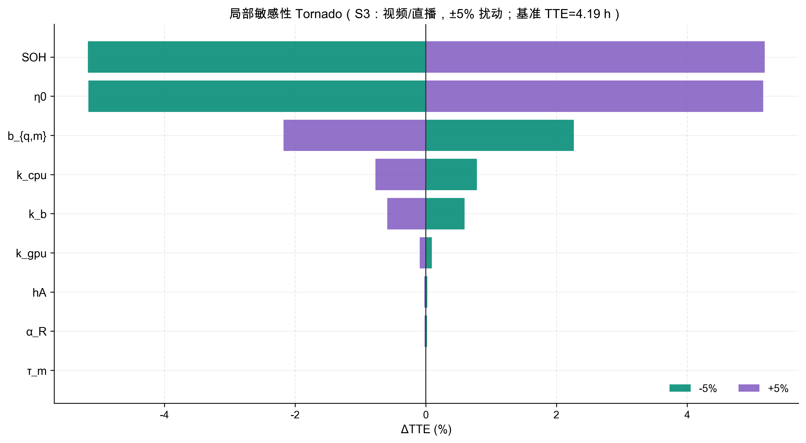
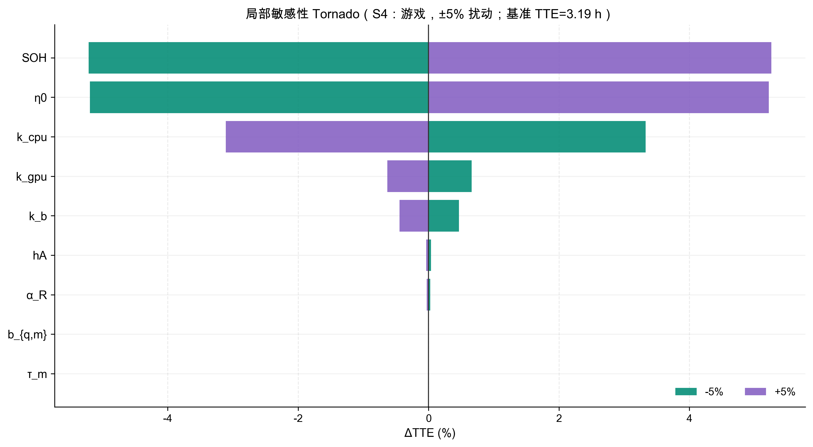
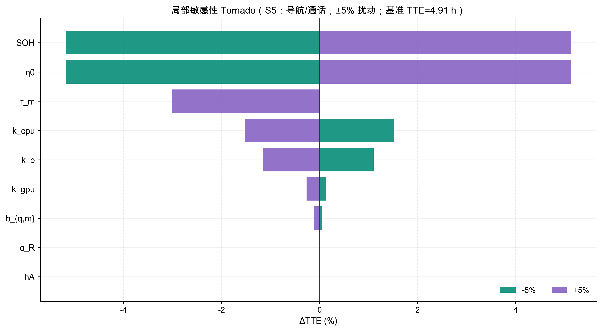

# Q3 7.1 局部敏感性分析（S1–S5，9 参数，±5% 扰动）

本目录产物用于填充 `敏感性分析.docx` 模板中的“7.1 敏感性分析”内容。

## 方法

对每个参数 $\theta_j$ 在基准点附近做对称扰动 $\varepsilon=0.05$：

- $TTE(\theta_j(1+\varepsilon))$ 与 $TTE(\theta_j(1-\varepsilon))$；
- 以相对变化率作为 Tornado 条形长度：

$$\Delta TTE(\%)=\frac{TTE(\theta_j(1\pm\varepsilon))-TTE(\theta_j)}{TTE(\theta_j)}\times 100\%.$$

为降低随机使用过程噪声，每个设定使用多随机种子重复仿真并取均值（见 CSV 明细）。

## Tornado 图（ΔTTE% / 全 9 参量）

### S1 待机/轻度

### S2 浏览/社交

### S3 视频/直播

### S4 游戏

### S5 导航/通话

## 各场景 Top-3 敏感参数（物理解释）

| 场景 | Top-1 | Top-2 | Top-3 |
|---|---|---|---|
| S1 待机/轻度 | SOH | η0 | k_cpu |
| S2 浏览/社交 | SOH | η0 | k_cpu |
| S3 视频/直播 | SOH | η0 | b_{q,m} |
| S4 游戏 | SOH | η0 | k_cpu |
| S5 导航/通话 | SOH | η0 | τ_m |

### S1 待机/轻度

- **SOH**：健康度：SOH↓同时带来有效容量↓与内阻上升（更易触发欠压截止），因此会缩短 TTE，且在高负载更敏感。
- **η0**：等效效率缩放：P_batt≈P_device/η0。η0↑→电池侧功率↓→电流↓→TTE↑（低负载下常呈“整体倍率”主导）。
- **k_cpu**：CPU尺度：CPU 负载↑会显著抬升功耗与电流，进而放大压降与热效应，缩短 TTE（尤其在交互/计算密集场景）。

### S2 浏览/社交

- **SOH**：健康度：SOH↓同时带来有效容量↓与内阻上升（更易触发欠压截止），因此会缩短 TTE，且在高负载更敏感。
- **η0**：等效效率缩放：P_batt≈P_device/η0。η0↑→电池侧功率↓→电流↓→TTE↑（低负载下常呈“整体倍率”主导）。
- **k_cpu**：CPU尺度：CPU 负载↑会显著抬升功耗与电流，进而放大压降与热效应，缩短 TTE（尤其在交互/计算密集场景）。

### S3 视频/直播

- **SOH**：健康度：SOH↓同时带来有效容量↓与内阻上升（更易触发欠压截止），因此会缩短 TTE，且在高负载更敏感。
- **η0**：等效效率缩放：P_batt≈P_device/η0。η0↑→电池侧功率↓→电流↓→TTE↑（低负载下常呈“整体倍率”主导）。
- **b_{q,m}**：单位吞吐能耗：网络有吞吐时，b_{q,m}↑→每 MB 能量↑→网络能耗↑→TTE↓（对流媒体/加载型场景更敏感）。

### S4 游戏

- **SOH**：健康度：SOH↓同时带来有效容量↓与内阻上升（更易触发欠压截止），因此会缩短 TTE，且在高负载更敏感。
- **η0**：等效效率缩放：P_batt≈P_device/η0。η0↑→电池侧功率↓→电流↓→TTE↑（低负载下常呈“整体倍率”主导）。
- **k_cpu**：CPU尺度：CPU 负载↑会显著抬升功耗与电流，进而放大压降与热效应，缩短 TTE（尤其在交互/计算密集场景）。

### S5 导航/通话

- **SOH**：健康度：SOH↓同时带来有效容量↓与内阻上升（更易触发欠压截止），因此会缩短 TTE，且在高负载更敏感。
- **η0**：等效效率缩放：P_batt≈P_device/η0。η0↑→电池侧功率↓→电流↓→TTE↑（低负载下常呈“整体倍率”主导）。
- **τ_m**：尾态时间常数：突发结束后“拖尾功耗”积分与 τ_m 成正比；高频 burst（社交/导航）场景对 τ_m 更敏感。

## 各场景 Top-5 数值表（便于填充 Word 模板）

### S1 待机/轻度

| 参数 | ΔTTE(-5%) | ΔTTE(+5%) | max|ΔTTE| |
|---|---:|---:|---:|
| SOH | -5.05% | +5.05% | 5.05% |
| η0 | -5.04% | +5.03% | 5.04% |
| k_cpu | +0.49% | -0.50% | 0.50% |
| k_b | +0.05% | -0.04% | 0.05% |
| hA | +0.03% | -0.01% | 0.03% |

### S2 浏览/社交

| 参数 | ΔTTE(-5%) | ΔTTE(+5%) | max|ΔTTE| |
|---|---:|---:|---:|
| SOH | -5.12% | +5.13% | 5.13% |
| η0 | -5.12% | +5.10% | 5.12% |
| k_cpu | +1.66% | -1.61% | 1.66% |
| k_b | +0.94% | -0.97% | 0.97% |
| b_{q,m} | +0.23% | -0.21% | 0.23% |

### S3 视频/直播

| 参数 | ΔTTE(-5%) | ΔTTE(+5%) | max|ΔTTE| |
|---|---:|---:|---:|
| SOH | -5.17% | +5.19% | 5.19% |
| η0 | -5.16% | +5.17% | 5.17% |
| b_{q,m} | +2.27% | -2.18% | 2.27% |
| k_cpu | +0.78% | -0.77% | 0.78% |
| k_b | +0.59% | -0.59% | 0.59% |

### S4 游戏

| 参数 | ΔTTE(-5%) | ΔTTE(+5%) | max|ΔTTE| |
|---|---:|---:|---:|
| SOH | -5.21% | +5.26% | 5.26% |
| η0 | -5.19% | +5.22% | 5.22% |
| k_cpu | +3.33% | -3.11% | 3.33% |
| k_gpu | +0.66% | -0.63% | 0.66% |
| k_b | +0.47% | -0.44% | 0.47% |

### S5 导航/通话

| 参数 | ΔTTE(-5%) | ΔTTE(+5%) | max|ΔTTE| |
|---|---:|---:|---:|
| SOH | -5.18% | +5.14% | 5.18% |
| η0 | -5.17% | +5.13% | 5.17% |
| τ_m | +0.00% | -3.01% | 3.01% |
| k_cpu | +1.53% | -1.53% | 1.53% |
| k_b | +1.11% | -1.16% | 1.16% |

## 产物清单

- 明细数据：`local_sensitivity_s1_s5_9params.csv`（S1–S5 × 9 参数 × ±5%）
- Tornado 图：`tornado_S1_*.png` ~ `tornado_S5_*.png`
- 本说明文档：`敏感性分析_产物.md`
